# 常见文件头尾

```
JPEG (jpg)，
文件头：FFD8FF　　 文件尾：FF D9　　　　　
PNG (png)， 　　
文件头：89504E47　 文件尾：AE 42 60 82
GIF (gif)， 　　
文件头：47494638　 文件尾：00 3B
ZIP Archive (zip)，
文件头：504B0304　　 文件尾：50 4B
TIFF (tif)， 　
文件头：49492A00
Windows Bitmap (bmp)， 　
文件头：424D　　　
CAD (dwg)， 　
文件头：41433130　　　　　　　　　　　　　　　　　　　　　　
Adobe Photoshop (psd)，
文件头：38425053　　　　　　　　　　　　　　　　　　　　　　
Rich Text Format (rtf)，
文件头：7B5C727466　　　　　　　　　　　　　　　　　　　　
XML (xml)，
文件头：3C3F786D6C　　　　　　　　　　　　　　　　　　　　
HTML (html)，
文件头：68746D6C3E
Email [thorough only] (eml)，
文件头：44656C69766572792D646174653A
Outlook Express (dbx)，
文件头：CFAD12FEC5FD746F
Outlook (pst)，
文件头：2142444E
MS Word/Excel (xls.or.doc)，
文件头：D0CF11E0
MS Access (mdb)，
文件头：5374616E64617264204A
WordPerfect (wpd)，
文件头：FF575043
Adobe Acrobat (pdf)，
文件头：255044462D312E
Quicken (qdf)，
文件头：AC9EBD8F
Windows Password (pwl)，
文件头：E3828596
RAR Archive (rar)，
文件头：52617221
Wave (wav)， 文件头：57415645
AVI (avi)， 文件头：41564920
Real Audio (ram)， 文件头：2E7261FD
Real Media (rm)， 文件头：2E524D46
MPEG (mpg)， 文件头：000001BA
MPEG (mpg)， 文件头：000001B3
Quicktime (mov)， 文件头：6D6F6F76
Windows Media (asf)， 文件头：3026B2758E66CF11
MIDI (mid)， 文件头：4D546864
```

# 压缩包

## 加密压缩包

无加密：`50 4B 03 04` 两个byte后为`00 00` ， `50 4B 01 02` 后四个byte为 `00 00`
伪加密：`50 4B 03 04` 两个byte后为`00 00` ， `50 4B 01 02` 后四个byte为 `09 00`
真加密：`50 4B 03 04` 两个byte后为`09 00` ， `50 4B 01 02` 后四个byte为 `09 00`

## LSB隐写

# 编码（密码）

大部分的misc题目不会直接给出有用信息，出题者通常将信息加密以增加难度，所以我们要学习判断是哪种加密，并对应进行解密操作

密码的种类非常多，这里不列举全部，只列举一些常见的

推荐使用工具`随波逐流CTF编码工具`

编码网站：[https://cyberchef.org/](https://cyberchef.org/)

## Base家族

Base家族中常见的是`Base64`或者`Base32`

`Base64`样式：`QUJDRA==`表示`ABCD`

特点是末尾有两个等号`==`

`Base32`样式：`MZWGCZY=`表示`flag`

特点是末尾有一个等号`=`

## 摩斯密码

又称摩尔斯电码，由点信号和长信号组成

样式：`.- -... -.-. -..`表示`ABCD`

摩斯密码常以音频形式出现

音频解密码[https://morsecodemagic.com/zh/%E6%91%A9%E5%B0%94%E6%96%AF%E7%94%B5%E7%A0%81%E9%9F%B3%E9%A2%91%E8%A7%A3%E7%A0%81%E5%99%A8/](https://morsecodemagic.com/zh/%E6%91%A9%E5%B0%94%E6%96%AF%E7%94%B5%E7%A0%81%E9%9F%B3%E9%A2%91%E8%A7%A3%E7%A0%81%E5%99%A8/)

*如果你是专业电报员，可以试试手动解码*

## 凯撒密码

将字母后移特定位，不移位数字

每次加密的位移都可能不同，需要爆破

位移10样式：`RovvyGybvn`表示`HelloWorld`

使用工具爆破，寻找有特征的字符串

> 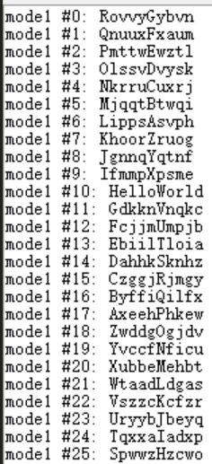


## rot位移密码

跟凯撒差不多，也是位移

## Quoted-printable

特点是用等号`=`加两个字符来表示一个字，常用于网络中，且英文字母一般不编码

样式`=E6=88=91=E8=A6=81=E5=AD=A6CTF`表示`我要学CTF`

### 解题步骤

BUUCTF Quoted-printable

哇非常的简单啊，直接给出密文

> 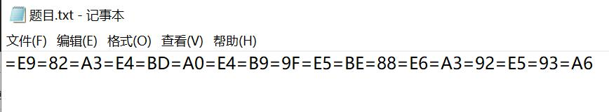

一眼Quoted-printable，当然题目就是这个

- 使用工具解密

> 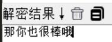

得到flag

```
flag{那你也很棒哦}
```

## Rabbit

特点是密文中常见加号`+`和斜杠`/`，常见开头`U2FsdGVkX1`

样式`U2FsdGVkX1+xGPc26adN6IuQDyc=`表示`flag`

## 栅栏密码

将原文分为指定行，从上到下依次取字符得到密文

比如将`Hello World`按每行2个字排列

`HloWrdel ol`表示`Hello World`

加密时每组字数不确定，需要爆破

## 培根密码

特点是只有字母`A`和`B`

样式`AAABABAABBAABAB`表示`ctf`

# 隐写

推荐使用工具`010Editor`或`WinHex`

## 文件十六进制编码隐写

常见隐写方式，将信息写入文件的编码中，需要使用专门的工具才能看到

## 图片宽高隐写

PNG文件结构

第`16~19`个字节为图片宽度

第`20~23`个字节为图片高度

第`12~28`个字节进行CRC计算得出第`29~32`位四字节

如果修改了图片宽高，计算出的CRC值就会与文件内的不一致

### 解题步骤

攻防世界 Normal_PNG

> 

- 先使用010查看文件结构

> 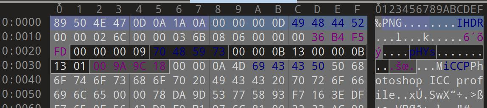

确认PNG文件头`89 50 4E 47`

宽度`26C`，高度`36B`

CRC值`36 B4 F5 FD`，010已经用红色高亮显示

- 将第`12~28`字节进行CRC计算

复制第`12~28`字节数据（0C到1C）

`49 48 44 52 00 00 02 6C 00 00 03 6B 08 06 00 00 00`

可以使用网站计算，选CRC32

[https://www.ip33.com/crc.html](https://www.ip33.com/crc.html)

> 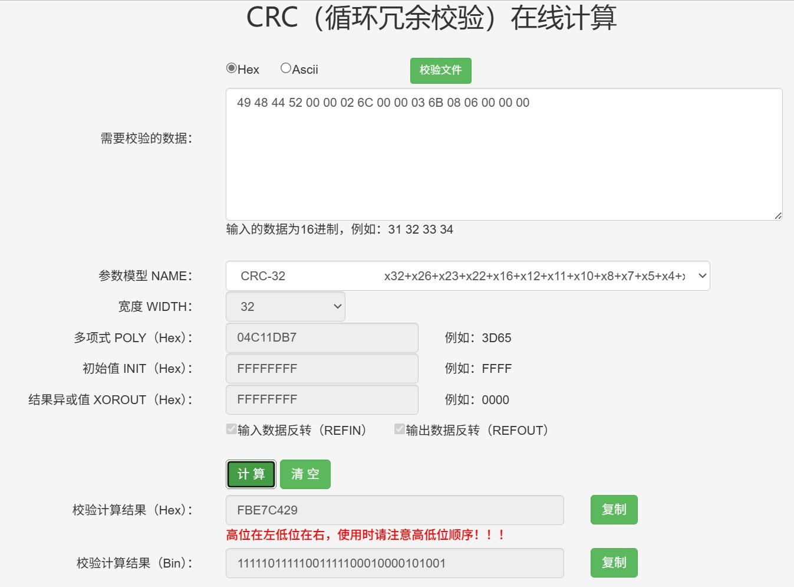

网站给出的CRC是`FB E7 C4 29`，明显与文件不一致，一般题目都是修改宽高，所以下一步直接开始爆破

- 使用脚本爆破出真实宽高

这里直接给出在网上找的校验爆破一键脚本

```python
import zlib
import struct
import argparse
import itertools


parser = argparse.ArgumentParser()
parser.add_argument("-f", type=str, default=None, required=True,
                    help="输入同级目录下图片的名称")
args  = parser.parse_args()


bin_data = open(args.f, 'rb').read()
crc32key = zlib.crc32(bin_data[12:29]) # 计算crc
original_crc32 = int(bin_data[29:33].hex(), 16) # 原始crc


if crc32key == original_crc32: # 计算crc对比原始crc
    print('宽高没有问题!')
else:
    input_ = input("宽高被改了, 是否CRC爆破宽高? (Y/n):")
    if input_ not in ["Y", "y", ""]:
        exit()
    else: 
        for i, j in itertools.product(range(4095), range(4095)): # 理论上0x FF FF FF FF，但考虑到屏幕实际/cpu，0x 0F FF就差不多了，也就是4095宽度和高度
            data = bin_data[12:16] + struct.pack('>i', i) + struct.pack('>i', j) + bin_data[24:29]
            crc32 = zlib.crc32(data)
            if(crc32 == original_crc32): # 计算当图片大小为i:j时的CRC校验值，与图片中的CRC比较，当相同，则图片大小已经确定
                print(f"\n文件CRC32: {hex(original_crc32)}")
                print(f"真实CRC32: {hex(crc32key)}")
                print(f"宽度: {i}, hex: {hex(i)}")
                print(f"高度: {j}, hex: {hex(j)}")
                exit(0)
```

使用方法`python 文件名.py -f 图片名.png`

> 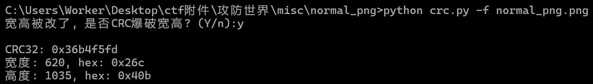

- 修改宽高，得到正确图片

可以看到高度被修改了，正确的高度为`40B`，得到正确的图片，拿到flag

> 

```
flag{B8B68DD7007B1E406F3DF624440D31E0}
```

其实还有一种邪修方法，拿到PNG先改宽高试试再说

## 图片底色隐写

网络上常见的“幻影坦克”和“光棱坦克”类的图片就属于此类

幻影坦克的原理是透明度叠加，将图片放到特定颜色背景下即可看到里图

光棱坦克要复杂一些，需要调整色阶，可以使用网站解密

[https://prism.uyanide.com/](https://prism.uyanide.com/)

## 文件包含

常见于图片或者视频文件中

常用方法：kali中使用binwalk查看文件包含

```bash
binwalk 文件名
```

没有现成题目，自己做一个

```powershell
copy/b 1.png+1.zip 2.png
```

该命令的作用就是将`1.png`和`1.zip`合并为`2.png`

准备好文件`1.png`和`1.zip`

> 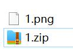

合并文件

> 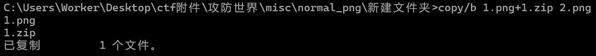

> 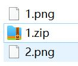

可以看到创建了一个`2.png`，并且可以正常打开

我们复制到kali里面用binwalk看看

> 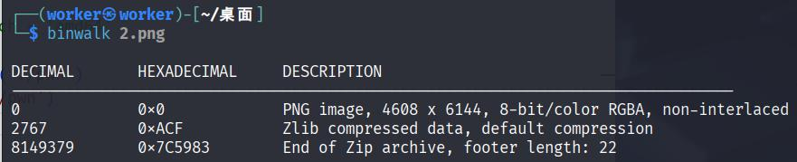

很明显看到里面藏了一个zip

## 音频隐写

推荐使用工具`Audacity`

音频隐写一般会配合其他编码的题目

### 解题步骤

西电新生赛 粒子艺术

附件给了一个音频文件

> 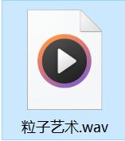

试听了一下，只有右声道，难道我耳机坏了？

用`Audacity`打开看看怎么回事，一眼就看到了问题

> 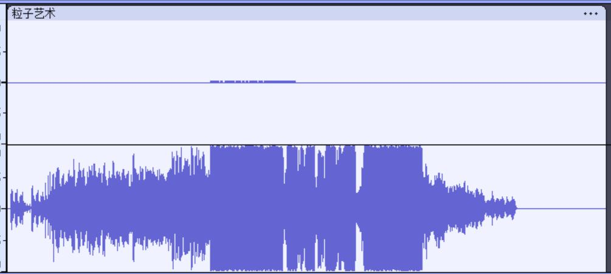

左声道放大看看

> 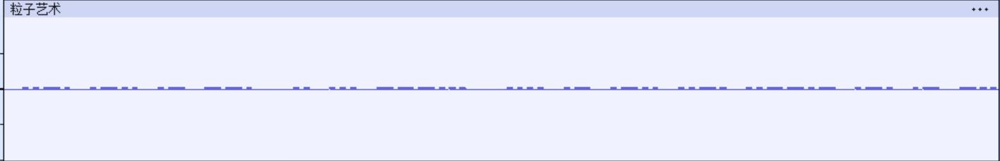

一眼摩斯密码

我们只需要将声道平衡拉到最左边即可得到完整的摩斯密码音频

> 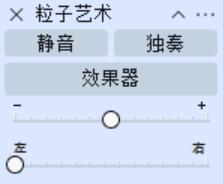

将多余的音频切掉，保存为新的音频文件，上传到解码网站进行解码

> 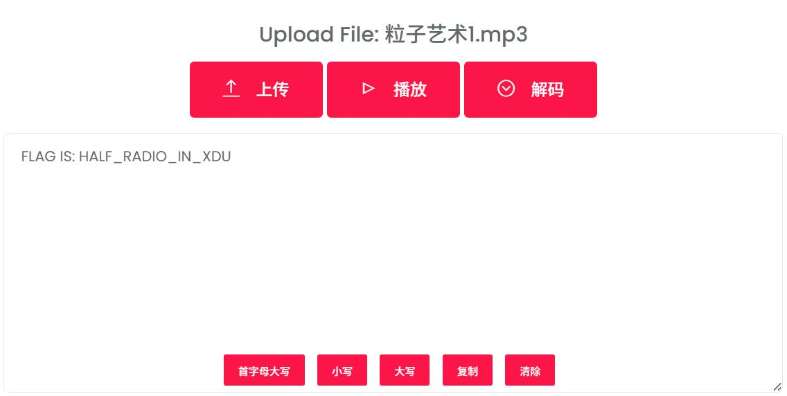

得到flag