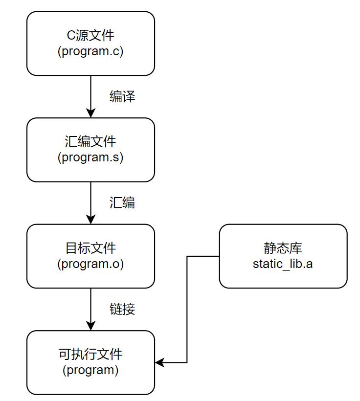
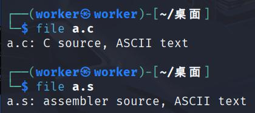
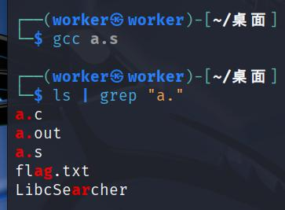
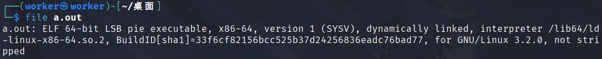
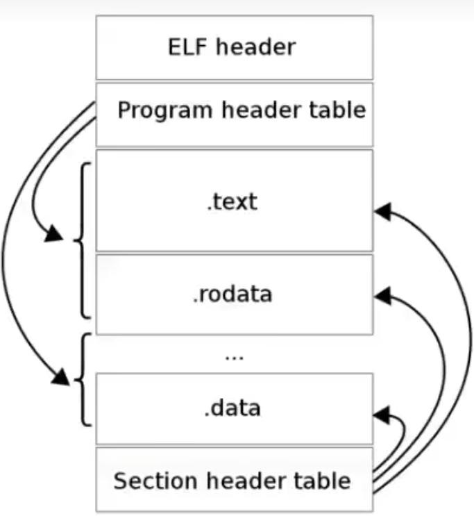
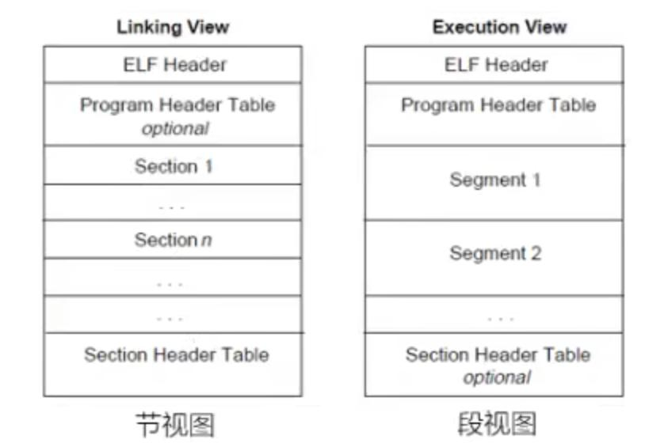
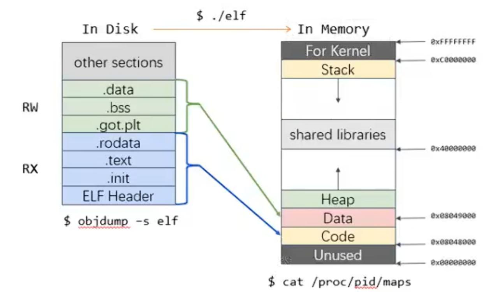
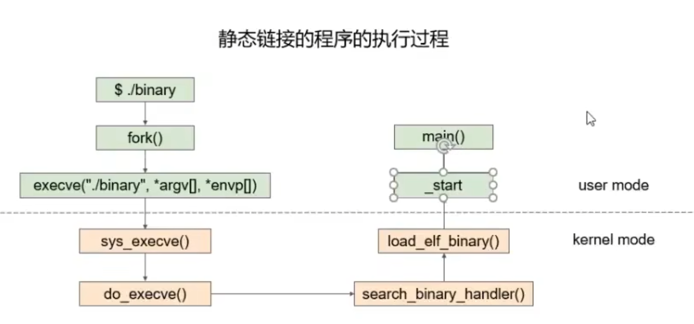
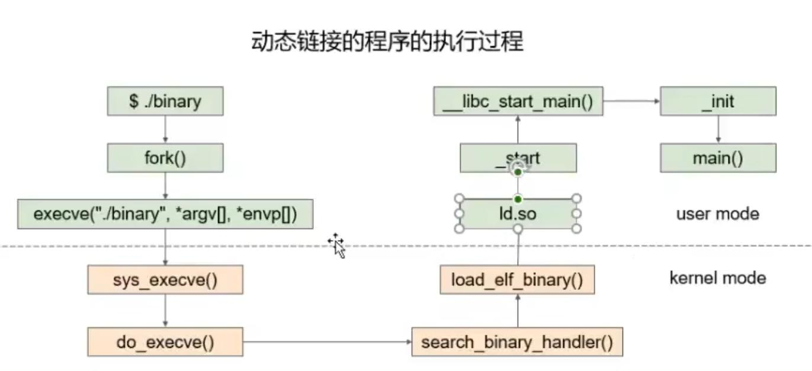

# Pwn 基础内容

本笔记使用的系统环境:

Windows 10、Kali Linux 2025.1c

`更新时间:2025-09-11`

### 名词解析

`exploit`: 用于攻击的脚本与方案

`payload`: 攻击载荷，目标进程被劫持控制流的数据

`shellcode`: 调用攻击目标的shell的攻击代码

### 程序的编译与连接

在C语言中, 我们学习了C程序的运行过程`编辑 → 编译 → 链接 → 运行`

> 

- 编译: 由C语言代码生成汇编代码
- 汇编: 由汇编代码生成机器码
- 链接: 将多个机器码文件链接为一个可执行程序

现在, 让我们手动地完成这个过程

#### 编译

准备好一份C源文件`a.c`
```c
#include<stdio.h>

int main() {
        printf("Hello, World!");
		return 0;
}
```

执行
```shell
gcc -S a.c
```

将`a.c`编译为汇编文件`a.s`
```assembly
	.file	"a.c"
	.text
	.section	.rodata
.LC0:
	.string	"Hello, World!"
	.text
	.globl	main
	.type	main, @function
main:
.LFB0:
	.cfi_startproc
	pushq	%rbp
	.cfi_def_cfa_offset 16
	.cfi_offset 6, -16
	movq	%rsp, %rbp
	.cfi_def_cfa_register 6
	leaq	.LC0(%rip), %rax
	movq	%rax, %rdi
	movl	$0, %eax
	call	printf@PLT
	movl	$0, %eax
	popq	%rbp
	.cfi_def_cfa 7, 8
	ret
	.cfi_endproc
.LFE0:
	.size	main, .-main
	.ident	"GCC: (Debian 14.2.0-19) 14.2.0"
	.section	.note.GNU-stack,"",@progbits
```

汇编文件与C语言源文件一样本质仍然是文本文件

> 

#### 汇编

执行
```shell
gcc a.s
```

将汇编文件生成机器码, 并生成可执行文件`a.out`

> 

查看`a.out`的文件格式, 不再是文本文件

> 

### 可执行文件

#### 什么是可执行文件

- 广义: 文件中的数据是可执行代码的文件(.out .exe .sh .py)
- 狭义: 文件中的数据是机器码的文件(.out .exe .dll .so)

#### 可执行文件的分类

- Windows: PE (Portable Executable)
	- 可执行程序`.exe`
	- 动态链接库`.dll`
	- 静态链接库`.lib`

- Linux: ELF (Executable and Linkable Format)
	- 可执行程序`.out`
	- 动态链接库`.so`
	- 静态链接库`.a`

### Linux下的可执行文件ELF

#### ELF文件格式

- ELF文件头表：记录了ELF文件的组织结构
- 程序头表/段表：告诉系统如何创建进程，生成进程的可执行文件必须拥有此结构，重定位文件不一定需要
- 节头表：记录了ELF文件的节区信息，用于链接的目标文件必须拥有此结构，其他类型目标文件不一定需要

> 

磁盘中的ELF(可执行文件本身)与内存中的ELF(进程内存映像)

> 

#### ELF文件运行

ELF文件运行会先从磁盘加载一份ELF镜像到内存中

> 

所有拥有相同权限的`节(section)`会合并成为一个`段(segment)`, 如图中的`.data`、`.bss`、`.got.plt`三个同样权限`RW`的节, 合并成为了`Data`段; 而`.rodata`、`.text`、`.init`、`ELF Header`拥有`RX`权限的节合并为了`Code`段

#### 虚拟内存

系统加载可执行文件到内存时, 并不会直接添加到真实的内存地址, 因为如果进程能够直接访问物理内存地址, 就可以对内存中的其他进程进行访问和修改, 所以当前的计算机系统普遍使用**虚拟内存**, 进程运行在虚拟的内存空间中, 不会影响到物理内存, 虚拟内存空间由系统统一管理

虚拟内存布局图在上图右侧, 请牢记

内存地址以`字节(Byte)`编码, 1 Byte = 8 bits

内存地址常以`16进制`表示, 例如 0x3c = 0011 1100

#### 段(segment)与节(section)

**请注意**

段(Segment)是内存组织单位, 而节(Section)是文件组织单位, 虚拟内存空间中不存在`节`的概念

- 代码段(Text Segment): 存放程序的机器指令, 包含以下节
	- `.text`
	- `.rodata`
	- `.hash`
	- `.dynsym`
	- `dynstr`
	- `.plt`
	- `.rel.got`
	- `...`

- 数据段(Data Segment): 存放全局变量和其他静态分配的数据, 包含以下节
	- `.data`
	- `.dynamic`
	- `.got`
	- `.got.plt`
	- `.bss`
	- `...`

- 堆段(Heap Segment): 用于动态内存分配，如C语言中的`malloc`或C++中的`new`
- 栈段(Stack Segment): 用于存储局部变量、函数参数、返回地址等

几个重要的节

`.text`: 存放用户写的代码

`.rodata`: 存放只读数据, 如常量

`.plt`: 存放用于解析动态链接的真实函数地址的代码

`.got.plt`: 存放解析后的真实函数地址

`.bss`: 存放未初始化的全局变量和静态变量的静态内存区域

不同的`节(section)`由链接器组合成一个完整的可执行文件或库文件

一个段包含多个节，段视图用于进程的内存区域的rwx权限划分，节视图仅用于ELF文件编译链接时在磁盘上存储时的文件结构组织

#### 程序数据在内存中的组织

对于C程序
```c
int glb;
char* str = "Hello, World!";

int sum(int x, int y) {
    int t = x * y;
    return t;
}

int main() {
    sum(1, 2);
    void* ptr = malloc(0x100);
    read(0, ptr, 0x100);	// input "deadbeef"
    return 0;
}
```

`malloc(0x100)`: 动态申请内存空间, 大小为`0x100 Bytes`
`read(0, ptr, 0x100)`: 从标准输入中读取输入, 放入缓冲区`ptr`中, 长度`0x100 Bytes`

程序运行时, 虚拟内存空间布局

|**区域**|**存储数据**|
|-------|-----------|
|Kernel	|			|
|Stack	|`t`, `ptr`	|
|shared libraries|	|
|Heap	|`"deadbeef"`|
|Bss	|glb		|
|Data	|`str`		|
|Text	|`main()`, `sum()`, `"Hello, World"`|
|Unused	|			|

#### 大端序与小端序

在计算机中, 每个数据都存放在一块连续的内存地址, 此时就需要考虑连续内存地址的分配

**小端序**是指将数据低位储存在内存低位, **大端序**是指将数据高位储存在内存低位

对于数据`1A2B3C4D`

- 小端序

	|内存地址|数据|
	|-------|----|
	|0		|4D	|
	|1		|3C	|
	|2		|2B	|
	|3		|1A	|
	
- 大端序
	|内存地址|数据|
	|-------|----|
	|0		|1A	|
	|1		|2B	|
	|2		|3C	|
	|3		|4D	|
	

我们主要关注于**小端序**

#### 进程的执行过程

计算机的核心部件一般只需要CPU和内存即可. 

CPU从地址总线访问内存中的某块内存空间，内存通过数据总线返回内存空间中的数据，CPU再通过控制总线从内存中获得相关指令. 

在CPU中, 使用寄存器来暂时保留从内存中获取到的数据, 并保留计算后的结果.

##### amd64寄存器结构

- `rax`: 8 Bytes
- `eax`: 4 Bytes
- `ax`: 2 Bytes
- `ah`: 1 Byte
- `al`: 1 Byte

##### 部分寄存器的功能

- `RIP`: 存放当前执行的指令的地址, 32位为`EIP`
- `RSP`: 存放当前栈帧的栈顶地址, 32位为`ESP`
- `RBP`: 存放当前栈帧的栈底地址, 32位为`EBP`
- `RAX`: 通用寄存器, 存放函数返回值

#### 程序的执行过程图解

> 

> 

#### 常用汇编指令

- `mov`

	`mov <DEST>, <SRC>`: 把源操作数传递给目标
	
	`MOV EAX, 1234`: 把`1234`传递给`EAX`
	
- `LEA`

	`LEA <REG>, <SRC>`: 把源操作数的有效地址传递给指定的寄存器
	
	`LEA EBX, ASC`: 把`ASC`的地址传递给`EBX`
	
- `PUSH`

	`PUSH <VALUE>`: 把目标值压栈, 同时SP指针-1字长(虚拟内存空间布局上看, 就是下移)
	
	`PUSH EAX`
	
- `POP`

	`POP <DEST>`: 将栈顶的值弹出至目标位置, 同时SP指针+1字长(虚拟内存空间布局上看, 就是上移)
	
	`POP EAX`
	
- `LEAVE`
	
	在函数返回时, 恢复父函数栈帧的指令
	
	等同于 `MOV ESP, EBP` `POP EBP`
	
- `RET`

	在函数返回时, 控制程序执行流返回父函数的指令
	
	等效于 `POP RIP`