# Worker`s Java 学习笔记

`更新时间:2025-11-18`

**本笔记使用JDK 8u431**

---

## 类

**类**是Java程序用来封装数据的代码块，类可以包含属性、方法、构造函数等

### 类声明

```
<可访问性> class <类名> {
    <类体>;
}
```
- 可访问性：，表示类的访问权限，有以下几种
  - `public` : 公开，表示类可以在任何地方访问
  - `private` : 私有，表示类只能在该类的内部访问
  - `protected` : 保护，只能在当前包或者子类中访问
- `class` : 关键字，表示类
- 类名：类名必须以字母开头，可以包含字母、数字、下划线
- 类体：类体中可以包含属性、方法、构造函数等

**一个Java文件内有且只有一个`public`类，且类名必须与该文件同名**

## 注释

Java的注释跟其他语言一样，有两种注释

- 行注释 `//`
- 段落注释 `/**/`

*跟C语言一模一样*

## 字面量

Java中的字面量表示程序一些特定的值，它们有特定的格式

### 字面量类型

- 整数：不带小数点的数字
    - `666`, `-88`
- 浮点数：带小数点的数字
    - `13.14`, `-5.21`
- 字符：单个字符，用单引号括起来
    - `a`, `A`, `%`
- 字符串：多个字符。用双引号括起来
    - `Hello`, `你好`
- 布尔值：只有两个值，表示真和假
    - `true`, `false`
- 空值：表示空
    - `null`

Java中还有一些转义字符，它们用于表示不可打印字符，比如 `\n`、`\t`、`\r`等

让我来打印一些字面量看看

```java
// Main.java
public class Main {     // 类名必须与文件名一致

    // Java程序的主入口是main方法
    public static void main(String[] args) {

        // 使用System.out.println()方法输出内容
        System.out.println(1);      // 整数
        System.out.println(2.5);    // 小数
        System.out.println('a');    // 字符
        System.out.println("Hello");    // 字符串
        System.out.println(true);   // 布尔值
        System.out.println("第一行\n第二行");   // 转义字符
    }
}
```

> 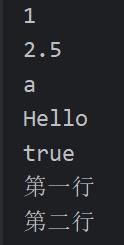

## 数据类型

数据类型用于限定变量所能够存储数据的类型，Java是静态类型语言，定义变量时必须声明数据类型

### 基本数据类型

- 整型
	- `int`：最常用的整数类型，4字节，范围-2147483648~2147483647，默认的整数类型
	- `long`：长整型，8字节，在定义时需要添加`L`后缀
	- `short`：短整型，2字节，范围-32768~32767
	- `byte`：字节型，1字节，范围-128~127
- 浮点型
	- `float`：单精度浮点型，4字节，在定义时需要添加`F`后缀
	- `double`：双精度浮点型，8字节，默认的浮点类型
- 字符型
	- `char`：2字节，Unicode
- 布尔型
	- `boolean`：1字节，只有两个值`true`和`false`

因为Java中的字符类型为2字节Unicode，所以可以直接储存一个中文汉字

### 引用数据类型

除了上述基本数据类型外，Java还有几种引用数据类型

- `class`：类，可以创建对象实例
- `interface`：接口，定义了类的行为规范
- `enum`：枚举，定义一组常量
- `String`：字符串，由字符数组组成，不可变
- `Array`：数组，多个相同类型元素组成的集合
- `Generic`：泛型，允许使用类型参数

## 变量

变量就是在程序中值会发生改变的量，变量可以理解为是一个储存数据的容器

Java中定义变量的方式

```
<类型标识符> <变量名>;
或
<类型标识符> <变量名> = <值>;
```

**局部变量**必须在使用前赋初值，否则编译报错

```java
// Main.java
public class Main {     // 类名必须与文件名一致

    // Java程序的主入口是main方法
    public static void main(String[] args) {

        // 定义整型变量a
        int a;
        
        // 没有赋初值直接使用
        System.out.println(a);
    }
}
```

> 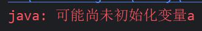

Java中也可以同时定义多个变量，再统一赋初值

```java
int a, b, c, d;
a = b = c = d = 123;
```

## 标识符

标识符是Java程序中用来唯一标识变量、方法、类等名称的特定字符串，它必须满足以下要求

- 由字母、数字、下划线和美元符号
- 开头不能是数字
- 后续字符可以是字母、数字、下划线或美元符号
- 不能是Java关键字
- 应遵循常见的标识符命名规则，如`myFunction`（小驼峰）、`MyMethod`（大驼峰）、`my_var`（下划线）

Java大小写敏感，所以`name`和`Name`是两个不同的程序对象

标识符可以使用中文，但是**绝对不推荐**！应避免在标识符中使用非ASCII字符


## 运算符

我们要先了解一下**表达式**的概念

`表达式` = `运算符` + `操作数`

Java提供了许多运算符，包括算术运算符、关系运算符、逻辑运算符、赋值运算符等等

### 算术运算符

算术运算符跟数学一样，不做过多解释

加`+`、减`-`、乘`*`、除`/`、取模`%`

**注意**，Java中的整数相处只保留整数，小数将直接舍弃，不四舍五入；取模运算的操作数只能是整数

```java
// Main.java
public class Main {     // 类名必须与文件名一致

    // main方法是程序的主入口
    public static void main(String[] args) {

        // 算术运算符
        int a = 3, b = 2;
        System.out.println("a + b = " + (a + b));   // 加法
        System.out.println("a - b = " + (a - b));   // 减法
        System.out.println("a * b = " + (a * b));   // 乘法
        System.out.println("a / b = " + (a / b));   // 除法
        System.out.println("a % b = " + (a % b));   // 取模
    }
}
```

> 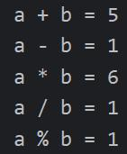

这里给出一个经典问题，请用Java的算术运算符拆分一个三位数的每位上的数字，比如一个三位数`256`，它的百位上的数字是`3`，十位上的数字是`5`，个位上的数字是`6`

```java
// Main.java
public class Main {     // 类名必须与文件名一致

    // main方法是程序的主入口
    public static void main(String[] args) {

        // 定义一个变量储存三位整数
        int num = 256;

        // 取百位
        int a = num / 100;

        // 取十位
        int b = num / 10 % 10;

        // 取个位
        int c = num % 10;

        // 输出
        System.out.printf("%d每位上的数字是:%d %d %d\n", num, a, b, c);
    }
}
```

> 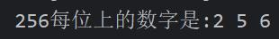

### 自增自减运算符

与C语言一样，Java拥有自增自减运算符，右结合性

- `++`：自增运算符，操作数只能是单个变量
- `--`：自减运算符，操作数只能是单个变量

Java中的自增自减运算符同样分为**前缀**和**后缀**两种形式，其中，**前缀**运算方式为**先加后用**，**后缀**运算方式为**后加先用**

```java
// Main.java
public class Main {     // 类名必须与文件名一致

    // main方法是程序的主入口
    public static void main(String[] args) {

        // 自增自减运算符
        int a = 1, b = 1;
        System.out.println(a++);    // 后缀
        System.out.println(++b);    // 前缀
        System.out.println(--a);    // 前缀
        System.out.println(b--);    // 后缀
    }
}
```

> 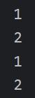

### 赋值运算符

- `=`：赋值运算符，将右侧的操作数赋值给左侧的操作数，左侧必须是变量

以下是**复合赋值运算符**，它们的运算方法是，先进行等号左边符号的算术运算，再将结果值赋值给左侧操作数

`+=`、`-=`、`*=`、`/=`、`%=`

*跟C语言一模一样？*

```java
// Main.java
public class Main {     // 类名必须与文件名一致

    // main方法是程序的主入口
    public static void main(String[] args) {

        // 复合赋值运算符
        int a = 2, b = 5;

        a += b;
        System.out.printf("a += b, a = %d  b = %d\n", a, b);
        a -= b;
        System.out.printf("a -= b, a = %d  b = %d\n", a, b);
        a *= b;
        System.out.printf("a *= b, a = %d  b = %d\n", a, b);
        a /= b;
        System.out.printf("a /= b, a = %d  b = %d\n", a, b);
        a %= b;
        System.out.printf("a %%= b, a = %d  b = %d\n", a, b);
    }
}
```

> 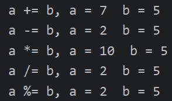

### 关系运算符

关系运算符用于判断左右操作数的关系，结果为布尔值`boolean`，真为`true`，假为`false`，不能大写

- `>`, `>=`：大于，大于等于
- `<`, `<=`：小于，小于等于
- `==`：等于
- `!=`：不等于

```java
// Main.java
public class Main {     // 类名必须与文件名一致

    // main方法是程序的主入口
    public static void main(String[] args) {

        // 关系运算符
        int a = 10, b = 20;

        System.out.println("a = " + a + ", b = " + b);
        System.out.println("a >= b:" + (a >= b));
        System.out.println("a <= b:" + (a <= b));
        System.out.println("a == b:" + (a == b));
        System.out.println("a != b:" + (a != b));
    }
}
```

> 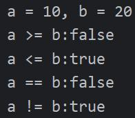

### 逻辑运算符

Java的逻辑运算的操作数**必须是**逻辑值或关系表达式结果同样是布尔值`boolean`

- `&&`：逻辑与，判断两个操作数的布尔值是否都为真，如果都为真，则返回`true`，否则返回`false`
- `||`：逻辑或，判断两个操作数的布尔值是否至少有一个为真，如果至少有一个为真，则返回`true`，否则返回`false`
- `!`：逻辑非，将操作数的布尔值取反，如果为真，则返回`false`，如果为假，则返回`true`

```java
// Main.java
public class Main {     // 类名必须与文件名一致

    // main方法是程序的主入口
    public static void main(String[] args) {

        // 逻辑运算符
        System.out.println("true && false = " + (true && false));
        System.out.println("true && true = " + (true && true));
        System.out.println("true || false = " + (true || false));
        System.out.println("true || true = " + (true || true));
        System.out.println("!true = " + !true);
        System.out.println("!false = " + (!false));
    }
}
```

> 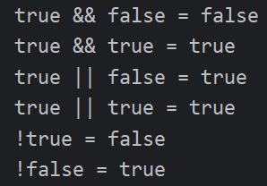

### 位运算符

位运算符跟逻辑运算符差不多，但是结果只能是两个值`1`或`0`

- `&`：按位与，与逻辑与`&&`类似，真为`1`，假为`0`
- `|`：按位或，与逻辑或`||`类似，真为`1`，假为`0`
- `^`：按位异或，两个操作数相同为0，不同为1
- `~`：按位取反，与逻辑非`!`类似，`1`取反为`0`，`0`取反为`1`
- `<<`：按位左移，将操作数的二进制表示向左移动指定位，并在右侧补`0`
- `>>`：按位右移，将操作数的二进制表示向右移动指定位，并在左侧补`0`，超过最低位的值将直接舍弃

计算机中并不直接以数字的二进制表示储存数据，所以按位运算结果值并不是对原十进制数的二进制表示进行操作，例如数字`5`，进行取反`~`操作后，结果值为`-6`

```java
// Main.java
public class Main {     // 类名必须与文件名一致

    // main方法是程序的主入口
    public static void main(String[] args) {

        // 位运算符
        // 十进制 5
        // 二进制 101
        int a = 5;
        // 十进制 3
        // 二进制 011
        int b = 3;

        // 按位与
        // 101 5
        // 011 3 &
        // 001 1
        System.out.println("a & b = " + (a & b));

        // 按位或
        // 101 5
        // 011 3 |
        // 111 7
        System.out.println("a | b = " + (a | b));

        // 按位异或
        // 101 5
        // 011 3 ^
        // 110 6
        System.out.println("a ^ b = " + (a ^ b));

        // 按位取反
        System.out.println("~ a = " + (~ a));
    }
}
```

> 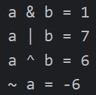


### 三目（三元）运算符
`<表达式一> ? <表达式二> : <表达式三>`

`<表达式一>`：条件表达式
`<表达式二>`：当条件表达式为真时执行
`<表达式三>`：当条件表达式为假时执行

```java
// Main.java
public class Main {     // 类名必须与文件名一致

    // main方法是程序的主入口
    public static void main(String[] args) {

        // 三目运算符
        int a = 1, b = 2;
        System.out.println(a > b ? "a > b" : "a <= b");
    }
}
```

> 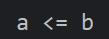

## 基础输入与输出

### 从键盘获取输入

Java中提供了键盘输入的相关方法，储存在类`Scanner`中，所以想在Java程序中输入数据，需要先导包

```java
import java.util.Scanner
```

创建一个`Scanner`对象实例

```java
Scanner sc = new Scanner(System.in)
```

调用方法获取键盘输入

```java
int i = sc.nextInt()	// 接收整型数据
```

完整代码

```java
// Main.java
// 导入Scanner
import java.util.Scanner;

public class Main {     // 类名必须与文件名一致

    // main方法是程序的主入口
    public static void main(String[] args) {

        // 创建Scanner对象并绑定到标准输入
        Scanner sc = new Scanner(System.in);

        // 定义变量接收输入
        int i = sc.nextInt();   // 接收整型数据

        // 输出
        System.out.println("i = " + i);
    }
}
```

> 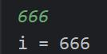

Scanner库有多种输入方法，这里列举几种常用的

- `nextInt()`：接收整数
- `nextDouble()`：接收浮点数
- `nextLine()`：接收一行字符串，遇到换行符停止，换行符不作为输入内容


### 输出

我们通常使用`System.out.println()`来输出内容，它只有一个参数

常用的输出方法还有

- `System.out.print()`

  跟`System.out.println()`用法一样，区别只有末尾不会自动换行

- `System.out.printf()`

  用法类似于C语言的`printf()`函数，需要使用格式化字符串控制输出样式

```java
// Main.java
public class Main {     // 类名必须与文件名一致

    // main方法是程序的主入口
    public static void main(String[] args) {

        int a = 10;
        float b = 20;

        // println
        System.out.println(a);
        System.out.println(b);

        // print
        System.out.print(a);
        System.out.print(b);

        // printf
        System.out.printf("%d %f", a, b);
    }
}
```

> 

## 练习：BMI计算器

BMI是一项重要的健康指数，计算方法是：体重（公斤）除以身高（米）的平方。

请编写一个程序，用户输入身高、体重自动计算出BMI的指数

```java
// Main.java
import java.util.Scanner;

public class Main {     // 类名必须与文件名一致

    // main方法是程序的主入口
    public static void main(String[] args) {

        // 创建Scanner对象实例
        Scanner input = new Scanner(System.in);

        // 获取用户输入
        System.out.print("请输入身高(m): ");
        float height = input.nextFloat();   // 身高
        System.out.print("请输入体重(kg): ");
        float weight = input.nextFloat();   // 体重

        // 计算BMI指数
        float bmi = weight / (height * height);

        // 输出
        System.out.printf("您的BMI指数为: %.1f", bmi);   // 使用格式化字符串控制小数位数
    }
}
```

## 程序流程控制

### 分支结构

分支结构是程序流程控制的重要组成部分，它允许程序根据条件判断从而执行不同的代码块。

Java中分支流程控制的语句有以下两种

#### if语句

基本语法

```
if (<表达式>)
	语句块;
```

当`if`命令后面括号内的表达式结果为`逻辑真`时，执行下方语句块内的语句，否则直接跳过该`if`语句

`if`语句后的表达式的值必须是`布尔(boolean)`类型


多分支形式

```
if (<表达式1>)
	语句块1;
else
	语句块2;
```

当`if`命令后面括号内的表达式结果为`逻辑真`时，执行`语句块1`的语句，否则执行`语句块2`的语句

```
if (<表达式1>)
	语句块1;
else if (<表达式2>)
	语句块2;
else
	语句块3;
```

当第一个`if`命令后面括号内的表达式结果为`逻辑真`时，执行`语句块1`的语句，否则判断第二个`if`命令后括号内的表达式，该表达式结果为`逻辑真`时，执行`语句块2`，否则执行`语句块3`


```java
// Main.java
public class Main {     // 类名必须与文件名一致

    // main方法是程序的主入口
    public static void main(String[] args) {

        int a = 1, b = 2, c = 3;

        // if语句
        if (a > b)
            System.out.println("a > b");
        else if (a > c)
            System.out.println("a > c");
        else
            System.out.println("a < b And a < c");
    }
}
```

> 

#### switch语句

switch语句常用于多分支结构

```
switch (<表达式>) {
	case 标号1:
		语句块1;
	case 标号2:
		语句块2;
	default:
		语句块3;
}
```

`switch`语句判断后面括号内表达式的值，并在下方的`case`标号中寻找相匹配的值，如果找到，则执行该标号后的语句块内的语句，如果没有找到，但存在`default`标号，则执行`default`后语句块的语句；如果没有`default`标号，则程序流程跳出`switch`语句

`switch`的表达式支持的类型有`基本整型`、`包装类`、`字符串`和`枚举`

`case`标号的值必须是`常量`，不能是`变量`

`switch`语句还可以使用`break`命令控制程序直接跳出`switch`语句块，也推荐这样做，如果没有`break`命令，在寻找到匹配的`case`标号后，程序流程仍然会往下执行

```java
// Main.java
public class Main {     // 类名必须与文件名一致

    // main方法是程序的主入口
    public static void main(String[] args) {

        int a = 0;
        
        // 不使用break控制的switch语句（不推荐！）
        switch (3) {
            case 1:
                a += 1;
            case 2:
                a += 2;
            case 3:
                a += 3;
            case 4:
                a += 4;
            default:
                a += 5;
        }
        
        System.out.println(a);
    }
}
```

你认为输出结果是多少？

> 

为什么是`12`？

程序流程找到匹配标号`case 3`后，执行`a += 3`，`a`的值现在为`3`，因为没有`break`命令，程序流程就会继续往下执行`case 4`和`default`标号后的语句，所以结果为`3 + 4 + 5 = 12`

### 循环结构

循环结构是程序流程控制的重要概念，它允许程序重复执行一段代码，直到满足条件为止。Java中循环结构有以下几种：

#### for语句

`for`语句是最常用的循环控制语句，它将循环三要素统一管理

基本语法

```
for (表达式1; 表达式2; 表达式3)
	语句块;
```

首先执行`表达式1`，然后判断`表达式2`，如果结果为`真`，则执行语句块内的语句，然后执行`表达式3`，再判断`表达式2`，如果结果为`真`，则继续执行语句块内的语句，构成循环，直达`表达式2`的结果为`假`

`表达式2`一般叫做`循环条件`，用于控制循环什么时候退出，`表达式3`一般用作循环控制变量的更新


示例

```java
// Main.java
public class Main {     // 类名必须与文件名一致

    // main方法是程序的主入口
    public static void main(String[] args) {
        Loop();     // 调用Loop方法
    }

    // 循环输出的Loop方法
    public static void Loop() {
        for (int i = 0; i < 5; i++) {
            System.out.println(i);
        }
    }
}
```

> 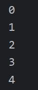


#### while语句

基本语法

```
while (<表达式>) {
	语句块;
}
```

`while`语句只有一个表达式用于判断循环条件，所以需要手动管理循环控制变量及其更新

示例

```java
// Main.java
public class Main {     // 类名必须与文件名一致

    // main方法是程序的主入口
    public static void main(String[] args) {
        Loop();     // 调用Loop方法
    }

    // 循环输出的Loop方法
    public static void Loop() {
        int i = 0;
        while (i < 5) {
            System.out.println(i);
            i++;
        }
    }
}
```

> 

#### do...while

基本语法

```
do {
	<代码块>
}while ([条件表达式]);
```

示例

```java
// Main.java
public class Main {     // 类名必须与文件名一致

    // main方法是程序的主入口
    public static void main(String[] args) {
        Loop();     // 调用Loop方法
    }

    // 循环输出的Loop方法
    public static void Loop() {
        int i = 0;

        do {
            i++;
            System.out.println(i);
        }while(i < 5);
    }
}
```

> 

## 练习：简易计算器

提示用户先输入两个数字，再输入运算符，最后输出计算结果

```java
// Main.java
import java.util.Scanner;

public class Main {     // 类名必须与文件名一致

    // main方法是程序的主入口
    public static void main(String[] args) {
        Scanner sc = new Scanner(System.in);

        System.out.print("请输入第一个数字：");
        double n = sc.nextDouble();

        System.out.print("请输入第二个数字：");
        double m = sc.nextDouble();

        System.out.print("请输入运算符：");
        char op = sc.next().charAt(0);

        double result = calc(n, m ,op);
        System.out.printf("结果是: %.2f",  result);
    }

    public static double calc(double n1, double n2, char op) {
        switch (op) {
            case '+':
                return n1 + n2;
            case '-':
                return n1 - n2;
            case '*':
                return n1 * n2;
            case '/':
                if (n2 == 0) {
                    System.out.println("除数不能为0！");
                    return 0;
                }
                return n1 / n2;
            default:
                System.out.println("错误的运算符！");
        }
        return 0;
    }
}
```

## 数组

数组是一种连续存储、类型相同的线性表，数组元素在内存中连续存放

### 数组声明

```
数据类型[] 数组名
 或者
数据类型 数组名[]
```

注意字符型`char`没有数组类型，字符串有专用的`String`类型

如果想要声明数组长度，需要使用

```
数据类型[] 数组名 = new 数据类型[长度]
```

### 调用与赋值

**初始化**

```java
int arr[] = new int[] {1, 2, 3};
int arr[] = {1, 2, 3};
```

**调用数组元素**

使用下标索引获取数组元素值，下标从0开始，最大为**数组长度减1**

```java
int arr = {1, 2, 3}
System.out.println(arr[0]);		// 结果为 1
System.out.println(arr[2]);		// 结果为 3
```

可以使用或者`数组名.length`方法快速获取数组长度

IDEA提供了`fori`方法快速创建遍历数组的`for`循环语句

## 练习：随机点名器

编写程序，使用数组储存几个姓名，每次输出一个姓名

```java
// Main.java
public class Main {     // 类名必须与文件名一致

    // main方法是程序的主入口
    public static void main(String[] args) {
        String name[] = {"小王", "小明", "小红", "小刚"};
        String lucky = randomCall(name);
        System.out.println("今天的幸运儿是：" + lucky);
    }

    public static String randomCall(String name[]) {
        int random = (int) (Math.random() * name.length);
        return name[random];
    }
}
```

## 练习：成绩录入

编写程序，输入5个学生的成绩，并计算最高分、最低分和平均分

```java
// Main.java
import java.util.Scanner;

public class Main {     // 类名必须与文件名一致

    // main方法是程序的主入口
    public static void main(String[] args) {
        double scores[] = new double[5];
        for  (int i = 0; i < 5; i++) {
            scores[i] = inputScore();
        }

        double max, min, average;
        max = min = average = scores[0];

        for (int i = 1; i < 5; i++) {
            if (scores[i] > max) {
                max = scores[i];
            }
            if (scores[i] < min) {
                min = scores[i];
            }
            average += scores[i];
        }

        average = average / 5;
        System.out.println("平均分: " + average);
        System.out.println("最高分: " + max);
        System.out.println("最低分: " + min);
    }

    public static double inputScore() {
        Scanner input = new Scanner(System.in);
        System.out.print("请输入成绩: ");
        return input.nextDouble();
    }
}
```

## 二维数组

Java中的二维数组就是数组名后两个中括号
