# Worker`s Lua 学习笔记

`更新时间:2024-07-01`

注释解释:
- `<>`必填项，必须在当前位置填写值
- `{}`必选项，必须在当前位置选择一个给出的选项
- `[]`可选项，可以在当前位置填写值或直接省略当前位置

# Lua介绍

Lua是一个由**C 语言**开发的、开源的、可扩展的、轻量级的、弱类型、解释型脚本语言。

## Lua语法基础

**注释符**

行注释：Lua使用两个连字符`-`作为行注释符
> 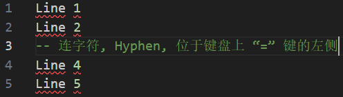

块注释：Lua使用两个连字符`-`后加两对中括号`[]`作为块注释符
> 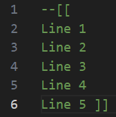

**数据类型**
<!-- 您可以将此条目修改为纯文字版 -->
> 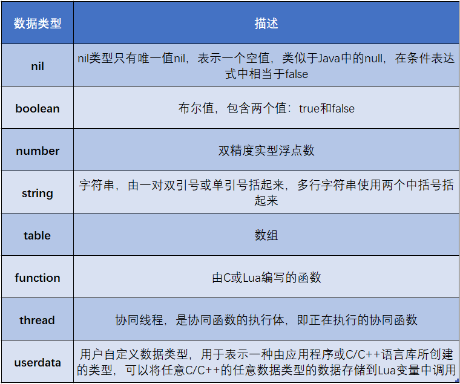

**标识符**

Lua的标识符由字母、数字、下划线组成
Lua的标识符不能以数字开头
Lua区分大小写
Lua的常见保留字有22个，自定义标识符不能与保留字同名
> 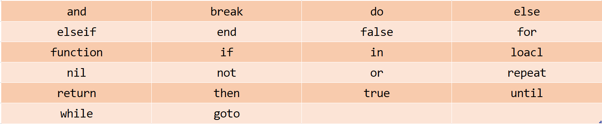

**变量**

Lua是弱类型语言，定义变量时无需类型声明
Lua的变量分为全局变量和局部变量
Lua中定义的变量默认为全局变量，定义局部变量需要使用 local
Lua中没有赋值的变量默认值为 nil

**表达式**
<!-- 关于本条目的名称, “表达式”和“运算符”哪个更合适? -->
<!-- 运算符的优先级和结合性暂无 -->
Lua的表达式与许多编程语言一样，由 “运算符” + “操作数” 组成

数学运算符
> 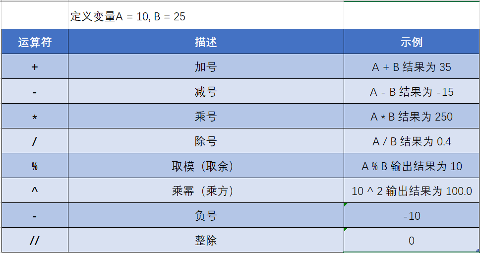
> 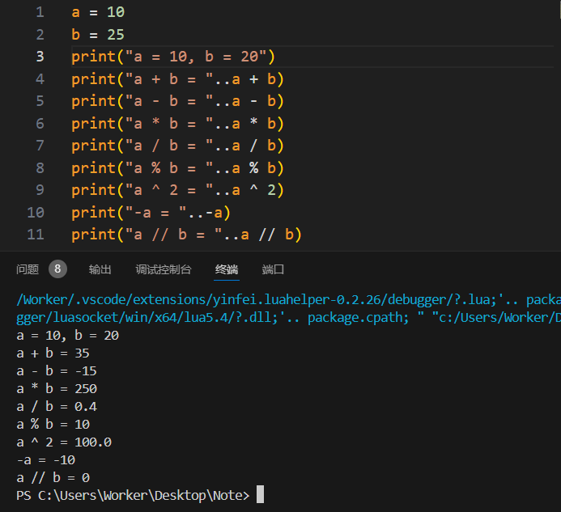

*Tips: Lua版本5.3及以上才能使用整除运算符*

关系运算符
> 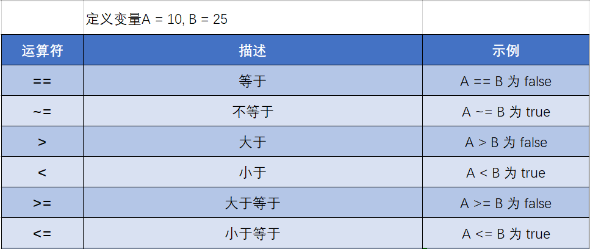

逻辑运算符  
> 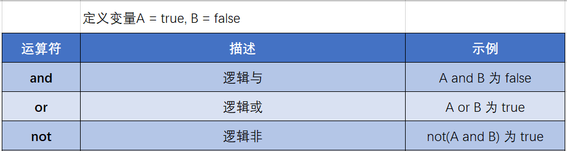

*Tips: Lua中，true、非nil 的值均为逻辑真，只有 false 和 nil 为逻辑假, 就算是 0 也是逻辑真*

其他运算符
> 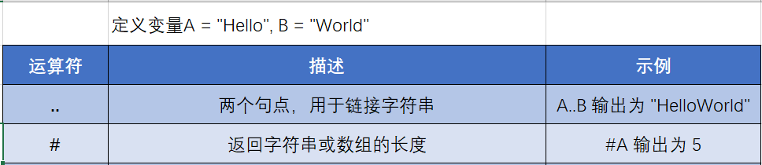
> 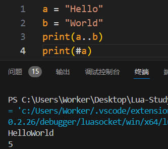

**函数**
Lua中的函数形参与实参在传递数据时并非需要一一对应，没有实参数据传入的形参默认值为 nil
Lua中的形参是局部变量，只能在函数内使用

实参可以比形参少，可以比形参多<br/>
> 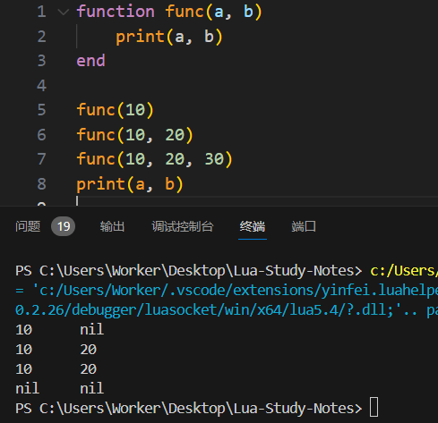

Lua中的函数可以使用可变形参，标识符为三个连续的句点`...`，可变形参可以与普通形参一起使用<br/>
> 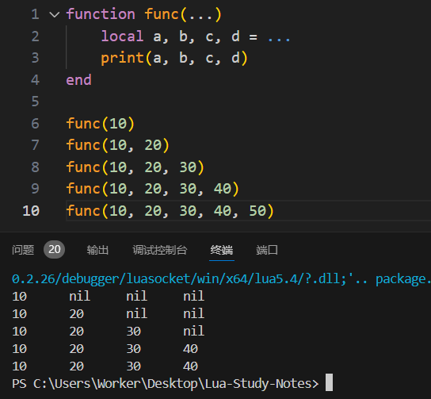<br/>

同时使用普通形参与可变形参<br/>
> 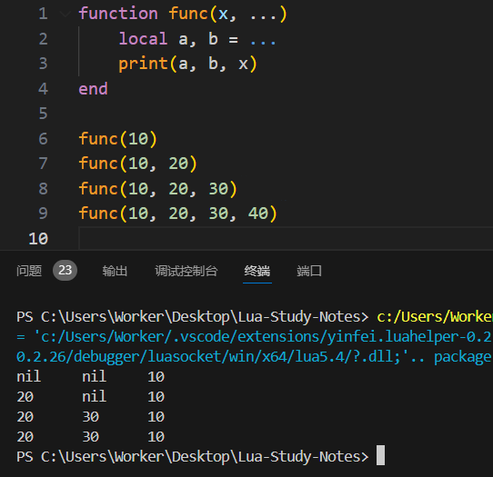

*Tips: 请尽量使用局部变量存储可变形参值*

Lua中的函数可以没有返回值，也可以一次返回多个值
> 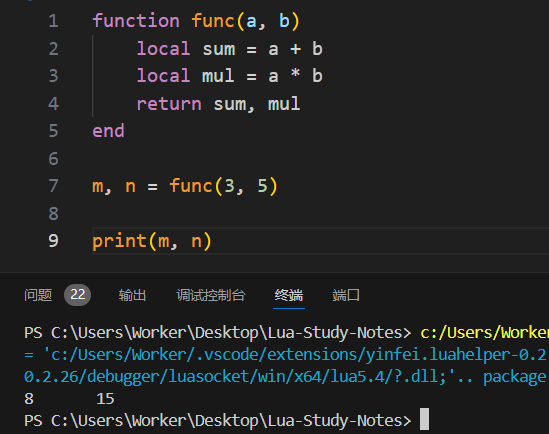

Lua中的函数也可以作为参数，作参数的函数可以是定义好的函数，也可以是匿名函数<br/> 
> 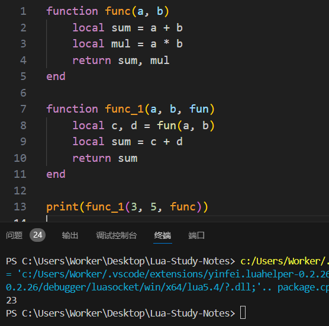<br/>

使用匿名函数做参数<br/>
> 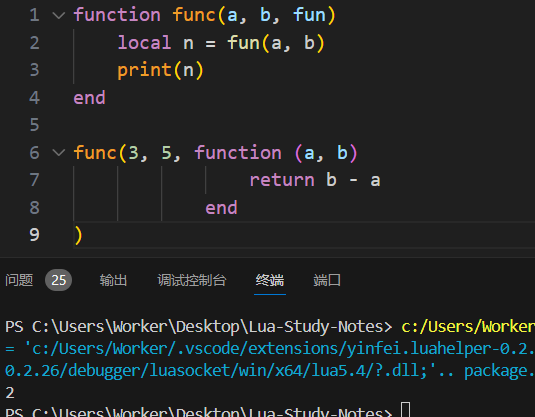

**程序流程控制**

Lua的程序流程控制命令大部分以命令动词开头，以 end 结尾
Lua提供 if...then 用于条件判断，其中 if 的判断条件可以是任意合法的Lua表达式。
Lua中只有 false 和 nil 为逻辑假，true 和 非nil 都表示逻辑真，即使是 0 也表示逻辑真
Lua中的 if 语句后的条件表达式可以用小括号括起来，也可以省略小括号

```Lua
if 语句的基本格式

if <表达式> then
    [语句1]
else
    [语句2]
end
```

Lua中提供了关键字 elseif 进行 if 嵌套，不能使用 else if 的形式嵌套 if 语句

```Lua
if 语句的嵌套

if <表达式1> then
    [语句1]
elseif <表达式2> then   -- else if 的写法是错误的
    [语句2]
else
    [语句3]
end
```

Lua提供了四种循环控制语句：while...do、repeat...until、数值for、泛型for

```Lua
while...do 语句的基本格式

while <表达式> do
    [语句]
end
```
```Lua
repeat...until 语句的基本格式
-- repeat...until 语句类似于C语言中的 do...while 语句

repeat
    [语句]
until <表达式>
```
```Lua
数值for 语句的基本格式

for <初始化赋值表达式>, <结束值>, [步长] do
    [语句]
end
```
```lua
泛型for 语句的基本格式

for <索引值变量>, <元素值变量> in <迭代器> do
    [语句]
end
```

**其他命令**

Lua提供了 break 和 goto 两个循环流程控制命令
Lua中的 break 只能在循环语句中使用
Lua中的 goto 命令与C语言类似，所以不建议使用此命令

## Lua进阶语法

**数组**

Lua提供 table 用来自定义一维、二维、多维数组
Lua中的数组下标从 1 开始，且无需声明数组长度，同一数组中的数组元素的数据类型可以不同
> 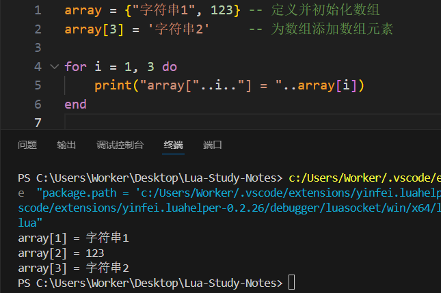

**Map**

Lua中可以通过 table 定义类似 Map 的 Key-Value 数据结构
> 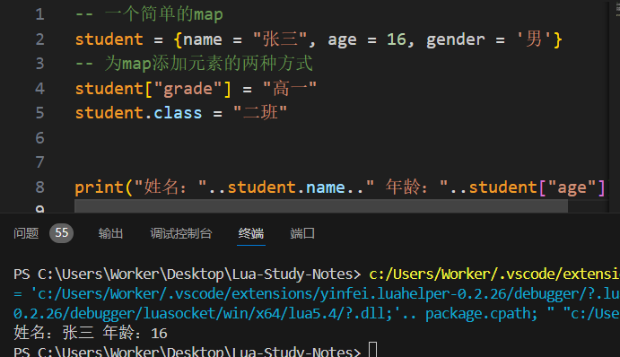

Lua中允许将数组与 Key-Value 混合在一个 table 中进行定义，且 Key-Value 不占用数组的数字索引值
> 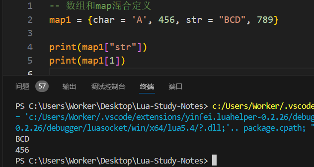
> 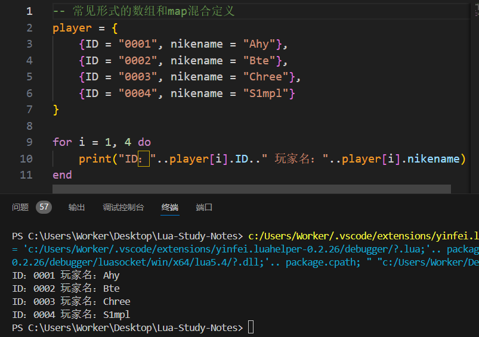

**table.concat 函数**

该函数用于将指定的数组元素进行字符串连接，位置从 start 到 end
数组元素间可以使用指定的分隔符 sep 隔开
如果 table 是一个混合结构，那么连接将直接忽略 Key_Value 元素
```Lua
table.concat 函数基本格式
table.concat ( <table> [, <sep> [, <start> [, <end>]]])
```
示例
> 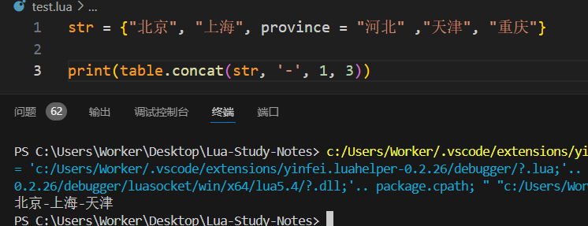

**table.pack 函数**

该函数可以将指定的参数打包成一个 table 返回
该函数的参数是一个可变参
该函数返回的 table 中含有一个属性 n 用于表示 table 中的元素个数
*Tips: Lua5.1及以下不支持此函数*
```lua
table.pack 函数基本格式
table.pack (...)
```
示例
```
arr2 = table.pack("Worker", "Ki1z", "Cool")
print(table.concat(arr2, ", "))
```
> 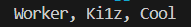

**table.unpack 函数**

该函数可以返回指定 table 的数组中的从第 start 个元素到第 end 个元素值，start 项默认为 1
*Tips: Lua5.1及以下不支持此函数*
```lua
table.unpack 函数基格式
table.unpack (table[, start[, end]])
```
示例
```lua
arr = {"Alex", "Blaine", "Carl", "Defrise"}
print(table.unpack(arr))
```
> 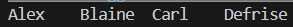

**table.maxn 函数**

该函数可以返回指定 table 的数组中的最大索引值
```lua
table.maxn 函数基本格式
table.maxn (table)
```

**table.insert 函数**

该函数用于在指定 table 的数组指定位置 pos 插入一个元素 value
pos 项默认为数组末尾，pos 位置后的元素将自动后移
```lua
table.insert 函数基本格式
table.insert (table, [pos,] value)
```

**table.sort 函数**

该函数用于对指定 table 排序，默认为升序，可以使用函数自定义排序方法
```lua
table.sort 函数基本格式
table.sort (table[, comp])
```
示例
```lua
arr = {"Box", "Agg", "Cat", "Dog", "Pudding"}
table.sort(arr)
print(table.concat(arr, ", "))
```
> 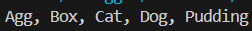

使用函数定义排序方法
```lua
arr = {"Box", "Agg", "Cat", "Dog", "Pudding"}
table.sort(arr, function(a, b)
    if a > b then
        return true
    else
        return false
    end
end
)
print(table.concat(arr, ", "))
```
> 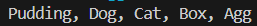

**迭代器**

Lua提供了`pairs`, `ipairs`两个迭代器函数用于泛型For循环
pairs 函数遍历 table 中所有元素，ipairs 函数仅遍历数组元素
* 使用 pairs 迭代器
```lua
arr = {1, 2, "abc", str = "0xFFFF"}
for k, v in pairs(arr) do
    print(k, v)
end
```
> 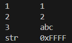

* 使用 ipairs 迭代器
```lua
arr = {1, 2, "abc", str = "0xFFFF"}
for i, v in ipairs(arr) do
    print(i, v)
end
```
> 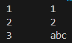

**模块**

模块是 Lua 中特有的数据结构，可以在内部定义一些变量与函数供其他文件调用
定义模块的方法
先创建一个 Lua 脚本文件，再定义一个与文件同名的表，使用`模块名.{变量|函数}`的形式定义变量或函数
* 示例
```lua
-- algorithm.lua
algorithm = {}

algorithm.pi = 3.1415

function algorithm.add(a, b)
    return a + b
end

function algorithm.sub(a, b)
    return a - b
end

function algorithm.mul(a, b)
    return a * b
end

function algorithm.div(a, b)
    return a / b
end

return algorithm
```

使用 require 函数调用模块，require 函数有返回值，如果模块文件末尾返回了模块，可以使用变量接受该模块，使用变量名代替模块名

*Tips: 只有全局变量或函数可以被调用*

* 使用 require 调用模块
```lua
-- main.lua
alg = require "algorithm"

function math(a, b, func)
    return func(a, b)
end

print(algorithm.pi)
print(math(6, 3, algorithm.add))
print(math(6, 3, algorithm.sub))
print(math(6, 3, alg.mul))
print(math(6, 3, alg.div))
```
> 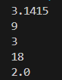

**元表**

元表，即 Lua 中普通 table 的元数据表；元方法，元表中定义的普通 table 的默认行为
元表中有两个重要函数：
setmetatable (\<table>, \<metatalbe>)：用于指定普通 table 的元表  
getmetatable (\<table>)：用于获取普通 table 的元表

**_ _index 元方法**

当用户对 table 进行读取访问时，如果访问的索引不存在，则系统会自动调用 _ _index元方法
_ _index 元方法重写可以是一个函数，也可以是另一个表
如果 _ _index 元方法重写是函数且有返回值，则直接返回；如果没有返回值，则返回 nil
* 示例
```lua
city = {"Beijing", "Tianjing", "Shanghai"}
other = {[4] = "Chengdu", [5] = "Xi'an"}
meta = {}

setmetatable(city, meta)

-- 使用匿名函数重写
meta.__index = function(tab, key)
    return "Index "..key.." Not Found"
end

print(city[4])

-- 使用另外一个table重写
meta.__index = other

print(city[4])
```
> 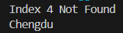

**_ _newindex 元方法**

当用户为 table 中一个不存在的索引赋值时，系统自动调用 _ _newindex 元方法
_ _newindex 元方法也可以使用函数和另外一个 table 重写，但与 _ _index 元方法略有区别
* 使用函数重写
```lua
city = {"Beijing", "Tianjing", "Shanghai"}
meta = {}

setmetatable(city, meta)

function meta.__newindex()
    print("Success")
end

city[4] = "Qingdao"
print(city[4])
```
> 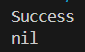

为什么输出是 nil？因为重写了 _ _newindex 元方法，新数据不会直接储存在 table 中，需要使用 rawset 函数将数据写入，所以将函数改为以下形式
```lua
function meta.__newindex(table, index, value)
    print("Success")
    rawset(table, index, value)
end
```
> 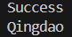

* 使用其他 table 重写
```lua
city = {"Beijing", "Tianjing", "Shanghai"}
other = {}
meta = {}

setmetatable(city, meta)
meta.__newindex = other

city[4] = "Qingdao"
print(city[4])
print(other[4])
```
> 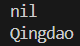

为什么 表other 有值而 表city 没有值？_ _newindex 元方法使用另一个普通 table 的作用是暂存新的数据

**运算符元方法**

对一个 table 进行运算时，会自动调用其元表的运算符元方法
> 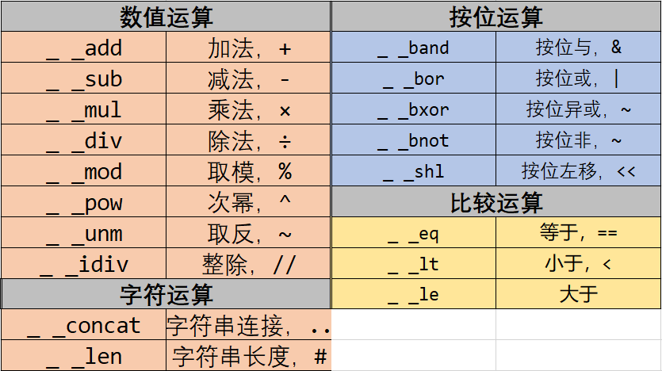

* 示例
```lua
array = {12, "Edge", name = "Tom", 18}
meta = {
    __add = function(tab, num)
        for k, v in pairs(tab) do
            if type(v) == "number" then
                tab[k] = v + num
            elseif type(v) == "string" then
                tab[k] = v..num
            end
        end
        return tab
    end
}

setmetatable(array, meta)
array = array + 5

for k, v in pairs(array + 5) do
    print(k..":"..v)
end
```
> 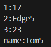

**_ _tostring 元方法**

使用 print 函数直接输出 table，则会输出该 table 的内存地址
* 使用 print 直接输出 table
```lua
table = {}
print(table)
```
> 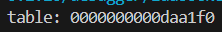

重写 _ _tostring 元方法，则可以自定义输出内容
* 示例
```lua
array = {12, "Edge", name = "Tom", 18}
meta = {
    __add = function(tab, num)
        for k, v in pairs(tab) do
            if type(v) == "number" then
                tab[k] = v + num
            elseif type(v) == "string" then
                tab[k] = v..num
            end
        end
        return tab
    end,

    __tostring = function(tab)
        str = ""
        for k, v in pairs(tab) do
            str = str..k..":"..v.."\n"
        end
        return str
    end
}

setmetatable(array, meta)
array = array + 10

print(array)
```
> 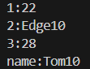

**_ _call 元方法**

将一个 table 以函数形式来使用时，Lua会自动调用 _ _call 元方法
* 使用匿名元表的方式重写
```lua
array = {12, "Edge", name = "Tom", 18}
setmetatable(array, {
    __call = function(tab, value1, value2)
        for k, v in pairs(tab) do
            if type(v) == "number" then
                tab[k] = v + value1
            elseif type(v) == "string" then
                tab[k] = v..value2
            end
        end
        return tab
    end
})

array(5, " Hello")
for k, v in pairs(array) do
    print(k..":"..v)
end
```
> 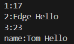

**元表文件**

元表可以单独定义在一个文件内，与模块一样使用 require 导入使用

**Lua 中的面向对象**

Lua 可以使用 table 定义对象属性，function 定义对象方法来创建一个简单对象
* 创建一个简单对象
```lua
-- 创建一个简单对象
player = {UID = "1001", nikename = "Sharp_Shark"}

-- 为对象添加方法
function player:message(text)
    print(self.nikename..":"..text)
end

player:message("Hello, World!")
```
> 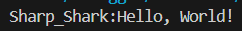

