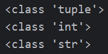

# Python 学习笔记
本笔记使用的Python版本为3.11

`更新时间:2024-11-25`

- `<>`必填项，必须在当前位置填写相应数据
- `{}`必选项，必须在当前位置选择一个给出的选项
- `[]`可选项，可以选择填写或忽略

*print("Hello World!")*

## Python 基础语法

### 数据类型

Python 中有6个数据类型，分别是:
- 数字(Number)
> 数字类型又可分为4种类型，即 整数(int), 浮点数(float), 
复数(complex), 布尔值(bool) <br>
> 
> - 整数(int), 例如 `10`, `-10`, `123`<br>
> - 浮点数(float), 例如 `13.4`, `-13.4`<br>
> - 复数(complex), 例如 `4+3j`, 以`j`结尾表示复数<br>
> - 布尔值(bool), 真(true), 假(false), 本质上是一个数字,
> `1`表示`true`, `0`表示`false`
- 字符串(String)
> 由任意数的字符组成, 必须用双引号`"`围起来, 例如 `"abc123"`, `"Python学习笔记"`
- 列表(List)
> 有序的可变序列, Python中使用最频繁数据类型
- 元组(Tuple)
> 有序的不可变序列, 可有序记录一堆不可变地Python数据集合
- 集合(Set)
> 无序不重复集合, 可无序记录一堆不重复地Python数据集合
- 字典(Dictionary)
> 无序Key-Value集合, 可无序记录一堆Key-Value型的Python数据集合

### 注释

*在所有编程语言中, 注释都是非常重要的工具*

在Python中, 注释与大多数编程语言一样, 分为两类

- 行注释: 以井号`#`开头, 井号的右边所有文字作为注释
    ```python
    # 这是一条注释
    # 这是一条注释
    # 这是一条注释
    ```
- 段落注释: 用 一对三个双引号`"""` 括起来的内容作为段落注释
    ```python
    """
        这是一条注释
        这是一条注释
        这是一条注释 
    """
    ```
### 变量

Python是动态类型语言, 所以定义变量时无需声明变量类型

定义变量的格式: `<变量名>` = `<变量值>`

```python
# 定义一些变量
a = 1
b = 2.0
c = "Python"
# 输出这些变量
print(a, b, c)
```


Python从3.6开始也支持静态类型

静态类型变量的定义格式: `<变量名>` : `<变量类型>` = `<变量值>`

```python
# 定义一些静态变量
a : int = 1
b : float = 2.0
c : str = "Python"
# 输出这些变量
print(a, b, c)
```


Python本质上还是动态类型语言, 所以运行时还是以动态类型方式, 即使变量值与声明的类型不一致仍然能够运行

```python
# 定义一些与声明类型不一致的静态变量
a : str = 1
b : int = 2.0
c : bool = "Python"
# 输出这些变量
print(a, b, c)
```


#### 数据类型与转换

上面我们已经学习了Python中常见的数据类型, 这里我们主要了解获取数据类型的方式与数据类型转换

Python提供一个专门的函数 `type()`用于获取变量或字面量的数据类型

```python
# 定义几个变量
a = 1       # 变量 a 是 int 类型
2.0     # 字面量 2.0 是 float 类型
c = "Python" # 变量 C 是 string 类型
# 获取并输出这几个变量的数据类型
print(type(a))
print(type(2.0))
print(type(c))
```


需要注意的是, 字符串类型(string) 的类型标识符为`str`, 而不是`string`

使用`type()`函数获取静态类型变量的数据类型时, 结果是怎样的?

```python
# 定义静态类型变量
a : int = 1
# 输出变量的数据类型
print(type(a))
# 给静态类型变量赋予一个不同类型的数据
a = 2.0
# 输出变量的数据类型
print(type(a))
```


也就是说, 即使使用静态类型变量, 其数据类型仍然跟随所储存的字面量的数据类型

`type()`函数拥有一个`str`类型的返回值, 返回值为所求取字面量或变量的数据类型

Python提供了许多用于数据类型转换的函数, 例如`int()`, `float()`, `str()`, 返回值为函数名

```python
# 类型转换函数的基本用法
<函数名>(<变量名或表达式>)
```

```python
# 定义不用的变量储存不同类型的数据
a = 1       # a 为 int 类型
b = 2.0     # b 为 float 类型
c = "333"   # c 为 str 类型
# 将它们的类型转换
a = str(a)
b = int(b)
c = float(c)
# 输出它们的数值和类型
print(a, type(a))
print(b, type(b))
print(c, type(c))
```


注意
- `int()`, `float()`等返回值为数值型的类型转换函数, 其参数只能是数值型或数字字符串
- `int()` 函数的参数为实型数据时, 返回值将直接舍弃小数部分, 只保留整数部分, 不进行四舍五入
- 任意字符都可以作为`str()`函数的参数

### 标识符

标识符就是编程时使用的名字,用于给变量、常量、函数等命名.
在Python中,标识符命名的规则有以下几点:
- 只允许使用英文、中文、数字、下划线
- 不能与系统标识符(关键字)关键字同名
- 对大小写敏感
- 不能以数字开头

以下是一些标识符的例子

```python
# 以下是一些合法的标识符
a_b
A_b     # 与a_b是两个不同的标识符
_ab
_a0123b
张三_a  # 合法,但不推荐

# 以下是一些不合法的标识符
import  # 与import命令重名
0_a11   # 以数字开头
```

尽管Python支持中文标识符,但中文标识符在使用过程中可能会出现未知的问题,所以不建议使用

*标识符名很简单*<br>
*字母数字下划线*<br>
*非数打头非关键*<br>
*字母区分大小写*<br>

#### 变量的命名规范

标识符不仅有严格的命名规则,使用过程中还需要遵守其命名规范

Python中标识符的命名规范分为三种:
- 变量名
- 类名
- 方法名

不同的标识符有不同的命名规范,目前我们只学习了变量,所以只学习变量的命名规范

变量的命名规范有以下几点:

- 见名之意

要尽量做到,看到变量名字,就知道变量的作用

```python
# 以下的变量没有做到见名之意,无法一眼就了解其作用
a = "张三"
b = 21
c = 175

# 以下的变量能够做到见名之意,一目了然,简洁高效
name = "张三"
age = 21
height = 175
```

- 下划线命名法

多个单词组合命名时,要使用下划线分隔

```python
# 以下的变量没有使用下划线命名法,难以阅读
playernickname = "张三"
playerage = 21

# 以下的变量使用了下划线命名法,便于阅读
player_nickname = "张三"
player_age = 21
```

- 英文字母全小写

变量名中的英文字母应全部小写

```python
# 以下的变量的标识符大小写混用,使用时极易导致混乱
Name = "张三"
name = "小二"

# 以下的变量的标识符保持全部小写,无需担心使用时混淆大小写
name_1 = "张三"
name_2 = "小二"
```

*在大部分编程语言中,标识符的命名规则与规范都相差不大*

### 运算符

- 数学(算术)运算符

Python中的部分数学运算符与其他编程语言没有区别,加减乘除均为`+`,`-`,`*`,`/`,其余的有:<br>
取整除(不四舍五入)`//`, 取余`%`, 指数`**`
```python
a = 9
b = 2

# 取整除运算符 //, 向下取整, 不四舍五入
print("a // b =", a // b)

# 取余运算符 %, 又称取模运算符, 直接求取余数
print("a % b =", a % b)

# 指数运算符 **, 符号前为底数, 后为指数
print("a ** b =", a ** b)
```


- 赋值运算符

一个等号`=`就是一个赋值运算符,它的作用是将等号右边的表达式的值赋值给等号左边的变量

Python还提供了特别的复合赋值运算符, 它们的形式均为数学运算符后紧跟一个等号

```python
# 复合赋值运算符的形式
a += b  # 等同于 a = a + b
a -= b  # 等同于 a = a - b
a *= b  # 等同于 a = a * b
a /= b  # 等同于 a = a / b
a %= b  # 等同于 a = a % b
a **= b # 等同于 a = a ** b
a //= b # 等同于 a = a // b
```
*注意,复合赋值运算会直接改变变量的值,而数学运算不会改变变量的值*

### 字符串

- 字符串的定义方式

在上面我们已经学习了字符串的定义方法,为什么这里还要学习呢?

在Python中,字符串其实有三种定义方法:

```python
# 单引号定义法 '
name = '张三'

# 双引号定义法 "
name = "张三"

# 三引号定义法 """
name = """张三"""
```

三引号定义法与段落注释写法一样,支持多行操作,使用变量接收,它就是字符串,不使用变量接收,它就是注释

```python
# 这是一个多行的字符串
message = """
    第一行文字
    第二行文字
    第三行文字
"""

# 这是一个段落注释
"""
    第一行文字
    第二行文字
    第三行文字
"""
```

- 转义符

我们刚刚学习了三种字符串的定义方式,它们都有一个共同点,都需要使用引号作为定界符,如果需要在字符串中使用定界符,那该怎么办呢?

我们可以使用与定界符不一样的引号,比如,使用单引号定义时,字符串中可以使用双引号,反之同理

```python
# 在字符串中使用引号
str_1 = "I'm Worker"
str_2 = 'I like "Minecraft"'

print(str_1 + '\n' + str_2)
```


另外,我们还可以使用一种名为转义符的特殊符号表示引号,它的用法很简单,并且不受定义方式的限制

转义符就是一个反斜线`\`, 其后紧跟需要转义的符号,比如单双引号`\'`,`\"`

```python
# 使用转义符号表示引号
str_1 = "I\'m Worker, I like \"Minecraft\""

print(str_1)
```


- 字符串拼接

如果我们有两个字符串,想要把它们链接成一个字符串,该怎么操作呢?这个时候,我们就需要用到python中的字符串拼接

在上面的案例中我们其实已经见过了,使用一个加号`+`即可拼接字符串

```python
# 拼接两个字符串
str_1 = "Hello"
str_2 = "World!"

print(str_1 + ", " + str_2)
```


*不是字符串的数据可以拼接吗?*

- 字符串格式化

如果只使用字符串拼接,那将会遇到很多问题,比如,无法将数字与字符串直接进行拼接,或是需要拼接的字符串太多,使用起来很麻烦,所以,python提供了字符串格式化来解决这些问题

字符串格式化需要使用一个占位符`%`,其后紧跟一个英文字母,不同的英文字母代表不同的数据类型

在定义字符串时,将占位符写在字符串内需要替换的位置,并在字符串后加上一个百分号`%`,百分号右侧写上需要替换的内容变量列表,多个变量需要使用括号括起来,用逗号分隔

```python
# 一些基本的占位符
%s # 将内容转换为字符串, 放入占位位置
%d # 将内容转换为整数, 放入占位位置
%f # 将内容转换为浮点型, 放入占位位置
```

*似乎跟C语言有点类似呢*

```python
# 占位符的使用案例
name = "苹果" # 定义一个字符串数据
count = 10  # 定义一个整型数据
price = 1.25  # 定义一个浮点型数据
# 使用字符串格式化定义字符串
message = "商品名: %s, 单价: %f, 数量: %d" % (name, price, count)

print(message)
```


注意到了没有,在上面的案例中,浮点型数据输出居然有4个小数点,这是为什么呢?

Python的数值型占位符都是有默认精度的,我们可以使用辅助符号小数点`.`来进行精度控制

```python
# 辅助符号控制精度的基本格式
m.n
```

`m`表示控制的字符宽度,没有此项就不限制长度,必须为整数;如果是正数,数字将右侧对齐,左侧填补空格,负数则左对齐,右侧填补空格;如果设置的宽度小于数字本身的宽度则无法生效<br>
`n`表示控制的小数位数,没有此项默保留6位小数,必须为正整数;如果设置的小数位数大于数字的小数位数,那么将在小数末尾补0,如果小于,则进行四舍五入<br>
小数点和小数位数也参与宽度计算,对于数字`11.345`,长度为`6`,小数位数为`3`

```python
# 辅助符号进行精度控制的举例
a = 1.234

print("a =" + "%5d" % a)
print("a =" + "%-5d" % a)
print("a =" + "%5.2f" % a)
print("a =" + "%.2f" % a)
print("a =" + "%2.f" % a)
print("a =" + "%.8f" % a)
```


*这么看更像C语言了*

- 字符串快速格式化

使用占位符`%`实现格式化已经很方便了,还能进行精度控制,但是,追求效率和优雅的python觉得这个办法还是太麻烦了,所以,python提供了另一种更快速的格式化方法

通过语法: `f"内容{变量}"` 的格式来快速格式化

```python
# 使用快速格式化定义字符串
name = "苹果"
count = 3
price = 1.25
message = f"商品名:{name}, 单价:{price}, 数量:{count}"

print(message)
```


字符串快速格式化无视数据类型,不做精度控制

- 表达式格式化

在上面的演示举例中,都是基于变量的,那么,可不可以直接用表达式进行格式化呢?

当然是可以的,直接在变量的位置写上表达式,其效果也是相同的

```python
# 占位符格式化
print("1 * 1的结果是: %d" % (1 * 1))
print(f"1 * 1的结果是:{1 * 1}")
print("字符串在python中的类型是: %s" % (type("字符串")))
```


### 数据输入输出

- input函数

在python中, input函数的作用是获取键盘输入, 其使用方式很简单, 直接用一个变量储存所获取的键盘输入即可

```python
# input函数的基本用法
a = input() # 小括号必不可少

# 打印所获取的键盘输入
print("你输入的是:", a)
```


*为什么会有一个换行?*

在编程中, 我们通常需要在用户使用键盘输入之前给予相应的提示信息, 以方便用户理解他所需要输入的是什么数据, 
我们一般会使用专门的数据输出函数打印提示信息, 就像下面这样

```python
print("请输入你的名字:") # 使用print函数打印提示信息
name = input()

print(name)
```


而在python中, input函数能直接使用字符串参数来打印提示信息

```python
name = input("请输入你的名字:")

print(name)
```


*两种方法在键盘输入时有什么区别?*

- 不同类型数据的输入

input函数的返回值类型为字符型`str`, 也就是说, 无论你输入的是数字、字母、汉字, 其存储到变量中的数据都是字符串

```python
# input函数的返回值类型
a = input()
b = input()
c = input()

# 打印变量的数据类型
print("变量 a:", a,"数据类型:", type(a))
print("变量 b:", b,"数据类型:", type(b))
print("变量 c:", c,"数据类型:", type(c))
```


想要输入其他类型的数据, 我们就需要使用之前学过的数据类型转换函数

```python
# 使用input函数获取键盘输入
a = input()
b = input()
c = input()

# 使用类型转换函数转换数据类型
a = int(a) # 将 a 转换为整型
b = float(b) # 将 b 转换为实型
c = str(c) # 这么做没有意义

# 打印变量的数据类型
print("变量 a:", a, "数据类型:", type(a))
print("变量 b:", b, "数据类型:", type(b))
print("变量 c:", c, "数据类型:", type(c))
```


- print函数

与input函数的作用相反, print函数是将指定的数据输出到相应的位置, 其用法也很简单, 在括号内写上需要输出的数据即可

```python
# print函数的基本用法
print("内容")
```

注意! print函数输出后会, 默认会在输出的末尾加上一个换行符`\n`, 如果想要取消自动换行, 则需要用到特定的参数

- print函数的参数

print函数拥有几个用于格式控制的参数

`sep`参数用于指定多个值之间的间隔符, 默认为空格

```python
a = "Hello"
b = "World"
print(a, b, sep = '*')
```


`end`参数用于指定字符串的结束符, 将其设置为空即可取消自动换行

```python
a = "Hello"
b = "World"
print(a, b, end = '!')
```


```python
# 取消print函数的自动换行
a = "Hello"
b = "World"

print(a, end = "")
print(b)
```


*因为第二个print没有使用end参数, 所以其尾部自动换行*

### 关系运算符与布尔类型

#### 关系运算符

python提供了许多用于判断的关系运算符

```python
# 常见的关系运算符
a > b # 大于
a >= b # 大于等于
a < b # 小于
a <= b # 小于等于
a == b # 等于(判断是否相同)
a != b # 不等于(判断是否不相同)
```

关系表达式的结果为布尔值

#### 布尔类型(bool)

布尔类型在python中属于数字(Number)类型, 只有两个字面量`True`和`False`

注意, 布尔类型的两个字面量`True`和`False`首字母必须大写

```python
a = true # 错误的语句
b = False # 正确的语句
```

实际上, python中的所有非空数据都被视为`True`, 例如非0数字、非空字符串、非空元组、非空集合等等;
相反的, 所有类型的空值都视为`False`, 例如空字符串、0、None、空元组等等

### 程序流程控制

#### if语句

python中提供了if语句进行判断

if语句的基本格式

```python
if <表达式> : # 冒号必不可少
    [语句]
```

python与其他大部分编程语言不同, 使用缩进进行语句块判断

```python
if <关系表达式> :
    [语句1] # 这条语句被if控制
    [语句2] # 这条语句被if控制
[语句3] # 这条语句不被if控制
```

*帮助你养成良好的缩进习惯*

#### if...else语句

python中同样可以使用`if...else`语句创建多分支判断

```python
moneyiHave = 100
moneyHeHave = 10000

if moneyiHave > moneyHeHave:
    print("小美喜欢我")
else :
    print("小美喜欢他")
```

*不需要打印输出, 你也应该知道答案*

注意, 因为python使用缩进进行语句块判断, 所以在不同缩进的`if`之后不能使用`else`

```python
# 错误示例
if 10 > 1:
    print("message")
    else : # 错误的缩进
    print("message")
```


#### if...elif...else语句

python还提供了与c语言中switch语句功能类似但不完全相同的`if...elif...else`语句

```python
myLove = input("我喜欢的人是:")

if myLove == "小美":
    print(f"明天去跟{myLove}表白")
elif myLove == "小红":
    print(f"明天去跟{myLove}表白")
elif myLove == "小兰":
    print(f"明天去跟{myLove}表白")
else : # else语句可以不写, 但必须写在语句块末尾
    print(f"我不能跟{myLove}表白, 因为她不存在")
```


在`if...elif...else语句`中, 任意一个条件满足后, 程序流程将直接跳出该if语句块, 并执行后面的语句

```python
num = 10

if num < 10: # 条件不满足, 程序流程继续向下
    print("10")
elif num < 5: # 条件满足, 执行下面的语句, 并跳出该if语句块
    print("5")
else # 程序流程已经跳出, 此语句后面的语句将不会执行
    print("1")
print("end") # 程序流程跳出到该语句处, 并从此处开始继续向下逐句执行
```

如果你想用多个条件同时判断, 可以嵌套if语句, 或使用逻辑运算符

```python
# 简单的if语句嵌套, 判断游乐园儿童票
age = input("请输入年龄:")
height = input("请输入身高:")

age = int(age)
height = int(height)

if age <= 12:
    if height <= 140:
        print("儿童票")
    else :
        print("成人票")
```


*上面的程序能改写为if...elif...else语句吗?*

#### while语句

python提供了与c语言一样的`while`语句用于循环

```python
# while语句的基本格式
while <表达式>:
    [语句1]
    [语句2]
```

只要`while`后面的表达式结果为真`True`, 那么循环将一直进行, 永远不会执行后面的语句

```python
# 这是一个死循环
while "向小美表白"
    print("小美我喜欢你!")
print("小美答应我的表白") # 程序流程永远不会转到这条语句
```

*永远无法到达的那个地方?*

```python
# 标准while语句的示例
i = 0 # 定义一个循环控制变量
while i > 10: # 正确的循环条件
    print("Hello, World!")
    i += 1 # 循环控制变量的更新, 保证不会构成死循环
print("End!")
```

`while`语句也可以嵌套使用

```python
# 打印九九乘法表
i = 1 # 外层循环的控制变量

while i <= 9:
    j = 1 # 内层循环的控制变量
    while j <= i:
        print(f"{j}x{i}={i * j}\t", end = '') # 打印乘法表
        j += 1 # 循环控制变量更新
    print() # 换行
    i += 1 # 循环控制变量更新
```

#### for语句

python的`for`循环语句与c语言不同, `for`循环是一种迭代结构, 即遍历每个元素, 并且自行控制循环, 不用手动写循环条件

```python
# for语句的基本格式
for <临时变量名列表> in <可迭代对象>
    [循环体]
```

`可迭代对象`包括:列表、元组、字符串、字典、集合、范围(range)

- 对于`列表`和`元组`, `for`遍历的是每个元素
- 对于`字符串`, `for`遍历的是每个字符
- 对于`字典`, `for`默认遍历的是每个键, 可以使用`values`方法遍历每个值, 还可以使用`items`方法遍历每个键值对
- 对于`集合`, `for`遍历的是每个元素
- 对于`范围(range)`, `for`遍历指定的范围

`for`语句跟`if`语句一样可以使用`else`子句, 但作用并不相同, `for`语句中的`else`子句的作用是在循环正常结束时(没有遇到`break`命令), 执行`else`子句控制的语句 

```python
date = ["7.24", "7.25", "7.26", "7.27", "7.28", "7.29"]  # 这是一个列表(list)

for value in date:
    print(f"今天是{value}, 我向小美表白了!")
else :
    print("小美还是没有接受我的表白!")
```


```python
times = "123456789"
for value in times:
    print(f"我向小美表白了{value}次")
    break
else :
    print("小美答应了我的表白")
print("小美还是没有答应我的表白")
```


#### 范围(range)语句

`for`循环不能自定义循环条件, 那么该如何控制循环次数呢? python提供了`range`语句进行`for`循环的条件控制

```python
# range语句的基本格式
range(<start>, <end>, <step>)
```

- `<start>`项表示范围的开始值, 必须是一个整数, 如果不写此项默认从`0`开始
- `<end>`项表示范围的结束值, 必须是一个整数,不包含值本身
- `<step>`项表示范围循环的步长, 必须是一个非`0`整数, 如果不写此项默认为`1`

```python
# range语句可以使用负数
for value in range(10, -2, -3):
    print(f"{value}, Hello, World!")
```


#### 循环控制命令

python提供了跟c语言一样的两个循环控制命令, `break`和`continue`

- `break`命令的作用是直接跳出该循环, 然后执行该语句块后面的语句
- `continue`命令的作用是直接结束本次循环, 然后开始执行下一次循环
- `break`和`continue`命令可以在嵌套循环中使用, 但只控制命令本身所在的循环
- 不能在`else`子句中使用循环控制命令

### 函数

#### 函数定义

python中, 函数的定义关键字为`def`

```python
# 函数定义的基本格式
def <函数名>([形参列表]): # 小括号不能省略, 参数可以省略
    [语句]
    return [返回值] # return语句可以省略
```

Python中的函数同样使用缩进进行语句块控制

```python
# 定义一个函数用于判断字符串长度
def strlen(arg):
    if type(arg) == str:
        count = 0 # 计数器变量
        # 字符串计数
        for i in arg:
            count += 1
        return count
    else :
        return "错误的类型"
print(strlen("Hello,World!"))
print(strlen(12345))
print(strlen("你好世界"))
```


小提示, Python自带字符串统计函数`len()`

#### 参数的传递

在python中, 函数并不能直接获取或传递外部数据, 需要使用参数, 参数也可以省略

参数分为`实参`和`形参`, 形参从外部接收数据传递到函数内部, 实参从函数接收返回值来传递到外部

函数定义里的参数是`形参`, 函数调用里的参数是`实参`, 形参与实参必须一一对应

参数传递数据的方式是: 实参传递给形参, 单向传递

```python
# 函数参数的传递
def i_say(message): # 定义了一个形参message
    print(message, end = '') # 输出形参
    return # 不需要返回值, return语句后不加表达式

sente_1 = "小美"
sente_2 = "我喜欢你"

i_say(sente_1) # 使用实参向形参传递数据
i_say(sente_2)
```


#### 关键字形参与默认值

Python的函数可以拥有多个实参和形参, 且必须顺序相同, 一一对应, 这非常容易导致程序出错

```python
# 这是一个错误的程序
def sum(n1, n2): # 这里定义了两个形参
    return n1 + n2

r = sum(1) # 函数调用时只有一个实参
print(r)
```

```python
# 这是一个错误的程序
def student(name, age): 
    # 这里定义了两个形参, name用于储存学生姓名, age用于储存学生年龄
    print(f"姓名:{name}, 年龄:{age}")

student(18, "小美")
# 这条调用语句是错误的, 它的实参位置与形参并不对应
```

所以, Python提供了两个方法来防止出现上述问题

- 形参默认值

在编写函数时, 可以给形参指定默认值, 简化函数调用

```python
# 使用形参默认值
def sum(n1 = 0, n2 = 0): # 这里定义了两个形参, 并赋予默认值
    return n1 + n2
    # 函数调用时, 只有形参n1接收到了值, 形参n2将使用默认值0进行运算

r = sum(1)
# 函数调用只给出一个实参, 其余的形参都将使用默认值
print(r)
# 输出结果为 1
```

- 关键字实参

关键字实参是传递给函数的名称-值对, 也就是直接把形参与实参值关联起来, 无需考虑实参顺序

```python
# 使用关键字实参
def student(name, age): 
    # 这里定义了两个形参, name用于储存学生姓名, age用于储存学生年龄
    print(f"姓名:{name}, 年龄:{age}")

student(age = 18, name = "小美")
# 使用关键字实参, 无需考虑实参顺序
```

形参默认值和关键字实参可以组合起来使用, 使程序更加简洁优雅

#### 返回值

函数既然有数据输入, 那么肯定会有数据输出, 我们将其称之为函数返回值, 在python中使用`return`语句将返回值传递给调用处

`return`语句和其后的表达式可以省略, 省略后函数仍然拥有返回值, 默认返回值为`None`

***Pycharm中的函数说明文档***

pycharm软件提供了非常便利的函数说明文档功能, 当我们定义好一个函数, 在函数体开头插入一个空的段落注释, pycharm会自动为为我们创建一个函数说明文档


当我们按下Enter键, 将自动创建函数说明文档


写上较为详细的注释信息, 在函数调用处, 鼠标光标悬停在函数名上时, 将自动显示函数说明文档信息


善于使用函数说明文档, 可以方便我们和其他人更快地理解函数的功能和作用, 是非常好的编程习惯

#### 变量的作用域

变量的作用域指的是变量的作用范围,一般分为`全局变量`和`局部变量`

所谓`局部变量`就是变量只在较小的范围内生效, 例如函数体内部定义的变量就只能在该函数体内部使用, 无法在外部访问
```python
# 局部变量
def sum(a, b):
    # 形参是典型的局部变量
    result = a + b
    # result是函数内部定义的变量, 默认的作用域为该函数体内部
    return result

sum(1, 2)
print(result)
# 错误的引用方式, 变量result作用域属于sum函数, 无法在外部访问
```

所谓`全局变量`, 就是与`局部变量`相反, 作用域包含整个文件的变量, 在任意作用域都可以直接访问它
```python
# 全局变量
n = 1
m = 2
# 定义在函数或语句块外部的变量就是全局变量

def sum():
    result = n + m
    # 全局变量可以在任意作用域内访问
    return result

print(sum())
```

如果想要在函数内部修改`全局变量`的值, 可以直接使用赋值操作吗?

```python
x = 10
# 这是一个全局变量

def fun():
    x = 20
    # 尝试为变量赋值 
    return

fun()
print(f"x = {x}")
```

程序输出为`x = 10`, 我们不是已经为`x`赋值了吗, 为什么`x`的值没有改变?

这是因为, 函数外部的`x`, 和函数内部的`x`实际上是两个变量, 外部的`x`是全局变量, 内部的`x`是局部变量, 两者同名了

python对于不同作用域的同名变量的处理方法是: `局部变量`优先, 自动屏蔽`全局变量`

所以, 我们必须使用一个新的关键字`global`来声明变量是全局变量

```python
# 使用global关键字声明全局变量
def fun():
    global x
    # 在函数内部声明一个全局变量
    x = 10
    return

fun()
x = 20
# 在任意作用域都可以访问全局变量
print(x)
```

需要注意的是, `global`关键字只能用于声明, 不能同时赋值

```python
# 这种写法是非法的
global x = 20
```

### 综合案例 - ATM存取款机

现在, 我们已经能够使用Python写一个简单的程序了, 让我们用一个案例来检验我们的Python学习成果

> **题目:**<br>
> ATM存取款机程序
> 
> **要求**<br>
> - 使用Python编写程序, 完成ATM存取款机的基本操作, 例如登录、存款、取款、查询余额等
> - 程序启动后要求输入客户姓名
> - 查询余额、存款、取款后都会返回主菜单
> - 只有当客户选择退出或密码错误时才会退出程序, 否则程序必须一直运行

详细的程序代码见"[practice/ATM.py](practice/ATM.py)"

### Python数据容器

数据容器是Python中一种可以存储多个元素的数据类型

元素就是数据容器中的每一个数据单元, 它可以是一个变量、常量、字符串或另一个数据容器

Python中有5种数据容器, 分别是`列表(List)`、`元组(tuple)`、`字符串(str)`、`集合(set)`、`字典(dict)`

#### 列表List

可以把列表抽象地理解为一行表格, 每个格子可以储存不同的数据

```python
# 定义一个简单列表
list_1 = [] # 定义了一个名为list_1的空列表
list_2 = ["小美", 123, 5e2, True, 13.0] # 定义了一个名为list_2的列表, 并初始化

# 列表里面也可以包含列表
list_3 = ["开头", list_1, list_2, "结尾"]

# 使用print函数可以直接输出列表
print(list_3)
```


中括号`[]`是列表的标识, 不可以省略

使用`print()`函数打印列表, 会自动打印将列表的全部元素, 但我们只想打印某个指定元素, 该怎么做呢?

这时, 我们需要使用到列表的下标索引

和c语言的数组一样, 下标索引用中括号`[]`包起来, 从`0`开始

```python
# 使用下标索引访问列表元素
list_1 = ["小王", "小刚", "小美", "小红"]

print(f"我喜欢的人是{list_1[2]}")

# 访问嵌套列表的元素
list_2 = ["小兰", "小白", list_1, "小飞"]

print(f"我喜欢的人是{list_2[2][2]}")
```


Python中的下标可以为负数, 负数表示指针从右向左移动, 即`-1`为最后一个元素, `-2`为倒数第二个元素

```python
# 使用反向索引访问列表元素
list_1 = ["小王", "小刚", "小美", "小红"]

print(f"我喜欢的人是{list_1[-2]}")
```


注意, 无论是正向或是反向索引, 下标索引值都不得超过`元素数量 - 1`, 否则视为下标越界, 程序将会报错

```python
# 这是一个错误的程序
list_1 = ["小王", "小刚", "小美", "小红"]
# 定义了一个列表, 其中包含4个元素

# 这是一条错误的语句, 列表list_1没有下标索引值为4的元素, 这会导致下标越界
print(list_1[4])
```

想要修改指定列表元素的值, 直接对它赋值即可

```python
# 修改指定列表元素的值
list_1 = [1, 2, 3, 4, 5]
# 直接对列表赋值
list_1[2] = 10

print(list_1)
```


#### 列表List的修改

Python为列表提供了修改方式

各方法的具体用法详见"[Methods.md](Methods.md)"

##### 查询

- 查找元素下标`index()`

```python
# index()方法的基本用法
list_1 = ['a', 'b', 'c', 'd', 'e']

# 查询并打印列表list_1中元素'c'的下标
print(list_1.index('c'))    # 结果为2
```

- 统计元素数量`count()`

```python
# count()方法的基本用法
list_1 = ['a', 'b', 'c', 'a', 'd']

# 统计列表list_1中元素'a'的数量并打印
print(list_1.count('a'))    # 结果为2
```

- 获取列表长度函数`len()`

```python
# len()函数的基础用法
list_1 = [1, 2, 3, 4, 5]

# 获取并打印列表list_1的长度
print(len(list_1))  # 结果为5
```

##### 更新

- 插入元素`insert()`

```python
# insert()方法的基本用法
list_1 = ['a', 'b', 'c']

# 在下标1的位置插入元素'd'
list_1.insert(1, 'd')
```

- 追加元素`append()`

```python
# append()方法的基本用法
list_1 = [1, 2, 3, 4]

# 为列表list_1追加元素6
list_1.append(5)
```

- 追加数据容器`extend()`

```python
# extend()方法的基本用法
list_1 = [1, 2, 3, 4]
list_2 = [5, 6, 7, 8]

# 为列表list_1追加另一个数据容器list_2
list_1.extend(list_2)
```

追加数据容器还可以使用一个更简单的办法, 使用连接符`+`

```python
list_1 = [1, 2, 3]
list_2 = [4, 5, 6]

# 为列表list_1追加另一个数据容器list_2
list_1 = list_1 + list_2
```

##### 排序

- 永久排序`sort()`

```python
# sort()方法的基本用法
list_1 = [3, 1, 2]
# 使用sort()方法永久排序列表list_1
list_1.sort()
# 打印排序后的列表list_1
print(list_1)   # 结果是[1, 2, 3]
```

`sort()`方法可以使用参数`reverse`设置排序方式, 其值默认为`False`升序, 为`True`时降序

- 永久倒序`reverse()`

```python
# reverse()方法的基本用法
list_1 = [3, 1, 2]
# 使用reverse()方法永久倒序列表list_1
list_1.reverse()
# 打印倒序后的列表list_1
print(list_1)   # 结果是[2, 1, 3]
```

- 临时排序函数`sorted()`

```python
# 使用临时排序函数
list_1 = [3, 1, 2]
# 使用sorted()函数排序并打印
print(sorted(list_1))   # 结果是[1, 2, 3]
```

`sorted()`函数也可以使用参数`reverse`设置排序方式

注意, `sorted()`函数并非直接修改列表, 而是返回一个新的列表, 除非用变量接收它, 否则它是临时的

##### 删除

- 删除元素命令`del`

```python
# 使用del命令直接删除列表元素
list_1 = ['a', 'b', 'c', 'd']

# 直接删除列表list_1中下标为1的元素'b'
del list_1[1]
```

- 弹出元素`pop()`

```python
# pop()方法的基本用法
list_1 = ['a', 'b', 'c', 'd']

# 弹出列表list_1中下标为1的元素'b', 并用变量接收
ch = list_1.pop(1)
```

- 删除指定元素`remove()`

```python
# remove()方法的基本用法
list_1 = ['a', 'b', 'c', 'd']

# 删除列表list_1中元素'b'
list_1.remove('b')
```

- 清空列表`clear()`

```python
# clear()方法的基本用法
list_1 = [1, 2, 3, 4, 5]

# 清空列表list_1
list_1.clear()
```

#### 元组tuple

元组与列表类似, 但它的数据无法被更新和删除

元组的定义方式与列表也大致相同

```python
# 定义一个简单元组
tuple_1 = () # 定义了一个名为tuple_1的空元组
tuple_2 = ("小美", 123, 5e2, True, 13.0) # 定义了一个名为tuple_2的元组, 并初始化

# 元组里面也可以包含元组
tuple_3 = ("开头", tuple_1, tuple_2, "结尾")
```

如果元组中只存在一个元素, 需要在元素后面增加一个逗号, 否则元组会被视为该元素类型的变量

```python
# 定义三个只有一个元素的元组
tuple_1 = (1, )
tuple_2 = (1)
tuple_3 = ('1')
# 打印它们的数据类型
print(type(tuple_1))
print(type(tuple_2))
print(type(tuple_3))
```


元组中同样可以使用下标索引, 在列表部分已经详细讲解了下标索引的相关知识, 这里不再赘述

因为元组的数据无法修改, 所以元组类下的方法只有`index()`和`count()`, 元组同样可以使用函数`len()`和`sorted()`

需要注意的是, 元组虽然无法直接修改元素值, 但如果嵌套了其他可以修改的数据容器, 我们可以其内部的元素

```python
# 定义一个嵌套列表的元组
tuple_1 = ('a', ['b', 'c'], 'd')

# 错误语句, 元组的元素无法直接修改
tuple_1[0] = 'e'
# 可以修改嵌套的数据容器的元素
tuple_1[1][0] = 'e'
```

#### 字符串str

字符串也是一种数据容器, 它的每个元素都是一个单独的字符

字符串也是无法修改的数据容器

```python
# 字符串是无法修改的数据容器
str_1 = "Hello, World!"

# 错误语句, 字符串的元素无法修改
str_1[3] = 'h'
```

##### 字符串的方法

除了已经学习过的`index()`、`count()`, 字符串还拥有几个独有的方法

- 字符串替换`replace()`

```python
# replace()方法的基本用法
str_1 = "playing, singing, dancing"
# 将字符串str_1中的字符串"ing"替换为"ed", 并使用变量str_2接收
str_2 = str_1.replace("ing", "ed")
# 打印替换后的字符串str_2
print(str_2)    #结果是played, seded, danced
```

因为字符串无法直接修改, 所以必须使用新的变量接收, 也可以写成如下的形式

```python
str_1 = str_1.replace("ing", "ed")
```

注意, 此时str_1是一个新的字符串, 而不是原来的字符串修改之后的

- 字符串分割`split()`

```python
# split()方法的基本用法
str_1 = "我是 保安 喜欢-业主,小美"
# 使用split()方法分隔字符串
str_1_list = str_1.split(' ')
# 打印列表str_1_list
print(str_1_list)   # 结果是['我是', '保安', '喜欢-业主,小美']
```

`split()`方法同样无法直接修改字符串, 而是返回一个新的列表, 可以使用原来的字符串变量去接收它, 但原字符串将会丢失

```python
str_1 = str_1.split(' ')
```

注意, 此时变量`str_1`所储存的不是字符串, 而是一个列表, 原字符串将会丢失

- 字符串规整`strip()`

```python
# strip()方法的基本用法
str_1 = " $Hello, World!$ "
# 没有参数的strip()
print(str_1.strip())    # 结果是$Hello, World!$
# 有参数的strip()
print(str_1.strip(' $'))    # 结果是Hello, World!
```

Python还提供了两个与`strip()`方法大致相同的方法`lstrip()`和`rstrip()`, 它们区别是`lstrip()`只能作用于左侧, `rstrip()`只能作用于右侧

字符串同样可以使用函数`len()`和`sorted()`

#### 序列

Python把`列表list`, `元组tuple`, `字符串str`都视为同一类数据容器, 序列

序列, 就是内容连续, 有序, 可使用下标索引的一类数据容器

##### 序列切片

切片就是将序列通过特定方式截取, 组成新的序列

```python
# 切片的基本语法
seq[start: stop: step]
```

- `seq`项为序列名
- `start`项为起始索引, 可以省略, 默认值为`0`
- `stop`项为结束索引, 不包含本身, 可以省略, 默认值为序列长度
- `step`项为步长, 即每隔多少个元素截取一个元素, 可以省略, 默认值为`1`

如果步长为正数, 则从左到右切片, 如果为负数, 则从右到左切片

切片的结果将返回一个新的序列, 需要用变量接收, 返回的序列类型与原序列类型一致

```python
old_list = [1, 2, 3, 4, 5]
new_list = old_list[0: 4: 2]
print(new_list)     # 结果是[1, 3]

# 元组切片
old_tuple = ("小王", "小刚", "小红", "小美")
new_tuple = old_tuple[3: 0: -2]
print(new_tuple)    结果是('小美', '小刚')

# 字符串切片
old_str = "Hello, World!"
new_str = old_str[0: len(old_str) - 1: 3]
print(new_str)      结果是Hl r
```

#### 集合set

集合是一种可以修改但不允许重复元素的数据容器

```python
# 集合的定义
set_1 = {}  # 定义一个空集合
set_2 = {1, 2, '3'}

# 集合中重复元素的处理方式
set_3 = {1, 2, 1, 3}
print(set_3)    # 结果是{1, 2, 3}
```

集合是无序的, 所以不能通过下标访问集合元素

```python
# 错误访问集合元素
set_1 = {1, 2, 3}
print(set_1[1])     # 程序将报错
```

##### 集合的修改方法

- 追加新元素`add()`

```python
# add()方法的基本用法
set_1 = {1, 2, 3}
set_1.add(4)
print(set_1)    # 结果是{1, 2, 3, 4}
```

如果集合里已经拥有的元素, 使用add()方法将无法继续追加该元素

此外, 集合还可以使用与列表相同的`remove()`、`pop()`、`clear()`方法以及`len()`和`sorted()`函数

因为集合无法使用下标索引, 所以`pop()`方法的用法与列表有区别

集合调用`pop()`方法时, 没有参数, 将从集合中随机弹出一个元素

- 取差集`difference()`

```python
# difference()方法的基本用法
set_1 = {1, 3, 5, 7, 9}
set_2 = {1, 2, 4, 6, 8}

set_3 = set_1.difference(set_2)
print(set_3)    # 结果是{9, 3, 5, 7}
```

因为集合是无序的, 所以每个人输出的元素顺序可能有所不同, 但是元素值是一致的

- 消差集`difference_update()`

```python
# difference_update()方法的基本用法
set_1 = {1, 2, 3, 4}
set_2 = {1, 3, 5, 6}

set_1.difference_update(set_2)
print(set_1)    # 结果是{2, 4}
```

- 合并集合`union()`

```python
# union()方法的基本用法
set_1 = {1, 2, 3, 4}
set_2 = {1, 3, 5, 6}

set_3 = set_1.union(set_2)
print(set_3)    # 结果是{1, 2, 3, 4, 5, 6}
```

#### 字典dict

字典是一种储存键值对的数据容器, 键不允许重复, 值只能透过键来访问

```python
# 字典的定义方式
dict_1 = {}     # 字典同样使用花括号作为定界符
dict_2 = {'A': "One", 'B': "Two", 'C': 3}

# 重复键的值处理方法
dict_3 = {'A': 1, 'B': 2, 'A': 3}
print(dict_3['A'])  # 结果是3
# 如果字典内存在相同的键, 那么将取最后一个该键的值
```

字典是可以嵌套的

```python
# 嵌套字典的定义方式
dict_1 = {
    'Person': {
        'name': "小美",
        'age': 18,
        'gender': "female",
        'grade': "freshman"
    },
    'family': {
        'father': "美我帅",
        'mother': "美我美",
        'brother': "美我高"
    },
    'marry': False
}

print(dict_1)
```

##### 字典的方法

字典常用的方法有`pop()`, `clear()`, 其中`pop()`方法的参数只能是键(Key)

- 获取全部键`key()`

```python
# key()方法的基本用法
dict_1 = {
    'Person': {
        'name': "小美",
        'age': 18,
        'gender': "female",
        'grade': "freshman"
    }
}

print(dict_1.keys())    # 结果是dict_keys(['Person'])
```

#### 数据容器练习

我是一个纯情程序员, 我想向我的女神小美表白, 但是我还不知道准备是否充分, 所以我要编写一个程序来测试我对小美的认识是否充分

> **小美的基本信息**
> 
> 名字: 美芷若<br>
> 年龄: 18<br>
> 身高: 185<br>
> 体重: 未知<br>
> 爸爸: 美我帅<br>
> 妈妈: 美我美<br>
> 哥哥: 美我高<br>
> 爱好: 拳击<br>
> 最爱的食物: 羊头<br>
> 最爱的东西: 皮卡车<br>
> 最爱的人: 未知

程序采用问答的形式, 题目就是小美的基本信息, 如果答对5道题以上, 我就向小美表白, 否则说明我的准备还不够充分

具体的程序代码在[practice/表白器.py](practice/表白器.py)

#### 数据容器的通用操作

python的各类数据容器尽管有所不同, 但部分操作是通用的

- 在遍历上, 5类容器都支持`for`循环

##### 统计

- `len()`函数: 统计数据容器长度(元素个数)
- `max()`函数: 统计最大的元素
- `min()`函数: 统计最小的元素

```python
# 数据容器的统计操作
list_1 = [1, 2, 3]
tuple_1 = ('a', 'b', 'c')
str_1 = "Worker"
dict_1 = {'A': 1, 'B': 2, 'C': 3}

print(max(list_1))      # 结果为3
print(max(tuple_1))     # 结果为c
print(min(str_1))       # 结果为W
print(min(dict_1))      # 结果为A
```

##### 类型转换

- `list()`函数: 将数据容器转换为列表
- `tuple()`函数: 将数据容器转换为元组
- `str()`函数: 将数据容器转换为字符串
- `set()`函数: 将数据容器转换为集合
- `dict()`函数: 将数据容器转换为字典

```python
# 数据容器的类型转换操作
list_1 = [1, 2, 3]
tuple_1 = ('a', 'b', 'c')
str_1 = "Worker"
dict_1 = {'A': 1, 'B': 2, 'C': 3}

print(str(list_1))      # 结果为[1, 2, 3], 这是一个字符串, 方括号或者逗号也是一个元素
print(list(tuple_1))    # 结果为['a', 'b', 'c']
print(tuple(str_1))     # 结果为('W', 'o', 'r', 'k', 'e', 'r')
print(set(dict_1))      # 结果为{'A', 'B', 'C'}
# 字典直接转换为非字符串类型时, 值将会丢失
```

##### 排序

- `sorted()`函数: 将数据容器内的元素进行临时排序

`sorted()`函数拥有一个参数`reverse`, 可以对其进行赋值操作, 其值为逻辑值. 如果`reverse`值为`True`, 则进行降序排序, 否则为升序, 其默认值为`False`

```python
# 数据容器的排序操作
list_1 = [1, 2, 3]
tuple_1 = ('a', 'b', 'c')
str_1 = "Worker"
dict_1 = {'A': 1, 'B': 2, 'C': 3}

print(sorted(list_1))   # 结果为[1, 2, 3]
print(sorted(tuple_1))  # 结果为['a', 'b', 'c']
print(sorted(str_1, reverse = True))    # 结果为['r', 'r', 'o', 'k', 'e', 'W']
print(sorted(dict_1, reverse = True))   # 结果为['C', 'B', 'A']
```

#### 字符串的排序和比较方式

细心的朋友可能注意到了, 在上面`sorted()`函数的字符串排序, 其结果似乎与常识不同, 为何字母`r`排在字母`W`之前?

这是因为, python并非完全按照英文字母表的顺序来进行排序, 而是按照`ASCII码`对字符进行排序

什么是`ASCII码`? ASCII<sup>[(1)](https://zh.wikipedia.org/wiki/ASCII "维基百科")[(2)](https://baike.baidu.com/item/ASCII/309296 "百度百科")</sup>是一种电脑字符编码系统, 它以数字来标识字符, 比如字符`a`的ASCII码值为`97`, `A`则为`65`

字符的比较与排序便是基于ASCII码值, 所以`a` > `A`, 因为`97` > `65`

```python
result = 'a' > 'A'
print(result)   # 结果为True
```

字符串的比较则是从左到右逐位进行比较, 比如字符串`ABCX`和`ABEY`, 前两位相同, 则比较第三位`C` < `E`, 只要有一位能够确定大小, 则不再继续比较, 取该位比较的值作为表达式的值, 所以`ABCX` < `ABEY`

```python
result = "ABCX" > "ABEY"
print(result)   # 结果为False
```

不同长度的字符串同理, 比如`abc`和`a`, 显然`abc`更大; 而对于`ABC`和`a`, 显然`a`更大

```python
result = "abc" > "a"
print(result)   # 结果为True
result = "ABC" > "a"
print(result)   # 结果为False
```

如果字符串是中文或其他语言(例如日文、韩文), 那么还会按照ASCII码进行排序吗?

```python
result = "你好" > "再见"
print(result)
```

结果是什么?

当然不会, ASCII码只能表示128个字符, 对于中文来说是远远不够的

python在设计之初便考虑到了这一点, 严格来说, python是按照Unicode<sup>[(1)](https://zh.wikipedia.org/wiki/Unicode "维基百科")[(2)](https://baike.baidu.com/item/%E7%BB%9F%E4%B8%80%E7%A0%81/2985798 "百度百科")</sup>编码对字符进行比较和排序, ASCII是Unicode字符集中的一个子集

再回到上面的题目, `你好`转换为Unicode表示为`\u4f60\u597d`, 而`再见`转换为Unicode表示为`\u518d\u89c1`, 所以`你` < `再`, `你好` < `再见`

```python
result = "你好" > "再见"
print(result)   # 结果为False
```

### 函数进阶

#### 多返回值

我们想要函数同时返回多个值, 该如何操作?

如果同时写多个`return`语句, 显然是行不通的, 同时只能有一个`return`被执行

```python
def return_test():
    return 1
    return 2

print(return_test())    #结果为1
print(return_test())    #结果为1
```

在python中, return语句可以同时返回多个值

```python
# 同时返回多个值的return语句
def return_test():
    return 1, 'A', True

x, y, z = return_test()
# 使用多个变量同时接收多个返回值

print(x)    # 结果为1
print(y)    # 结果为'A'
print(z)    # 结果为True
```

#### 多参

##### 位置实参

位置实参就是最常见的实参形式, 在调用函数时根据形参位置来传递

位置实参要求形参与实参必须顺序相同, 数量一致

```python
def func(a, b, c):
    print(a, b, c)

func(1, 2, 3)   # 结果是1 2 3
```

##### 关键字实参

关键字实参的使用形式为`键`=`值`, 关键字实参没有顺序要求

```python
def func(a, b, c):
    print(a, b, c)

func(b = 2, a = 1, c = 3)   # 结果是1 2 3
```

关键字实参与位置实参可以进行混用

```python
# 混用关键字参数与位置参数
def func(a, b, c):
    print(a, b, c)

func(1, c = 3, b = 2)   # 结果为1 2 3
```

##### 默认参数值

形参在定义时可以指定默认值, 没有实参传入的形参将使用默认值作为参数值

```python
def func(a, b, c = 3):
    print(a, b, c)

func(1, 2)  # 输出为1 2 3
```

注意, 含有默认值的形参, 必须定义在形参列表末尾, 否则将出现语法错误

```python
# 错误的形参默认值设置
def func(a = 1, b, c)   # 语法错误
    print(a, b, c)
```

##### 不定长参数

- 关键字`*`

```python
def func(*args):
    print(args)

func(1, 2, 3)   # 输出为(1, 2, 3)
```

形参`*args`的实质是一个元组`tuple`

- 关键字`**`

```python
def func(**kwargs):
    for key in kwargs:
        print(f"{key}:{kwargs[key]}", end = ' ')

func(a = 1, b = 2, c = '3') # 输出为a:1 b:2 c:3 
```

形参`**kwargs`的实质是一个字典`dict`

#### 匿名函数

##### 函数作参

函数作参传递的是函数的算法而非数据

```python
def calc(func):
    result = func(1, 2)
    print(result)

def add(x, y):
    return x + y

def sub(x, y):
    return x - y

calc(add)   # 结果为3
calc(sub)   # 结果为-1
```

让我们利用所学的内容, 优化一下上面程序, 就能更直观地理解函数作参

```python
def calc(func, x = 0, y = 0):
    result = func(x, y)
    print(result)

def add(x, y):
    return x + y

def sub(x, y):
    return x - y

calc(add, 2, 5) # 结果为7
calc(sub, 1, 7) # 结果为-6
calc(add)   # 结果为0
```

##### lambda匿名函数(λ)

`lambda`关键字用于定义匿名函数, 匿名函数没有名称且只能使用一次

`lambda`函数的函数体只能是一条语句, 所以不需要写return语句, 自动返回值

```python
def calc(func):
    result = func(1, 2)
    print(result)

calc(lambda x, y: x + y)    # 结果为3
```

## Python 中级语法

### 文件操作

#### 文件编码

计算机中的文件基本都是经过编码储存的, 而每种编码格式都有不同的解码方法

比如字符编码, 国内常用的字符编码为`GBK`, 而网络上最常用的是`UTF-8`, 而我们之前学过的还有`ASCII`

如果一个文件使用一种编码储存, 但是以另一种编码格式打开, 就会出现错误, 这种情况被称为`乱码`

在`Windows`操作系统中, 使用一种名为`ANSI`的编码格式, `ANSI`实际上并不是一种编码格式, 而是一项标准, 对于不同系统环境的计算机, `ANSI`表示不同的编码格式, 在中文环境下, `ANSI`表示`GBK(CP936)`编码, 在英文环境下则为`UTF-8`

*最新的中文编码是GB18030(CP54936)*

正是因为`ANSI`编码的缘故, 诞生出了中文互联网最著名的乱码错误`锟斤拷`

`锟斤拷`是因为使用`GBK`编码储存的文件以`UTF-8`编码保存后再以`GBK`编码打开而形成的错误

```python
# python实现"锟斤拷"乱码
print((u'\uFFFD'.encode('utf-8')*2).decode('gbk'))
# 输出为锟斤拷
```

这是一段以`UTF-8`编码储存, 以`GBK`编码打开而显示的文字`灏忕編鎴戝枩娆綘`, 你能想办法知道这句话本来的意思吗?

在当今趋势下, `UTF-8`代表的`Unicode`编码已经逐渐成为主流, 许多现代的编程语言、数据库系统、网页标准也大都使用`UTF-8`编码, 而`GBK`编码一般存在于老旧系统之中, 在最新的Windows 11中, 中文环境下的记事本(notepad)程序已经将默认编码更改为了`UTF-8`, 以此来提升兼容与可读性

因此, 我们在日常编程时, 应尽量使用`UTF-8`编码, 但仍然需要根据用户使用环境来确定编码格式

**在本笔记中, 如无特殊标注, 均使用UTF-8编码格式**

#### 打开文件

在python中, 使用函数`open()`函数打开文件

`open()`函数有三个参数, `name`, `mode`, `encoding` 

`name`参数类型为`str`, 它表示文件的名字, 可以包含路径(绝对、相对), 默认路径为该python文件同文件夹

*注意, Windows系统目录分隔符`\`会被识别为转义标识符, 需要在字符串前添加字母`r`*

`mode`参数类型为`str`, 它表示文件打开的模式, 以下几个值

- `r` 只读模式, 默认为此模式
- `w` 写入模式, 会覆盖文件内容, 如果文件不存在, 则创建一个新的文件
- `a` 追加模式, 写入的数据会追加到文件末尾, 如果文件不存在, 则创建一个新的文件
- `r+` 读写模式, 文件指针在文件开头
- `b` 二进制模式, 可以与其他模式进行组合使用, 例如`rb`, `wb`

`encoding`参数类型为`str`, 它表示文件的编码格式, 一般使用`UTF-8`(不区分大小写), 只能通过关键字实参访问

`open()`函数有返回值, 返回值类型为`object`

```python
# 使用open()函数打开文件
f = open("python.txt", "r", encoding = "UTF-8")
```

#### 读取文件

- `read()`按指定字节数读取文件, 不指定则默认读取文件全部内容, 返回一个字符串

```text
# python.txt
Hello, World!
```

```python
# read()方法的基本用法
f = open("python.txt", "r", encoding = "UTF-8")
# 打开文件

content = f.read()
print(content)  # 输出为Hello, World!
```

- `readlines()`读取文件全部内容, 返回一个列表

```text
# python.txt
Hello!
```

```python
# readlines()方法的基本用法
f = open("python.txt", "r", encoding = "UTF-8")
# 打开文件

f_list = f.readlines()
print(f_list)  # 输出为['Hello!']
```

此外, 还有`readline()`方法, 读取文件一行内容, 返回一个字符串

注意, 使用文件读取方法后, python会记录文件指针位置, 下一次再使用读取方法时, 从记录的指针位置开始读取

```text
# python.txt
Hello, World!
```

```python
f = open("python.txt", "r", encoding = "UTF-8")
# 打开文件

content = f.read(5)
print(content)  # 输出为Hello

f_list = f.readlines()
print(f_list)   # 输出为[', World!']
```

- for循环遍历文件对象

for循环也可用于遍历文件对象, 每次读取一行

```text
# python.txt
Hello, World!
Workerrrr
```

```python
f = open("python.txt", "r", encoding = "UTF-8")
# 打开文件

for line in f:
    print(line)

""" 输出为
Hello, World!

Workerrrr

"""
```

#### 关闭文件

- close()方法

```python
# 用close()方法直接关闭文件
f = open("python.txt", "r", encoding = "UTF-8")
# 打开文件

f.close()   # 关闭文件
```

- 使用`with open() as f:`创建语句块, 在语句块结束时自动关闭文件

```python
with open("python.txt", "r", encoding = "UTF-8") as f:
    for line in f:
        print(line)
# 语句块结束, 自动关闭文件
print("Hello, World!")
```

#### 文件读取练习-统计单词数量

编写程序, 统计下文中单词`to`的数量

```text
# essay.txt
I've been writing for most of my life.
The book Writing Without Teachers introduced me to one distinction and one practice that has helped my writing processes tremendously.
The distinction is between the creative mind and the critical mind.
While you need to employ both to get to a finished result, they cannot work in parallel no matter how much we might like to think so.
Trying to criticize writing on the fly is possibly the single greatest barrier to writing that most of us encounter.
If you are listening to that 5th grade English teacher correct your grammar while you are trying to capture a fleeting thought, the thought will die.
If you capture the fleeting thought and simply share it with the world in raw form, no one is likely to understand.
You must learn to create first and then criticize if you want to make writing the tool for thinking that it is.
```

我们很快就能想要, 使用`count()`方法能很快完成这个题目

```python
# 直接读取全文
with open(".\practice\essay.txt", "r", encoding = "UTF-8") as f:    # 打开文件
    print(f.read().count("to"))     # 输出为13
```

```python
# 以每行为单位读取
with open(".\practice\essay.txt", "r", encoding = "UTF-8") as f:    # 打开文件
    count : int = 0
    for line in f:
        count += line.strip(' ').count("to")
print(count)    # 输出为13
```

*但是, 答案正确吗?*

显然不正确, `count()`是用于统计子串, 而非题目要求的**单词**, 对于单词`tomato`, 我们认为它不是单词`to`, 而`count()`方法则会统计到两个`to`

所以, 我们需要稍微修改一下程序, 不使用`count()`方法, 而是使用关系运算符

```python
with open(".\practice\essay.txt", "r", encoding = "UTF-8") as f:    # 打开文件
    count : int = 0
    for line in f:
        for word in line.split(' '):
            if word == "to":
                count += 1
print(count)    # 输出为12
```

这次的答案是正确的. 这个程序其实还有些问题, 如果单词前后有标点符号, 将会被`split()`方法分割进用于储存单词的变量`word`中, 将无法统计, 但对于这个题目, 单词`to`的前后一般都不会存在标点符号, 所以需要具体问题具体分析

#### 写入文件

python提供了`write()`方法用于向文件写入数据, 但是`write()`方法并不直接作用于文件, 而是写入到缓冲区内, 使用方法`flush()`将缓冲区内容写入到硬盘中, `close()`方法同样有`flush()`方法的作用

```python
# 打开文件
f = open("python.txt", "w", encoding = "UTF-8")

# 写入数据
f.write("Hello, World!")

# 刷新缓冲区
f.flush()

# 关闭文件
f.close()
```

#### 追加写入

文件追加操作只需要将`open()`函数的第二个参数`mode`指定为`a`即可

```python
# 以追加方式文件
f = open("python.txt", "a", encoding = "UTF-8")
```

