## DVWA

### Brute Force（暴力破解）

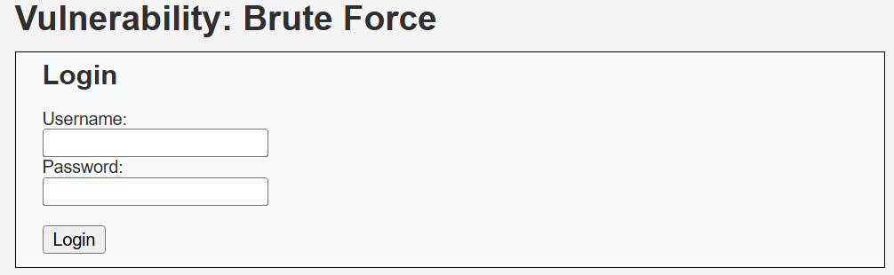

#### Low

一个常见的登录页面，首先尝试正常登录

输入用户名和密码都输入`1`

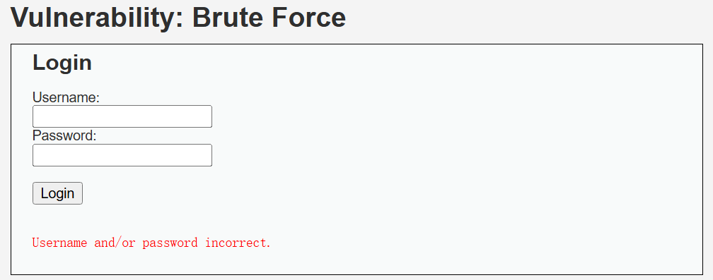

网页提示用户名或密码错误，观察URL，发现参数传递

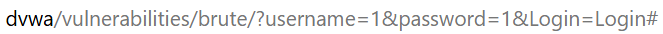

说明该页面使用GET方法传参，使用**Yakit**抓包

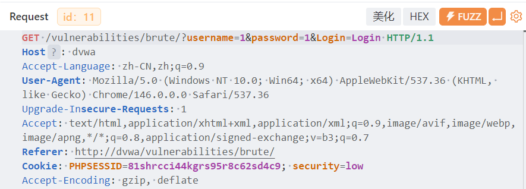

使用**Web Fuzzer**功能插入字典进行暴力破解

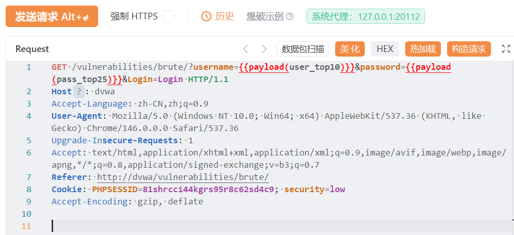

筛选**相应大小**，确认攻击成功

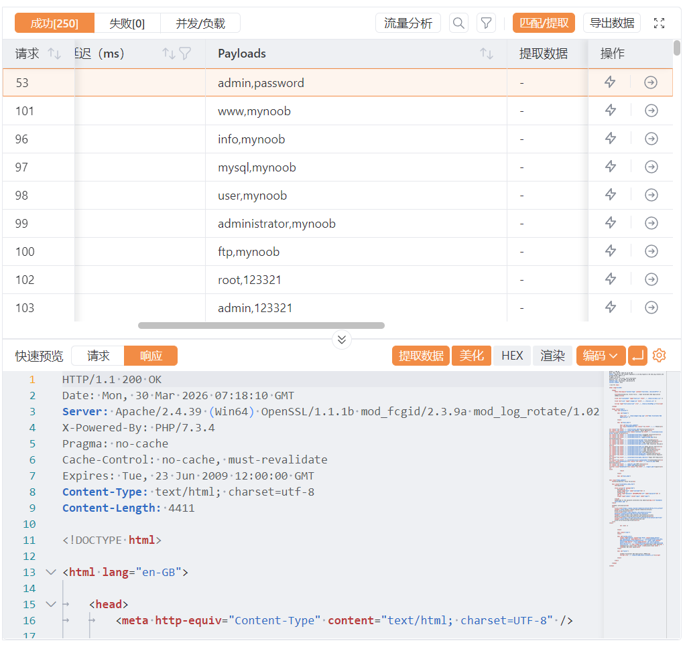

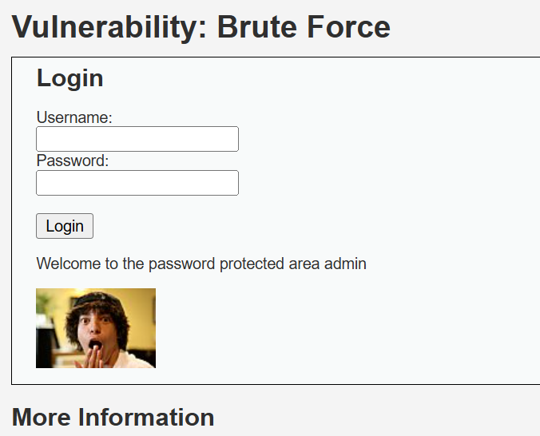

##### 代码审计

```php
<?php

if( isset( $_GET[ 'Login' ] ) ) {
    // Get username
    $user = $_GET[ 'username' ];

    // Get password
    $pass = $_GET[ 'password' ];
    $pass = md5( $pass );

    // Check the database
    $query  = "SELECT * FROM `users` WHERE user = '$user' AND password = '$pass';";
    $result = mysqli_query($GLOBALS["___mysqli_ston"],  $query ) or die( '<pre>' . ((is_object($GLOBALS["___mysqli_ston"])) ? mysqli_error($GLOBALS["___mysqli_ston"]) : (($___mysqli_res = mysqli_connect_error()) ? $___mysqli_res : false)) . '</pre>' );

    if( $result && mysqli_num_rows( $result ) == 1 ) {
        // Get users details
        $row    = mysqli_fetch_assoc( $result );
        $avatar = $row["avatar"];

        // Login successful
        echo "<p>Welcome to the password protected area {$user}</p>";
        echo "";
    }
    else {
        // Login failed
        echo "<pre><br />Username and/or password incorrect.</pre>";
    }

    ((is_null($___mysqli_res = mysqli_close($GLOBALS["___mysqli_ston"]))) ? false : $___mysqli_res);
}

?>
```

- `$pass = md5( $pass );`

  直接对密码明文进行md5加密，没有加盐，容易遭受彩虹攻击，并且md5算法已被证实不安全

- `$query  = "SELECT * FROM `users` WHERE user = '$user' AND password = '$pass';";`

  直接将用户输入用于构造SQL查询语句，极易受到SQL注入攻击，对于该题目，可以构造`admin' or '1'='1`成功登录


#### Medium

同样尝试正常登录

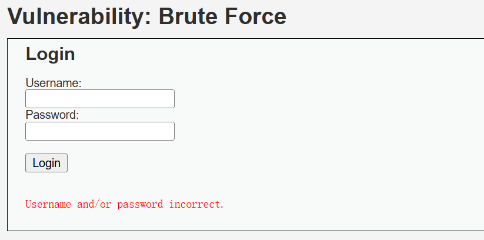

同样的GET传参，但是页面加载速度明显变慢了

尝试爆破

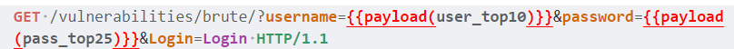

观察爆破结果，可以看到延迟非常奇怪

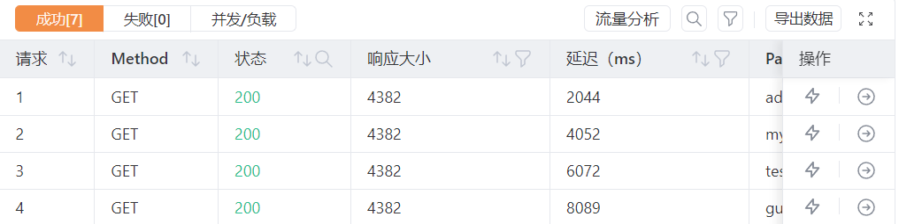

爆破成功，结果与Low一致，直接登录


##### 代码审计

```php
<?php

if( isset( $_GET[ 'Login' ] ) ) {
    // Sanitise username input
    $user = $_GET[ 'username' ];
    $user = ((isset($GLOBALS["___mysqli_ston"]) && is_object($GLOBALS["___mysqli_ston"])) ? mysqli_real_escape_string($GLOBALS["___mysqli_ston"],  $user ) : ((trigger_error("[MySQLConverterToo] Fix the mysql_escape_string() call! This code does not work.", E_USER_ERROR)) ? "" : ""));

    // Sanitise password input
    $pass = $_GET[ 'password' ];
    $pass = ((isset($GLOBALS["___mysqli_ston"]) && is_object($GLOBALS["___mysqli_ston"])) ? mysqli_real_escape_string($GLOBALS["___mysqli_ston"],  $pass ) : ((trigger_error("[MySQLConverterToo] Fix the mysql_escape_string() call! This code does not work.", E_USER_ERROR)) ? "" : ""));
    $pass = md5( $pass );

    // Check the database
    $query  = "SELECT * FROM `users` WHERE user = '$user' AND password = '$pass';";
    $result = mysqli_query($GLOBALS["___mysqli_ston"],  $query ) or die( '<pre>' . ((is_object($GLOBALS["___mysqli_ston"])) ? mysqli_error($GLOBALS["___mysqli_ston"]) : (($___mysqli_res = mysqli_connect_error()) ? $___mysqli_res : false)) . '</pre>' );

    if( $result && mysqli_num_rows( $result ) == 1 ) {
        // Get users details
        $row    = mysqli_fetch_assoc( $result );
        $avatar = $row["avatar"];

        // Login successful
        echo "<p>Welcome to the password protected area {$user}</p>";
        echo "";
    }
    else {
        // Login failed
        sleep( 2 );
        echo "<pre><br />Username and/or password incorrect.</pre>";
    }

    ((is_null($___mysqli_res = mysqli_close($GLOBALS["___mysqli_ston"]))) ? false : $___mysqli_res);
}

?>
```

- `$user = ((isset($GLOBALS["___mysqli_ston"]) && is_object($GLOBALS["___mysqli_ston"])) ? mysqli_real_escape_string($GLOBALS["___mysqli_ston"],  $user ) : ((trigger_error("[MySQLConverterToo] Fix the mysql_escape_string() call! This code does not work.", E_USER_ERROR)) ? "" : ""));`

  将用户输入进行过滤转义，防止SQL注入

- `sleep( 2 );`

  登录失败后，程序暂停2秒，增加暴力破解的时间成本


##### High

该难度同样使用GET方法传参，但是增加了`user_token`参数

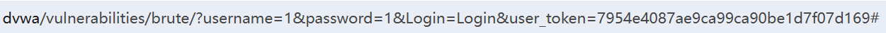

`user_token`由服务器通过Response报文传递给客户端，客户端下次发起Request报文时必须携带该`token`，否则即使账号密码正确，服务器也会拒绝请求

响应体中的`user_token`

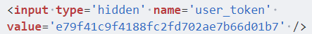

使用**Yakit**获取Token

在`Web Fuzzer`中，找到左侧`规则`->`数据提取器`，添加一个数据提取器

提取类型`XPath`，改场景提取范围为`响应体`，下方匹配内容为`//input[@name='user_token']/@value`

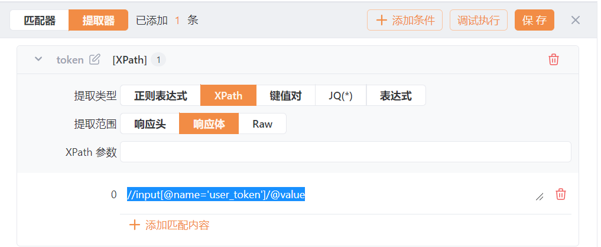

可以点击左上角的**调试执行**查看结果，获取到`user_token`值


### Command Injection（命令注入）

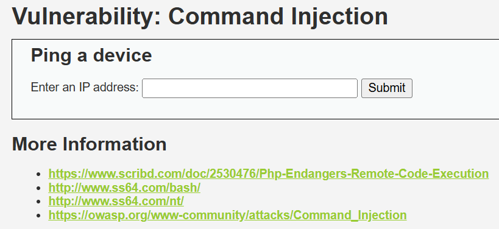

#### Low

先Ping一个正常IP试试，`ping 1.1.1.1`

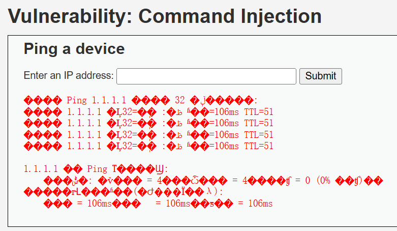

乱码了不用管，页面编码问题

重点来了，这个回显结果看起来是**Windows**服务器，这是显然，因为我使用的是PHPStudy本地部署

让我们来看看**Linux**服务器的回显结果（假设固定-c 4）

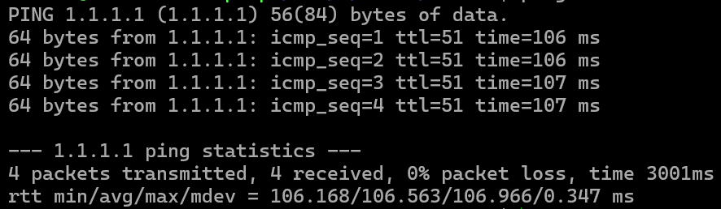

具体命令注入方法见 [命令注入.md](./命令注入.md)

直接拼接 `& whoami` 试试

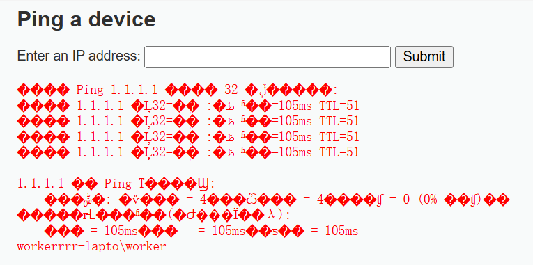

命令成功执行，没有过滤

##### 代码审计

```php
<?php

if( isset( $_POST[ 'Submit' ]  ) ) {
    // Get input
    $target = $_REQUEST[ 'ip' ];

    // Determine OS and execute the ping command.
    if( stristr( php_uname( 's' ), 'Windows NT' ) ) {
        // Windows
        $cmd = shell_exec( 'ping  ' . $target );
    }
    else {
        // *nix
        $cmd = shell_exec( 'ping  -c 4 ' . $target );
    }

    // Feedback for the end user
    echo "<pre>{$cmd}</pre>";
}

?>
```

- `$cmd = shell_exec( 'ping  ' . $target );`

  接收用户输入的命令后，没有过滤直接执行，造成命令注入的直接原因

#### Medium

注入的步骤和结果与Low一致，让我误以为没有区别，所以直接看看代码

##### 代码审计

```php
<?php

if( isset( $_POST[ 'Submit' ]  ) ) {
    // Get input
    $target = $_REQUEST[ 'ip' ];

    // Set blacklist
    $substitutions = array(
        '&&' => '',
        ';'  => '',
    );

    // Remove any of the characters in the array (blacklist).
    $target = str_replace( array_keys( $substitutions ), $substitutions, $target );

    // Determine OS and execute the ping command.
    if( stristr( php_uname( 's' ), 'Windows NT' ) ) {
        // Windows
        $cmd = shell_exec( 'ping  ' . $target );
    }
    else {
        // *nix
        $cmd = shell_exec( 'ping  -c 4 ' . $target );
    }

    // Feedback for the end user
    echo "<pre>{$cmd}</pre>";
}

?>
```

- ```php
  // Set blacklist
      $substitutions = array(
          '&&' => '',
          ';'  => '',
      );
  ```

  增加了黑名单机制，但是黑名单数量太少，只过滤了`&&`和`;`，换一种连接符就可以直接绕过

#### High

同样尝试`& whoami`

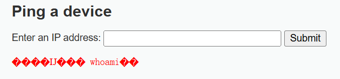

虽然是一串乱码，但是可以猜测出这是被过滤的提示

经过几次测试，都被过滤了，我们直接看看源代码

```php
<?php

if( isset( $_POST[ 'Submit' ]  ) ) {
    // Get input
    $target = trim($_REQUEST[ 'ip' ]);

    // Set blacklist
    $substitutions = array(
        '&'  => '',
        ';'  => '',
        '| ' => '',
        '-'  => '',
        '$'  => '',
        '('  => '',
        ')'  => '',
        '`'  => '',
        '||' => '',
    );

    // Remove any of the characters in the array (blacklist).
    $target = str_replace( array_keys( $substitutions ), $substitutions, $target );

    // Determine OS and execute the ping command.
    if( stristr( php_uname( 's' ), 'Windows NT' ) ) {
        // Windows
        $cmd = shell_exec( 'ping  ' . $target );
    }
    else {
        // *nix
        $cmd = shell_exec( 'ping  -c 4 ' . $target );
    }

    // Feedback for the end user
    echo "<pre>{$cmd}</pre>";
}

?>
```

- ```php
  $substitutions = array(
          '&'  => '',
          ';'  => '',
          '| ' => '',
          '-'  => '',
          '$'  => '',
          '('  => '',
          ')'  => '',
          '`'  => '',
          '||' => '',
      );
  ```

  依然使用了黑名单机制，这次黑名单的数量更多；观察数组元素，虽然`| `被过滤了，但是`|`后面有个空格，并且过滤处理使用`str_replace`函数，直接使用`|`就可以直接绕过

#### Impossible

```php
<?php

if( isset( $_POST[ 'Submit' ]  ) ) {
    // Check Anti-CSRF token
    checkToken( $_REQUEST[ 'user_token' ], $_SESSION[ 'session_token' ], 'index.php' );

    // Get input
    $target = $_REQUEST[ 'ip' ];
    $target = stripslashes( $target );

    // Split the IP into 4 octects
    $octet = explode( ".", $target );

    // Check IF each octet is an integer
    if( ( is_numeric( $octet[0] ) ) && ( is_numeric( $octet[1] ) ) && ( is_numeric( $octet[2] ) ) && ( is_numeric( $octet[3] ) ) && ( sizeof( $octet ) == 4 ) ) {
        // If all 4 octets are int's put the IP back together.
        $target = $octet[0] . '.' . $octet[1] . '.' . $octet[2] . '.' . $octet[3];

        // Determine OS and execute the ping command.
        if( stristr( php_uname( 's' ), 'Windows NT' ) ) {
            // Windows
            $cmd = shell_exec( 'ping  ' . $target );
        }
        else {
            // *nix
            $cmd = shell_exec( 'ping  -c 4 ' . $target );
        }

        // Feedback for the end user
        echo "<pre>{$cmd}</pre>";
    }
    else {
        // Ops. Let the user name theres a mistake
        echo '<pre>ERROR: You have entered an invalid IP.</pre>';
    }
}

// Generate Anti-CSRF token
generateSessionToken();

?>
```

在`Impossible`难度中，页面接收用户输入后，先使用`stripslashes`函数删除字符串中的反斜杠`\`，再根据点号`.`分割，并判断每个元素是否为数字或数字字符串，同时判断分割后的数组元素数量，最后再执行命令；并且同时引入Token，**不存在命令注入漏洞**


### CSRF（跨站请求伪造）

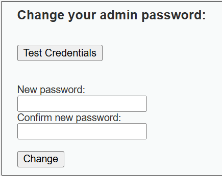

模拟的一个后台更改管理员密码的界面

#### Low

我们直接点`Change`按钮，模仿管理员正常更改密码

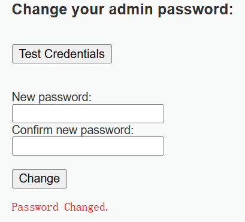

页面提示`Password Changed.`，密码更改成功，我们再观察`url`栏

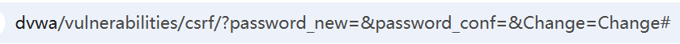

使用了GET方式提交，及其危险，再到`Test Credentials`测试

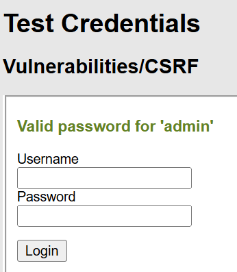

确认密码更改是成功的，接下来我们就可以开始进行CSRF攻击

直接在`url`栏修改参数值，模拟用户的浏览器GET请求伪造的外部资源链接

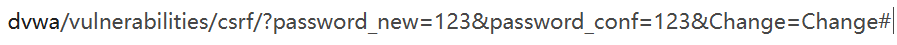

回车执行，到`Test Credentials`测试


密码修改成功，攻击成功

##### 代码审计

```php
<?php

if( isset( $_GET[ 'Change' ] ) ) {
    // Get input
    $pass_new  = $_GET[ 'password_new' ];
    $pass_conf = $_GET[ 'password_conf' ];

    // Do the passwords match?
    if( $pass_new == $pass_conf ) {
        // They do!
        $pass_new = ((isset($GLOBALS["___mysqli_ston"]) && is_object($GLOBALS["___mysqli_ston"])) ? mysqli_real_escape_string($GLOBALS["___mysqli_ston"],  $pass_new ) : ((trigger_error("[MySQLConverterToo] Fix the mysql_escape_string() call! This code does not work.", E_USER_ERROR)) ? "" : ""));
        $pass_new = md5( $pass_new );

        // Update the database
        $current_user = dvwaCurrentUser();
        $insert = "UPDATE `users` SET password = '$pass_new' WHERE user = '" . $current_user . "';";
        $result = mysqli_query($GLOBALS["___mysqli_ston"],  $insert ) or die( '<pre>' . ((is_object($GLOBALS["___mysqli_ston"])) ? mysqli_error($GLOBALS["___mysqli_ston"]) : (($___mysqli_res = mysqli_connect_error()) ? $___mysqli_res : false)) . '</pre>' );

        // Feedback for the user
        echo "<pre>Password Changed.</pre>";
    }
    else {
        // Issue with passwords matching
        echo "<pre>Passwords did not match.</pre>";
    }

    ((is_null($___mysqli_res = mysqli_close($GLOBALS["___mysqli_ston"]))) ? false : $___mysqli_res);
}

?>
```

该代码接收GET方式提交的参数，进行对比后直接更新数据库，没有做任何检查

#### Medium

直接尝试在`url`修改密码，但是报错

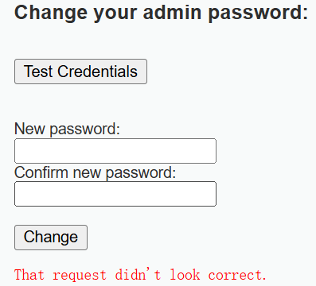

我们抓包分析一下

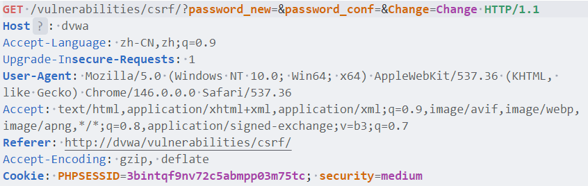

这是正常修改密码的请求，对比一下我们直接修改`url`后的请求

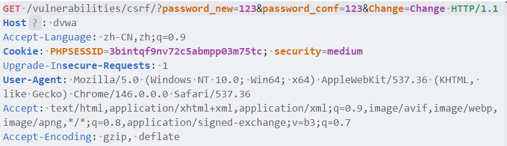

可以看到，直接修改`url`的请求缺少了`Referer`字段，我们只要在请求中加上该字段即可成功攻击

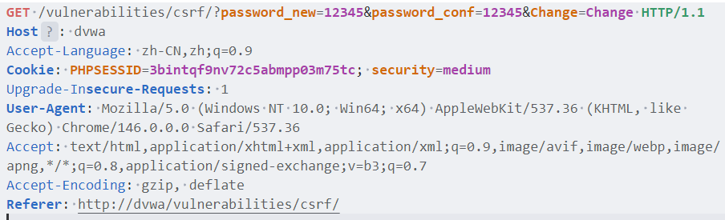


##### 代码审计

```php
<?php

if( isset( $_GET[ 'Change' ] ) ) {
    // Checks to see where the request came from
    if( stripos( $_SERVER[ 'HTTP_REFERER' ] ,$_SERVER[ 'SERVER_NAME' ]) !== false ) {
        // Get input
        $pass_new  = $_GET[ 'password_new' ];
        $pass_conf = $_GET[ 'password_conf' ];

        // Do the passwords match?
        if( $pass_new == $pass_conf ) {
            // They do!
            $pass_new = ((isset($GLOBALS["___mysqli_ston"]) && is_object($GLOBALS["___mysqli_ston"])) ? mysqli_real_escape_string($GLOBALS["___mysqli_ston"],  $pass_new ) : ((trigger_error("[MySQLConverterToo] Fix the mysql_escape_string() call! This code does not work.", E_USER_ERROR)) ? "" : ""));
            $pass_new = md5( $pass_new );

            // Update the database
            $current_user = dvwaCurrentUser();
            $insert = "UPDATE `users` SET password = '$pass_new' WHERE user = '" . $current_user . "';";
            $result = mysqli_query($GLOBALS["___mysqli_ston"],  $insert ) or die( '<pre>' . ((is_object($GLOBALS["___mysqli_ston"])) ? mysqli_error($GLOBALS["___mysqli_ston"]) : (($___mysqli_res = mysqli_connect_error()) ? $___mysqli_res : false)) . '</pre>' );

            // Feedback for the user
            echo "<pre>Password Changed.</pre>";
        }
        else {
            // Issue with passwords matching
            echo "<pre>Passwords did not match.</pre>";
        }
    }
    else {
        // Didn't come from a trusted source
        echo "<pre>That request didn't look correct.</pre>";
    }

    ((is_null($___mysqli_res = mysqli_close($GLOBALS["___mysqli_ston"]))) ? false : $___mysqli_res);
}

?>
```

- `stripos( $_SERVER[ 'HTTP_REFERER' ] ,$_SERVER[ 'SERVER_NAME' ])`

  使用`stripos`检查`Referer`字段中是否存在`SERVER_NAME`值（`Host`字段值），但该函数只检查第二个字符串在第一个字符串中第一次出现位置，只有当第二个字符串不是第一个字符串的子串时才返回`FALSE`，并且不区分大小写；攻击者可以利用包含多个关键字的超长字符串轻松绕过该检查

#### High

这个难度引入了`token`，用户每次访问页面token都会变化，并且请求时必须提供是上一次服务器提供的`token`


这里我们可以通过提取响应体中的`token`的方式成功修改密码，但这并非`CSRF`的利用方式；`CSRF`始终是被动攻击，正确的做法是制作一个恶意页面，然后自己扮演被害者访问该页面

##### 代码审计

```php
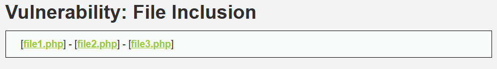<?php

$change = false;
$request_type = "html";
$return_message = "Request Failed";

if ($_SERVER['REQUEST_METHOD'] == "POST" && array_key_exists ("CONTENT_TYPE", $_SERVER) && $_SERVER['CONTENT_TYPE'] == "application/json") {
    $data = json_decode(file_get_contents('php://input'), true);
    $request_type = "json";
    if (array_key_exists("HTTP_USER_TOKEN", $_SERVER) &&
        array_key_exists("password_new", $data) &&
        array_key_exists("password_conf", $data) &&
        array_key_exists("Change", $data)) {
        $token = $_SERVER['HTTP_USER_TOKEN'];
        $pass_new = $data["password_new"];
        $pass_conf = $data["password_conf"];
        $change = true;
    }
} else {
    if (array_key_exists("user_token", $_REQUEST) &&
        array_key_exists("password_new", $_REQUEST) &&
        array_key_exists("password_conf", $_REQUEST) &&
        array_key_exists("Change", $_REQUEST)) {
        $token = $_REQUEST["user_token"];
        $pass_new = $_REQUEST["password_new"];
        $pass_conf = $_REQUEST["password_conf"];
        $change = true;
    }
}

if ($change) {
    // Check Anti-CSRF token
    checkToken( $token, $_SESSION[ 'session_token' ], 'index.php' );

    // Do the passwords match?
    if( $pass_new == $pass_conf ) {
        // They do!
        $pass_new = mysqli_real_escape_string ($GLOBALS["___mysqli_ston"], $pass_new);
        $pass_new = md5( $pass_new );

        // Update the database
        $current_user = dvwaCurrentUser();
        $insert = "UPDATE `users` SET password = '" . $pass_new . "' WHERE user = '" . $current_user . "';";
        $result = mysqli_query($GLOBALS["___mysqli_ston"],  $insert );

        // Feedback for the user
        $return_message = "Password Changed.";
    }
    else {
        // Issue with passwords matching
        $return_message = "Passwords did not match.";
    }

    mysqli_close($GLOBALS["___mysqli_ston"]);

    if ($request_type == "json") {
        generateSessionToken();
        header ("Content-Type: application/json");
        print json_encode (array("Message" =>$return_message));
        exit;
    } else {
        echo "<pre>" . $return_message . "</pre>";
    }
}

// Generate Anti-CSRF token
generateSessionToken();

?>
```

**High**级别的代码增加了`Anti-CSRF token`机制，顾名思义该机制就是为了防止`CSRF`的漏洞；但是，仍然使用`GET`方式提交，造成了`token`泄露

### File Inclusion（文件包含）


#### Low

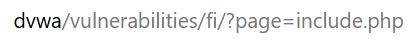

可以看到URL中的文件包含目录，尝试一个任意文件`1.txt`

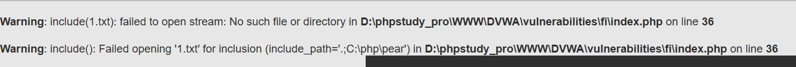

