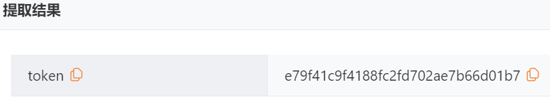

## DVWA

### Brute Force（暴力破解）


#### Low

一个常见的登录页面，首先尝试正常登录

输入用户名和密码都输入`1`


网页提示用户名或密码错误，观察URL，发现参数传递


说明该页面使用GET方法传参，使用**Yakit**抓包


使用**Web Fuzzer**功能插入字典进行暴力破解


筛选**相应大小**，确认攻击成功


##### 代码审计

```php
<?php

if( isset( $_GET[ 'Login' ] ) ) {
    // Get username
    $user = $_GET[ 'username' ];

    // Get password
    $pass = $_GET[ 'password' ];
    $pass = md5( $pass );

    // Check the database
    $query  = "SELECT * FROM `users` WHERE user = '$user' AND password = '$pass';";
    $result = mysqli_query($GLOBALS["___mysqli_ston"],  $query ) or die( '<pre>' . ((is_object($GLOBALS["___mysqli_ston"])) ? mysqli_error($GLOBALS["___mysqli_ston"]) : (($___mysqli_res = mysqli_connect_error()) ? $___mysqli_res : false)) . '</pre>' );

    if( $result && mysqli_num_rows( $result ) == 1 ) {
        // Get users details
        $row    = mysqli_fetch_assoc( $result );
        $avatar = $row["avatar"];

        // Login successful
        echo "<p>Welcome to the password protected area {$user}</p>";
        echo "";
    }
    else {
        // Login failed
        echo "<pre><br />Username and/or password incorrect.</pre>";
    }

    ((is_null($___mysqli_res = mysqli_close($GLOBALS["___mysqli_ston"]))) ? false : $___mysqli_res);
}

?>
```

- `$pass = md5( $pass );`

  直接对密码明文进行md5加密，没有加盐，容易遭受彩虹攻击，并且md5算法已被证实不安全

- `$query  = "SELECT * FROM `users` WHERE user = '$user' AND password = '$pass';";`

  直接将用户输入用于构造SQL查询语句，极易受到SQL注入攻击，对于该题目，可以构造`admin' or '1'='1`成功登录


#### Medium

同样尝试正常登录


同样的GET传参，但是页面加载速度明显变慢了

尝试爆破


观察爆破结果，可以看到延迟非常奇怪


爆破成功，结果与Low一致，直接登录


##### 代码审计

```php
<?php

if( isset( $_GET[ 'Login' ] ) ) {
    // Sanitise username input
    $user = $_GET[ 'username' ];
    $user = ((isset($GLOBALS["___mysqli_ston"]) && is_object($GLOBALS["___mysqli_ston"])) ? mysqli_real_escape_string($GLOBALS["___mysqli_ston"],  $user ) : ((trigger_error("[MySQLConverterToo] Fix the mysql_escape_string() call! This code does not work.", E_USER_ERROR)) ? "" : ""));

    // Sanitise password input
    $pass = $_GET[ 'password' ];
    $pass = ((isset($GLOBALS["___mysqli_ston"]) && is_object($GLOBALS["___mysqli_ston"])) ? mysqli_real_escape_string($GLOBALS["___mysqli_ston"],  $pass ) : ((trigger_error("[MySQLConverterToo] Fix the mysql_escape_string() call! This code does not work.", E_USER_ERROR)) ? "" : ""));
    $pass = md5( $pass );

    // Check the database
    $query  = "SELECT * FROM `users` WHERE user = '$user' AND password = '$pass';";
    $result = mysqli_query($GLOBALS["___mysqli_ston"],  $query ) or die( '<pre>' . ((is_object($GLOBALS["___mysqli_ston"])) ? mysqli_error($GLOBALS["___mysqli_ston"]) : (($___mysqli_res = mysqli_connect_error()) ? $___mysqli_res : false)) . '</pre>' );

    if( $result && mysqli_num_rows( $result ) == 1 ) {
        // Get users details
        $row    = mysqli_fetch_assoc( $result );
        $avatar = $row["avatar"];

        // Login successful
        echo "<p>Welcome to the password protected area {$user}</p>";
        echo "";
    }
    else {
        // Login failed
        sleep( 2 );
        echo "<pre><br />Username and/or password incorrect.</pre>";
    }

    ((is_null($___mysqli_res = mysqli_close($GLOBALS["___mysqli_ston"]))) ? false : $___mysqli_res);
}

?>
```

- `$user = ((isset($GLOBALS["___mysqli_ston"]) && is_object($GLOBALS["___mysqli_ston"])) ? mysqli_real_escape_string($GLOBALS["___mysqli_ston"],  $user ) : ((trigger_error("[MySQLConverterToo] Fix the mysql_escape_string() call! This code does not work.", E_USER_ERROR)) ? "" : ""));`

  将用户输入进行过滤转义，防止SQL注入

- `sleep( 2 );`

  登录失败后，程序暂停2秒，增加暴力破解的时间成本


##### High

该难度同样使用GET方法传参，但是增加了`user_token`参数


`user_token`由服务器通过Response报文传递给客户端，客户端下次发起Request报文时必须携带该`token`，否则即使账号密码正确，服务器也会拒绝请求

响应体中的`user_token`


使用**Yakit**获取Token

在`Web Fuzzer`中，找到左侧`规则`->`数据提取器`，添加一个数据提取器

提取类型`XPath`，改场景提取范围为`响应体`，下方匹配内容为`//input[@name='user_token']/@value`


可以点击左上角的**调试执行**查看结果，获取到`user_token`值



