## XSS 跨站脚本攻击

### 什么是XSS

XSS（Cross Site Scripting），跨站脚本攻击。是一种利用浏览器特性和动态网页内容进行的注入攻击，静态网页则完全不受影响。XSS原本应当简写为CSS，但与层叠样式表（CSS）同名，为了区分则取名XSS

### XSS的原理及危害

XSS是一种注入攻击，恶意用户将恶意代码注入到网页内容中，其它用户正常打开网站时，浏览器接收到内容后自动执行。XSS攻击可以绕过浏览器同源策略，从而窃取用户的Cookie，劫持用户的Web行为，还可以结合CSRF（跨站请求伪造）进行针对性的攻击

### XSS的分类

根据XSS的传播方式和触发原理，XSS通常分为三类，分别是：`反射型`、`存储型`、`DOM型`

#### 反射型XSS

反射型XSS特点是攻击只有一次，通常出现在搜索框、登录页面等用户输入内容会被立即回显的位置

反射型XSS中，XSS攻击脚本出现在URL中，作为用户输入提交给服务器，服务器解析后返回响应，而用户的浏览器接收响应时XSS脚本执行，会经过一次在服务器端的反射，所以称之为反射型XSS

**特点**

- XSS脚本不会被服务器储存，仅在一次请求-响应中生效
- 需要用户主动点击攻击者构造的恶意链接
- 常用于窃取Cookie或进行钓鱼欺骗

**利用反射型XSS的前提**

- 用户主动点击恶意链接
- 目标网站存在反射型XSS漏洞，在页面中回显了未转义的用户输入

#### 存储型XSS

顾名思义，存储型XSS是将恶意脚本存储在了服务器中，可以是数据库、日志或其它持久化介质中，只要能够被其它用户访问就能够加载和执行

存储型XSS常见于论坛、博客等网站的讨论区、留言板中。攻击者在发帖过程中将恶意脚本连同正常的信息一并注入到帖子内容中，服务器永久储存内容，其它用户浏览时，浏览器自动获取并执行，达到攻击目的

**特点**

- 常见于留言板、评论系统、论坛帖子、用户签名等交互区域
- 管理员、用户浏览内容自动触发
- 服务器永久储存，危害范围大，攻击持久，难以察觉

#### DOM型XSS

DOM型XSS是基于浏览器中的文档对象模型（DOM）进行的一种攻击方式，与反射型XSS类似，脚本注入与执行只发生在客户端，服务器不直接参与

**特点**

- 攻击入口仍然通过URL参数传递
- 服务端响应的HTML是干净的，恶意脚本在浏览器解析DOM时动态执行
- 主要依赖客户端JavaScript中的不安全操作（如`document.write()`、`innerHTML`、`eval()`等）

### 攻击示例

#### 反射型

这里我们利用**DVWA**作示例，使用DVWA的XSS (Reflected)页面

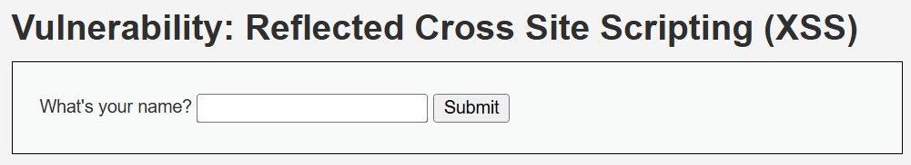

输入一个名字，前端就会回显我们的输入

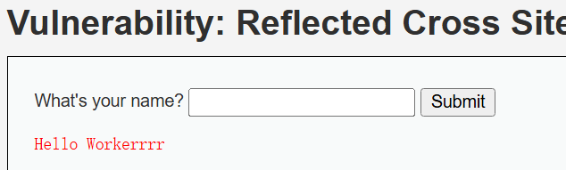

并且通过URL传递参数，回显在前端，典型的反射型XSS漏洞

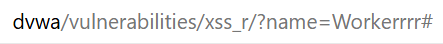

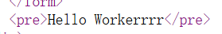

构造

```
http://dvwa/vulnerabilities/xss_r/?name=<script>alert('XSS')</script>#
```

然后我们模仿倒霉蛋，使用浏览器访问我们的链接，即可实现反射型XSS攻击

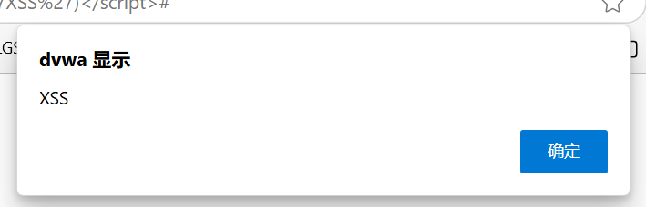

查看前端源码，可以看到脚本被注入到了前端源码中

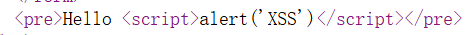

#### 存储型

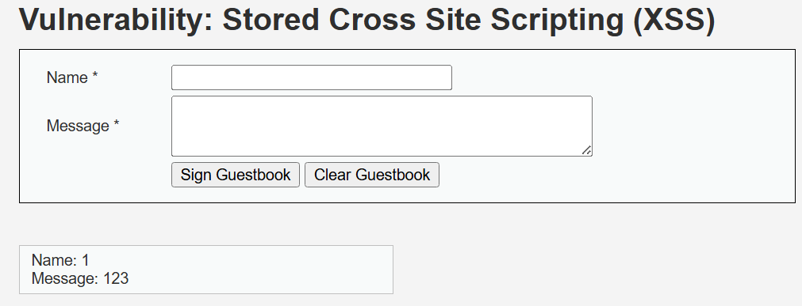

DVWA的存储型XSS页面还原了一个留言板功能，我们可以在此输入名称和留言

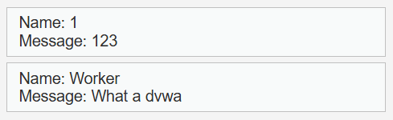

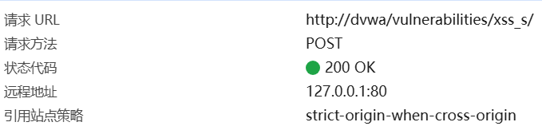

POST提交给服务器永久储存，我们直接输入`<script>alert('XSS')</script>`

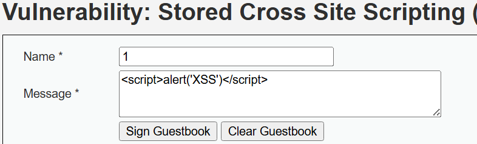

点击提交后，页面自动刷新一次，脚本也成功执行


👆这里的图片用的是反射型XSS执行成功的图片，所以可以在URL中看到脚本

*~~主要是懒得截新图~~*

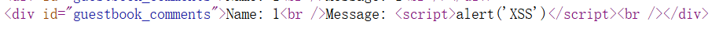

成功注入到前端代码中

#### DOM型

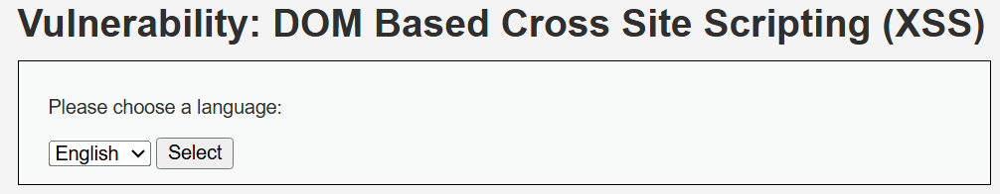

还原了一个选择默认语言的功能，没有实际的效果，依靠URL传参

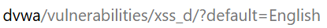

直接篡改URL

```
http://dvwa/vulnerabilities/xss_d/?default=<script>alert('XSS')</script>
```

回车即可执行脚本


DOM型XSS执行时，除了URL，前端看不到脚本，这使得用户难以察觉


待续

https://www.cnblogs.com/red1giant-star/p/19795780#_label1

https://xz.aliyun.com/news/17955