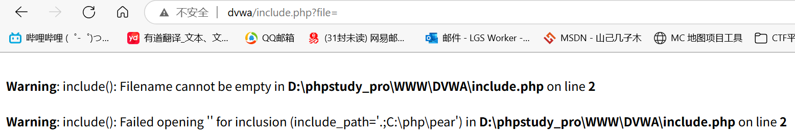
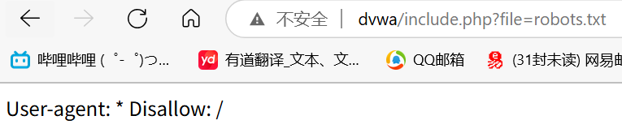
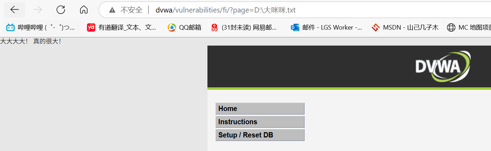
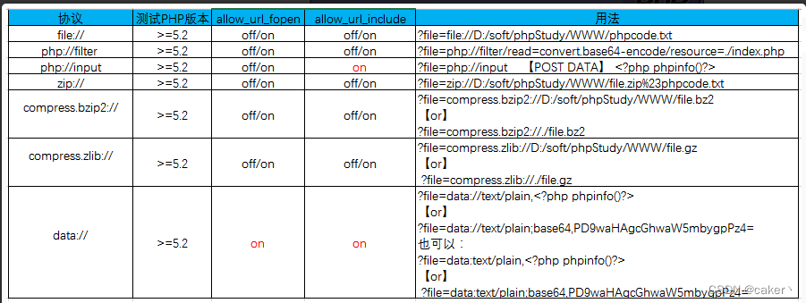

## File Inclusion 文件包含

文件包含也是一种**注入型漏洞**

- 什么是“包含”

  编程时，我们通常将需要经常使用的函数写在一个文件内，使用时不需要再定义，直接导入该文件即可调用函数，这个**导入**的过程就称之为**包含**

  常见的编程语言都有文件包含的方法，例如`C语言`的`#include`，`Python`和`Java`的`import`，`Web`中常见的是`PHP`

PHP常见的文件包含函数有以下四种

- `include()`：找不到被包含的文件时，产生警告并继续执行
- `require()`：找不到被包含的文件时，产生致命错误，停止执行
- `include_once()`：与`include`类似，区别是`include`可以重复包含同一个文件多次，而`include_once`只会包含一次
- `require_once()`：与`include_once`类似

### 漏洞原理

假设有以下代码

```php
// include.php
<?php
    include $_GET['file'];
?>
```

从`GET`请求获取一个文件并包含

假设我们构造`include.php?file=`，就可以传入任意文件

`include()`接收任意类型的数据，无论是`txt`、`png`还是`exe`，只要内容有PHP代码就会解析



```
http://dvwa/include.php?file=robots.txt
```



### 本地文件包含（LFI）

能够打开并包含本地文件的漏洞，我们称之为**本地文件包含**漏洞

这里的**本地**指的是网站主机的本地，可以凭借该漏洞泄露网站主机的本地信息

这里我们拿`DVWA`举例

```php
<?php

// The page we wish to display
$file = $_GET[ 'page' ];

?>
```


该段代码对文件包含的文件没有任何过滤与检查，所以能够直接包含**本地任意文件**

我们直接使用绝对路径读取本地文件`D:\大咪咪.txt`



同样，我们可以获取系统中的一些敏感信息了，可以自行搜索各个系统的常见敏感数据目录

#### 利用

文件包含的利用一般配合文件上传使用（File Upload），具体利用过程如下：

`文件上传漏洞`->`上传植入后面的文件`->`利用文件包含进行解析`->`获取shell`

如果没有文件上传点，可以利用`Apache`日志写入一句话木马，包含日志文件后拿到shell

CentOS、RHEL、Arch等：`/var/log/httpd/access.log`或`/var/log/httpd/error.log`

Ubuntu、Debian、SLES等：`/var/log/apache2/access.log`或`/var/log/apache2/error.log`

还可以包含SESSION、临时文件等，这里就不一一列举了

### 远程文件包含（RFI）

如果PHP配置选项`allow_url_include`、`allow_url_fopen`状态为`on`的话，`include`和`require`函数是可以加载远程文件的，这种漏洞被称为**远程文件包含**

远程文件包含的利用和本地文件包含一样，只是从本地变成了远程，可以理解为一种变相的**文件上传**

远程文件包含非常危险，PHP默认并未启用，所以一般只能在CTF题目中见到

### PHP伪协议

PHP内置了很多URL风格的封装协议，可用于类似`fopen()`、`copy()`、`file_exists()`等文件操作函数

- `file://`

  不受`allow_url_include`和`allow_url_fopen`影响，通常用于访问本地文件系统，可以使用绝对路径和相对路径

  

- `php://`

  不受`allow_url_fopen`影响，但`php://input`、`php://stdin` `php://memory` 、`php://temp`需要`allow_url_include ON`

  用于访问各个输入/输出流（I/O Streams），CTF中常用的是`php://filter`和`php://input`，前者用于读取代码，后者用于执行代码

PHP伪协议的利用方式众多灵活，这里就不一一列举了



### 文件包含防护

文件包含漏洞的防护较为简单，通过过滤特殊字符、做好权限管理、增加目录白名单的方式即可